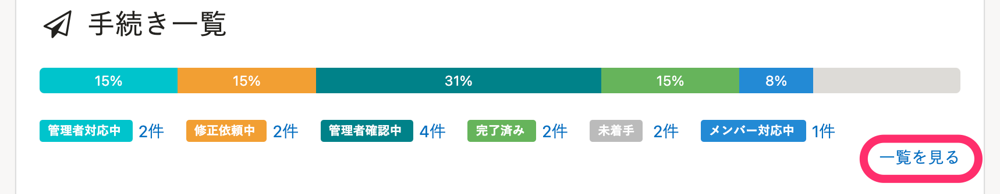
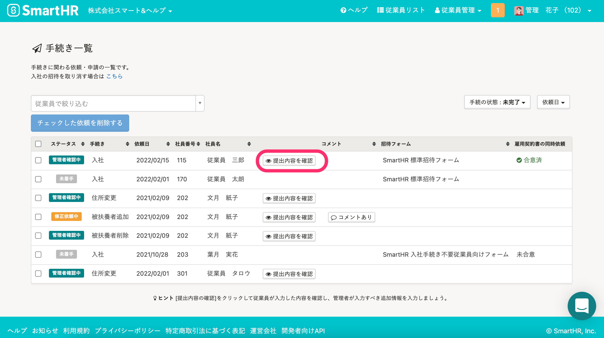
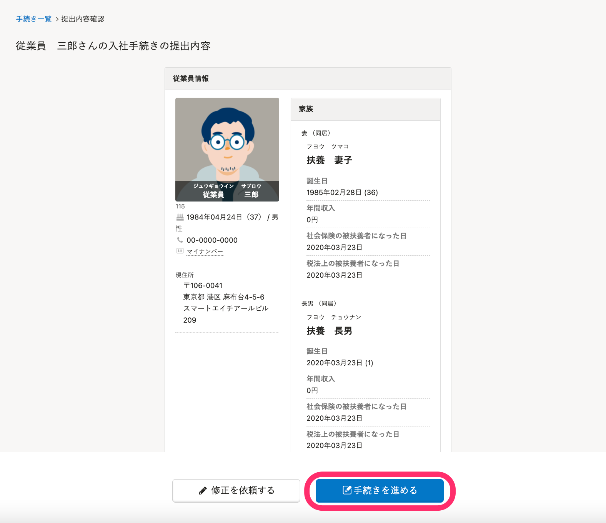
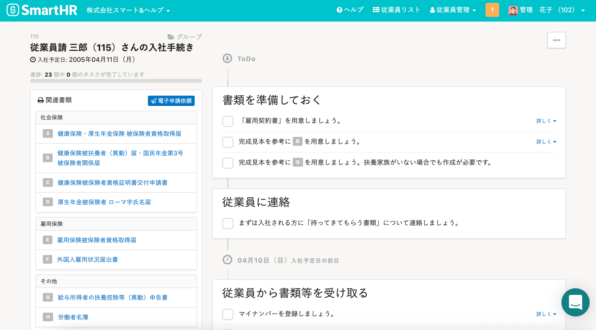
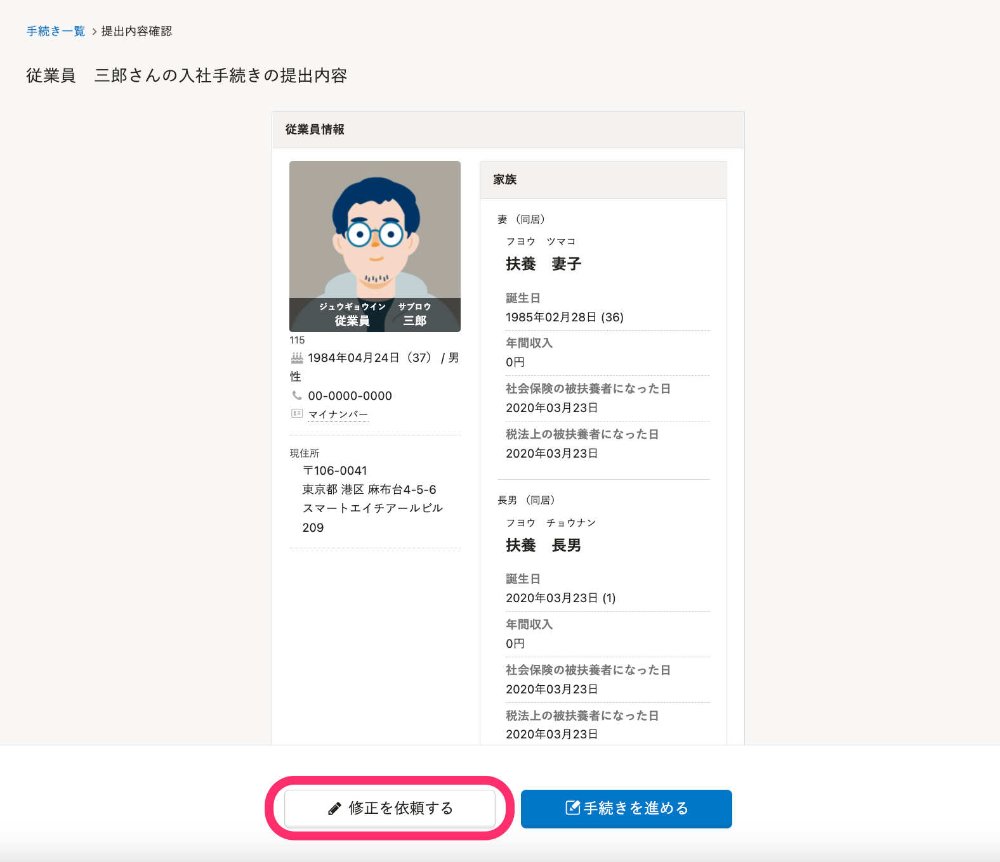
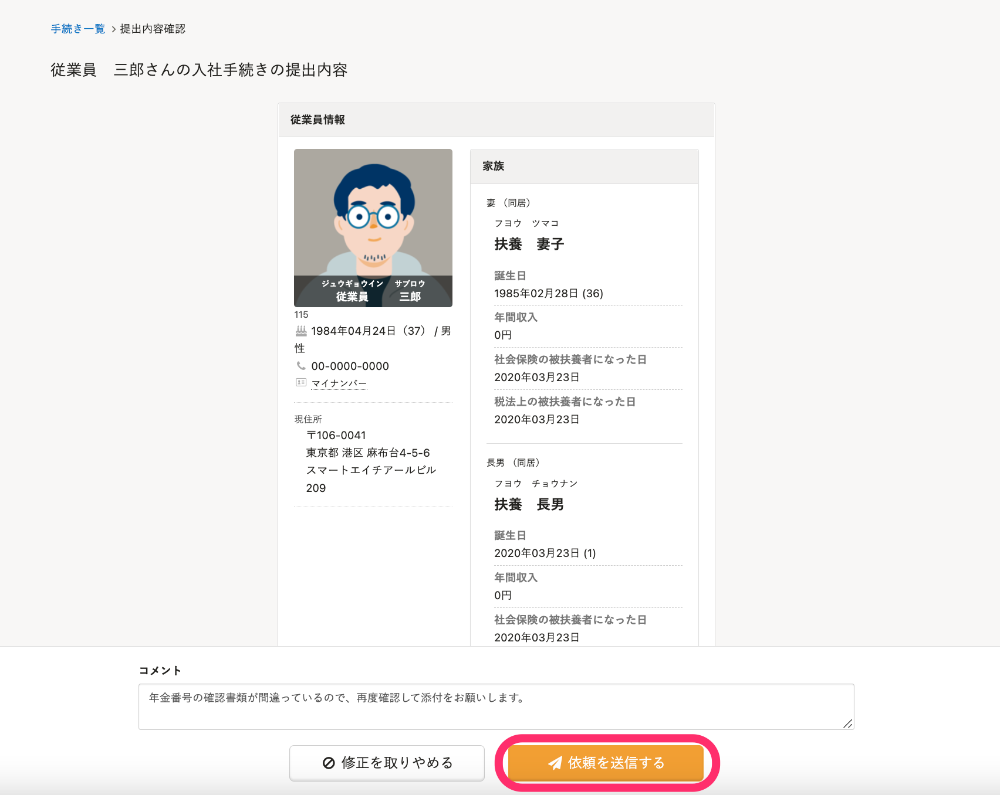
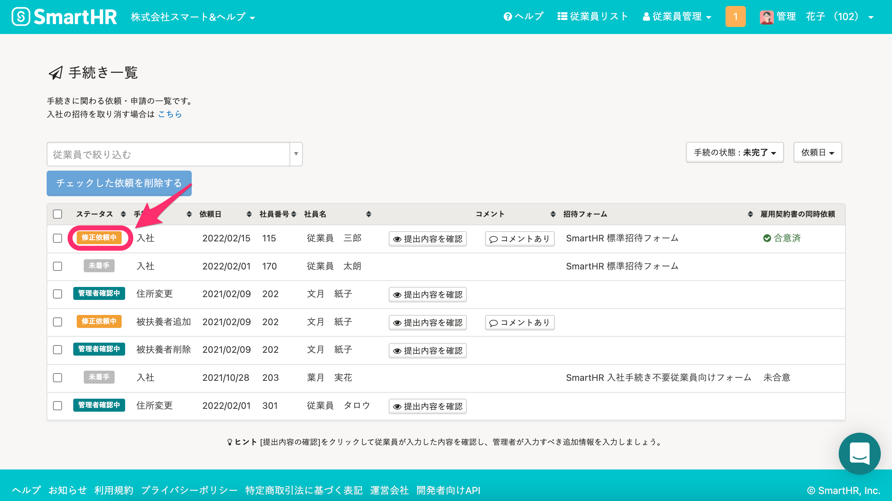

従業員から情報が入力された後に入社手続きを進めるには、トップページの **［手続き一覧］** から操作をはじめます。

# 修正を依頼せずに入社手続きを行う場合

## 1\. トップページ >［手続き一覧］>［一覧を見る］をクリック

従業員本人が情報を入力し提出を行うと、トップページ **［手続き一覧］** の **［管理者確認中］** ステータスに反映されます。

手続きを進めるために、 **［一覧を見る］** をクリックしてください。

※¥0プラン、またはスモールプランをご利用のお客さまの場合、 **［手続き一覧］** は **［入社手続き一覧］** と表示されます。

## 2\. 手続きを作成したい従業員の［提出内容を確認］をクリック

手続きを作成したい従業員の **［提出内容を確認］** をクリックし、入力内容を確認してください。

## 3\. ［手続きを進める］をクリック

入力内容に問題が無い場合は、 **［手続きを進める］** をクリックしてください。

※ 不備がある場合は、後述の「入力内容の不備を修正してもらう場合」の手順を参考に、修正依頼を行ってください。

## 4\. 手続きを完成させる

画面の手順に従い、手続きに必要な情報を入力し、手続きを完成させてください。
（ここで入力した情報は後から変更することも可能です）

## 5\. ToDoに沿って書類を作成・提出する

入社手続きが作成されます。ToDoを参考に書類の作成・提出などを行なってください。

# 入力内容の不備を修正してもらう場合

## 1\. ［修正を依頼する］をクリック

上記手順の①、②まで進めたら、情報の確認画面で **［修正を依頼する］** をクリックしてください。

## 2\. ［依頼を送信する］をクリック

任意でコメントを入力し、 **［依頼を送信する］** をクリックしてください。

修正依頼が届いたときの対応方法について、詳しくは下記のページをご覧ください。

[入社手続きの修正依頼が届いたら？](https://knowledge.smarthr.jp/hc/ja/articles/360026105074)

## 3\. 手続きを再開する

従業員から情報が再度提出されるまでは、 **［修正依頼中］** ステータス として **［手続き一覧］** に表示されます。

従業員から再提出があると［ **管理者確認中］** のステータスになります。

前項を参考に手続きを進めてください。

