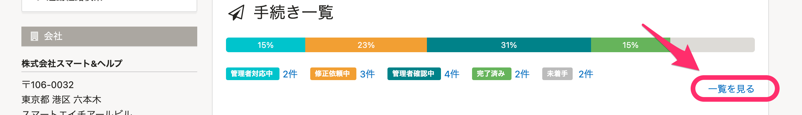
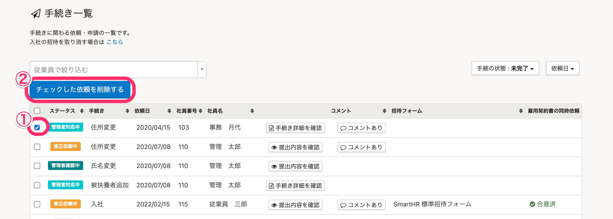

入社手続きの入力依頼を削除する方法をご案内します。

# 1.［手続き一覧］の［一覧を見る］をクリック

トップページにある **［手続き一覧］** 右下の **［一覧を見る］** をクリックすると、 **［手続き一覧］** 画面へ移動します。

※¥0プラン、またはスモールプランをご利用の場合、 **［手続き一覧］** は **［入社手続き入力依頼］** と表示されます。

# 2\. 依頼を選択し、［チェックした依頼を削除する］をクリック

削除したい依頼にチェックを入れ、 **［チェックした依頼を削除する］** をクリックすると、手続き入力依頼が削除されます。

:::tips
入力依頼を削除しても、登録済みの従業員情報は消えません。
入社手続きの入力依頼を削除すると、従業員側では招待フォームの情報入力画面の後に表示される **［以下の内容で入社手続きを作成します］** の確認画面に移動せず、入力完了となります。
従業員側の画面遷移は以下を参考にしてください。
[入社の手続き依頼をした後のステータスはどう遷移する？](https://knowledge.smarthr.jp/hc/ja/articles/360026103554)
招待ごと依頼を取り消す場合は、以下をご覧ください。
[招待メールを再送する  >「入社の手続き」から招待した場合](https://knowledge.smarthr.jp/hc/ja/articles/360026103574#i)
:::
