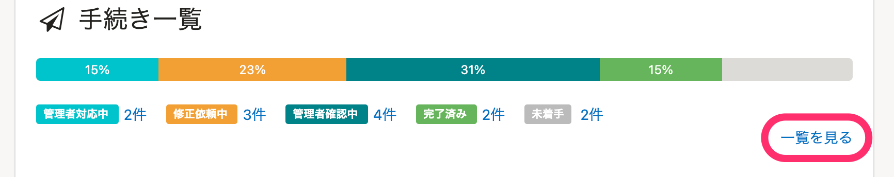
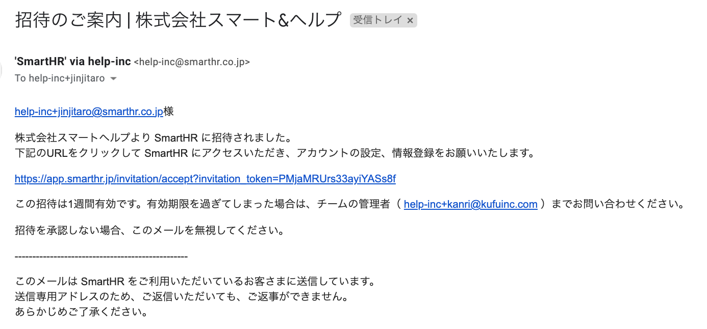
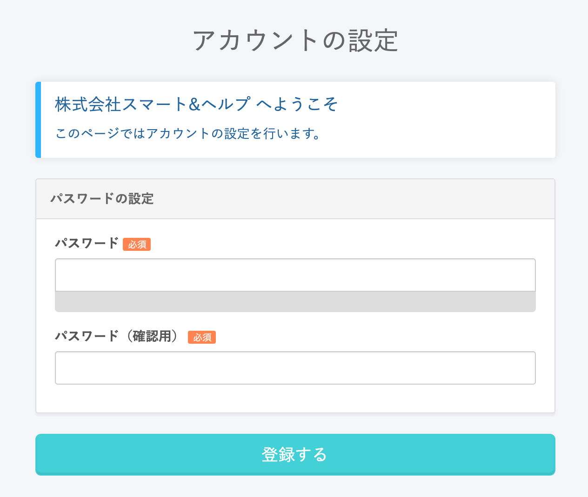
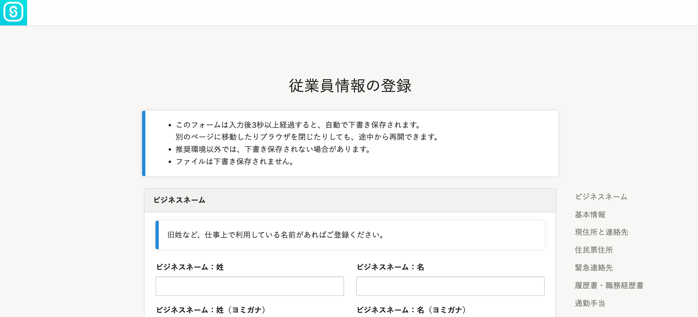
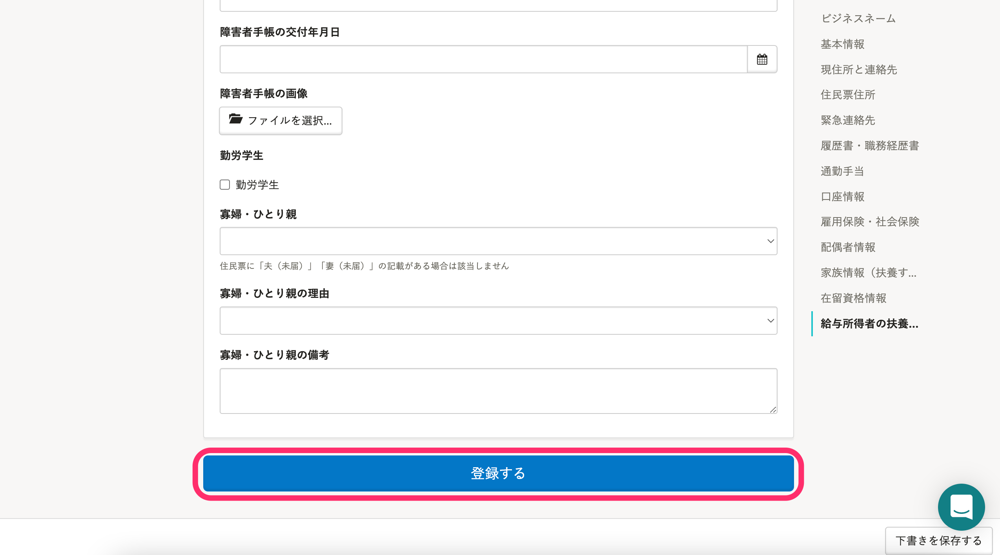
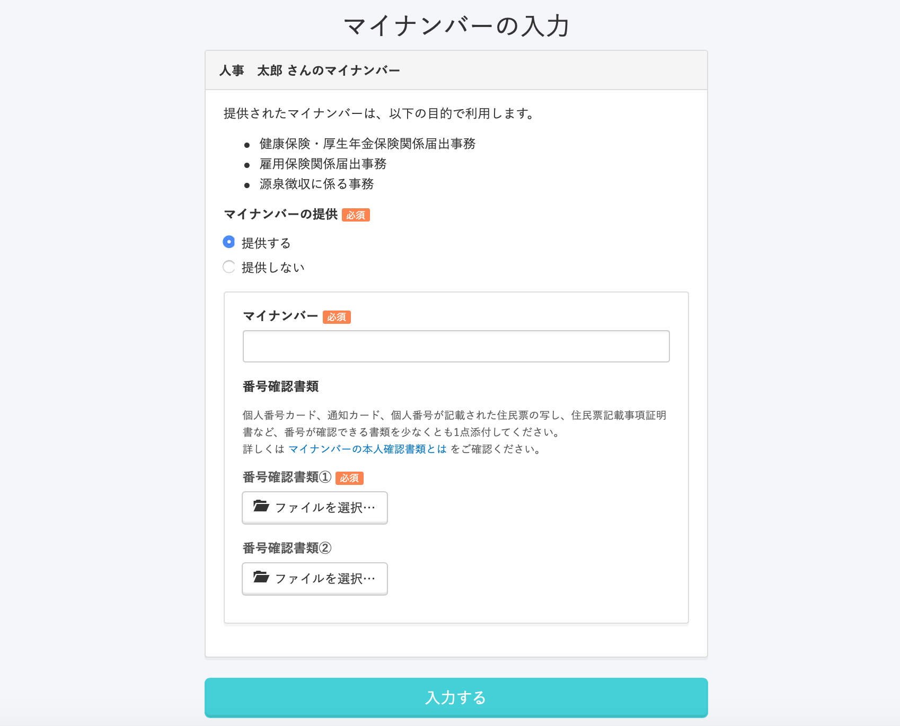
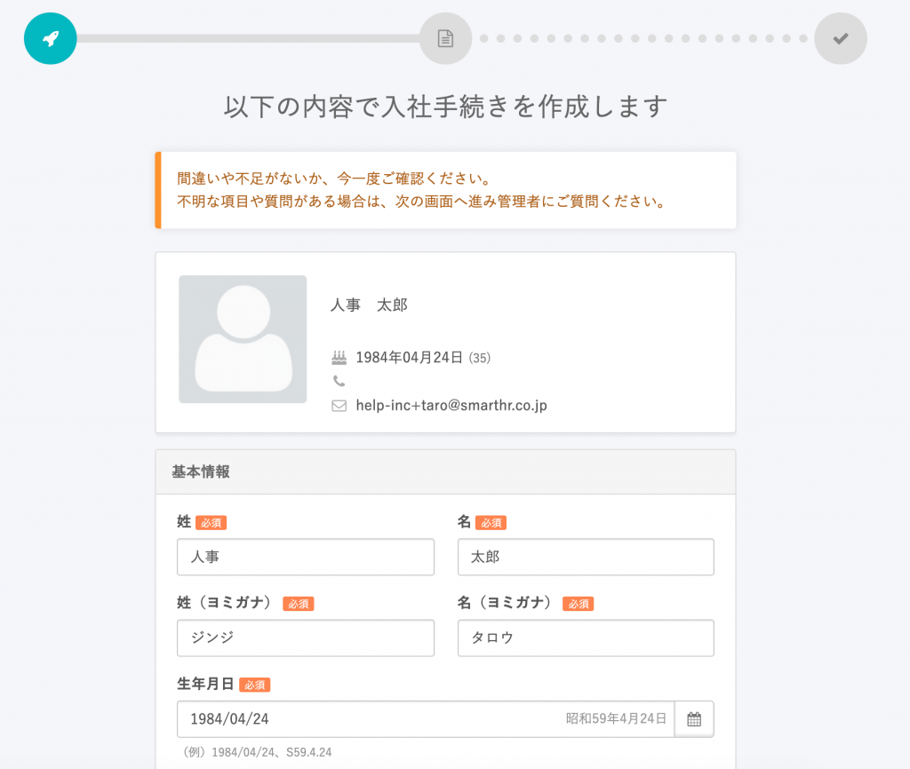
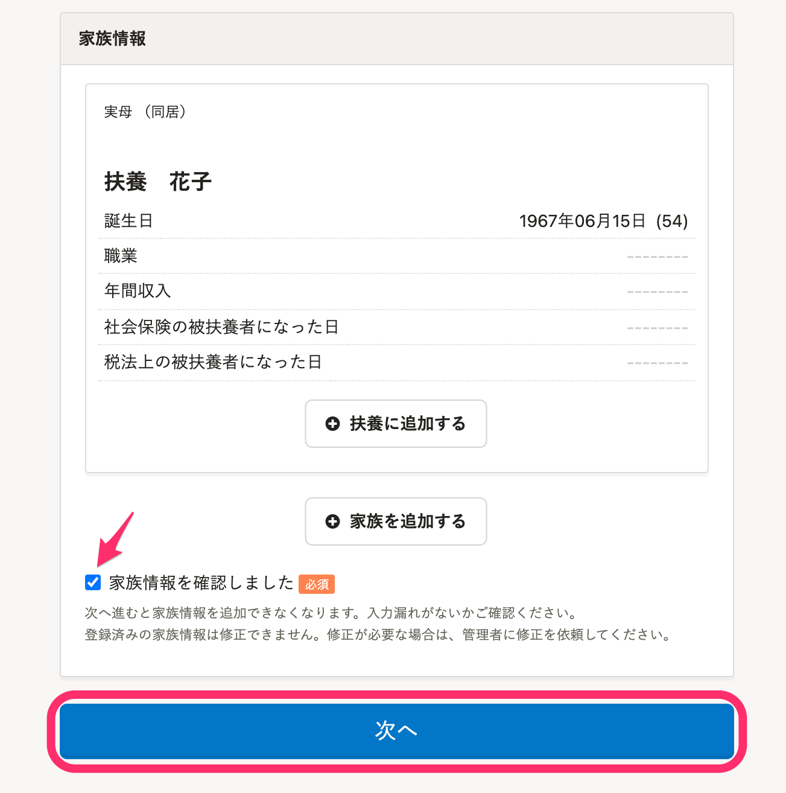
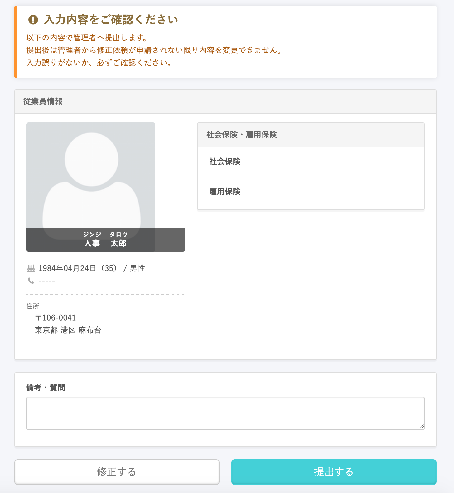
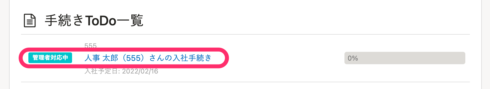

トップページの **［入社の手続き］** から従業員に情報入力を依頼した後の流れとステータスの変化を説明します。

入力依頼のステータスは、トップページの **［手続き一覧］** の右下にある **［一覧を見る］** から確認できます。

※¥0プラン、またはスモールプランをご利用のお客さまの場合は「入社手続き入力依頼」と表示されています。

:::related
[招待・入社手続きの進捗を確認する](https://knowledge.smarthr.jp/hc/ja/articles/900005113826)
:::

# 1\. 従業員に招待のメールが届く

この時点ではステータスは **［未着手］** です。

:::alert
スマートフォンでSmartHRを表示する際は、iPhone標準のメールアプリやGmailアプリ、Yahoo!メールアプリなどの **アプリ内のWebブラウザではなく、ChromeやSafariなどのブラウザで直接開く** よう、従業員の皆さまへ案内をお願いします。
アプリ内のWebブラウザでの表示は動作環境外となり、正しく動作しない可能性があります。
:::

# 2\. 従業員がパスワードの設定をする

招待メールに記載されているリンクをクリックすると「アカウントの設定」画面が開き、パスワードの登録ができます。

この画面で従業員がパスワードを設定し、 **［登録する］** をクリックすると、従業員情報入力画面に移ります。

この時点でSmartHRへの招待とアカウントの発行は完了しますが、「手続き入力依頼」のステータスは **［未着手］** のままです。

# 3\. 従業員情報を入力する

従業員が必要な情報を入力し、最下部の **［登録する］** をクリックすると次の画面へ移ります。

ステータスは **［未着手］** のままです。

:::tips
従業員が **［従業員情報の登録］** 画面で **［登録する］** をクリックした時点で、入力した内容で従業員情報が更新されます。
:::

# 4\. マイナンバーを入力する

管理者が入社の手続き依頼と同時にマイナンバーの提供依頼を送っていた場合、このタイミングでマイナンバー入力フォームが表示されます。

従業員にマイナンバーの提供依頼をしていない場合は、この画面はスキップされます。

:::related
[招待と同時に従業員にマイナンバーの入力を依頼する](https://knowledge.smarthr.jp/hc/ja/articles/360026105274)
:::

従業員が必要な情報を入力し、 **［入力する］** をクリックすると次の画面へ移ります。

ステータスは **［未着手］** のままです。

# 5\. 入力内容を確認する

これまでの入力内容に間違いがないか確認します。

被扶養者情報についても再度確認し、内容に間違いがなければ「家族情報の内容をもう一度ご確認ください」にチェックを入れ、 **［次へ］** をクリックすると次の画面へ移ります。

# 6\. 最終確認をして、提出する

この画面まで進むと、手続き入力依頼のステータスが **［メンバー対応中］** になります。

 **［修正する］** をクリックすると、従業員は提出内容の修正ができます。

 **［提出する］** をクリックすると、管理者へ情報を提出します。

情報の提出後は、 **［管理者確認中］** のステータスになります。

ステータスは、従業員のトップページにも表示されます。

# 7\. 情報が提出された後、手続きを進める

従業員から情報が提出された後の手順については、下記のヘルプページをご確認ください。

:::related
[従業員から情報が提出された後、入社手続きを進める](https://knowledge.smarthr.jp/hc/ja/articles/360026265873)
:::
