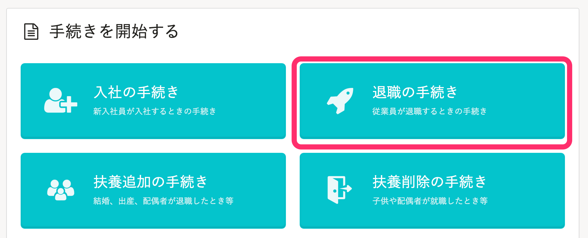
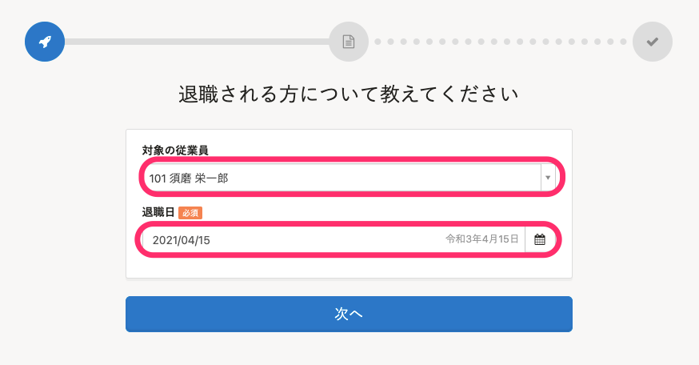
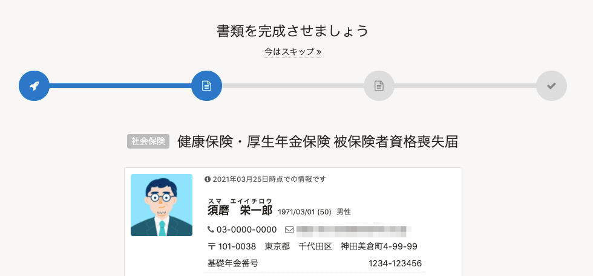
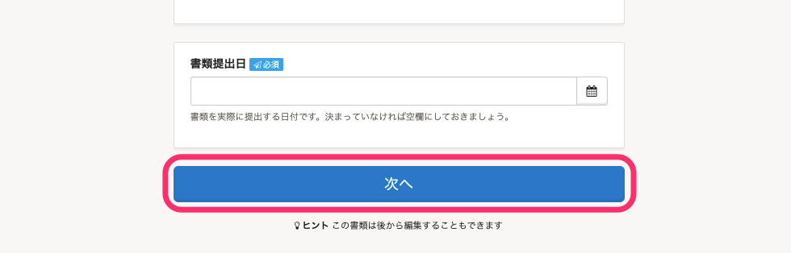
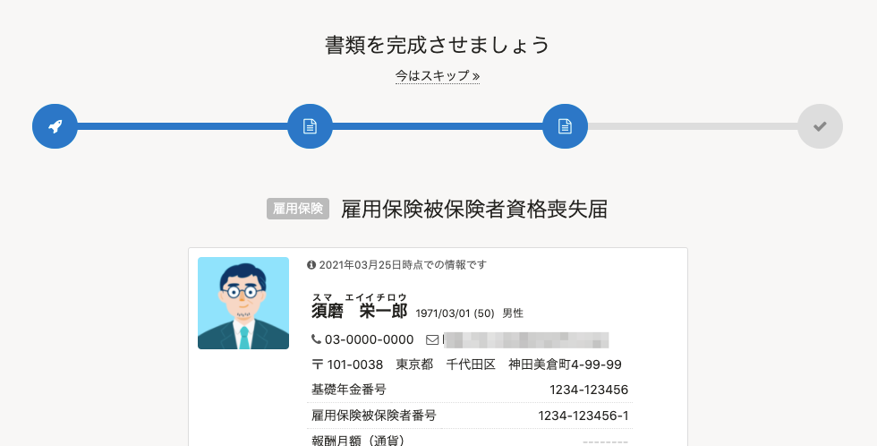
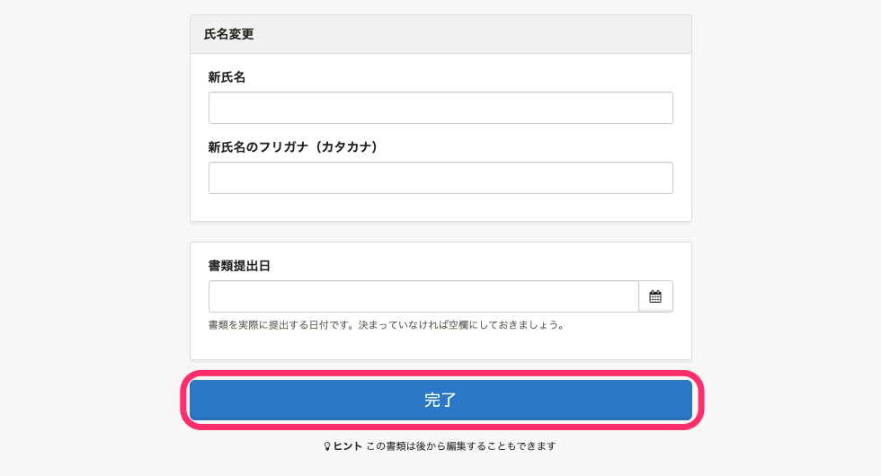
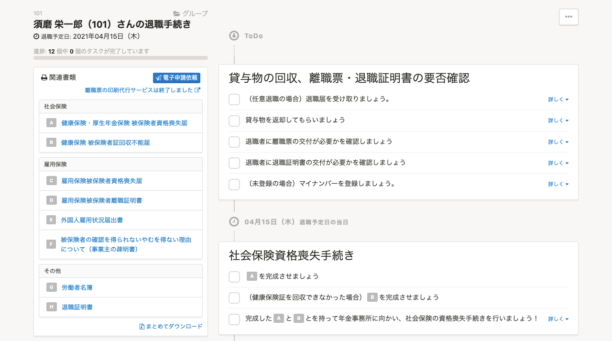
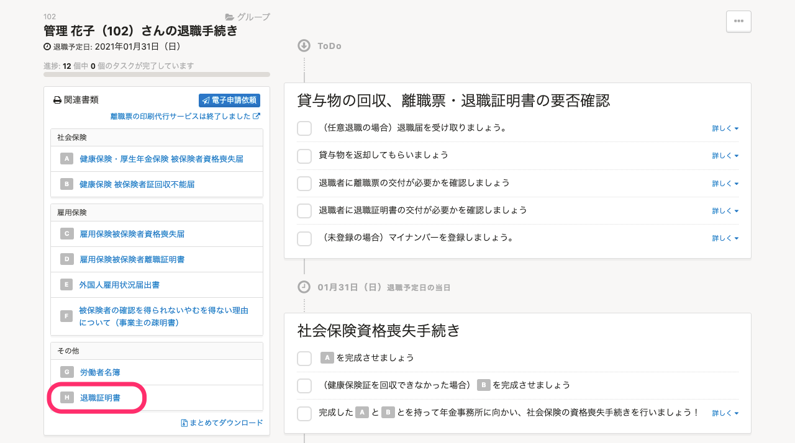

:::tips
2021年4月1日より、在籍状況が「退職済」になるタイミングを変更しました。
- **いままで：**退職の手続きを作成した際に、在籍情報が「退職済」に変更されていました。
- **これから：**退職日の翌日に在籍状況が「退職済」に変更されます。
あわせて、ご請求の対象となる従業員の条件も変更しました。詳しい変更点は、下記のお知らせをご覧ください。
[「ご請求の対象となる従業員の条件」と在籍状況の仕様変更に関するお知らせ | SmartHR](https://smarthr.jp/other/22960)
:::

トップページの **「退職の手続き」** から、退職の手続きを作成できます。

このページでは、「協会けんぽ」の場合を例に、手続きの流れを説明します。

# 1\. トップページの［退職の手続き］をクリック

トップページにある［ **退職の手続き］** をクリックすると、退職者を選択する画面に移動します。

# 2\. ［対象の従業員］と［退職日］を入力

 **［対象の従業員］** を選択し、 **［退職日］** を入力して **［次へ］** をクリックすると、書類内容を入力する画面に移動します。

 **［退職日］** に入力した日付の翌日に、在籍状況が自動で **［退職済］** に変更されます。

:::tips
 **［退職日］** に過去の日付を入力した場合は、手続きを作成した時点で在籍状況が **［退職済み］** に変更されます。
:::

# 3\. 健康保険・厚生年金保険 被保険者資格喪失届に関する情報を入力

喪失原因や保険証回収の有無など、健康保険・厚生年金保険 被保険者資格喪失届に関する情報を入力します。

この画面はスキップをして、後で情報を追加することもできます。

画面最下部にある **［次へ］** をクリックすると、 **［雇用保険被保険者資格喪失届］** の入力フォームへ移動します。

# 4\. 雇用保険被保険者資格喪失届に必要な情報を入力

喪失原因や離職票交付希望の有無など、雇用保険被保険者資格喪失届に関する情報を入力します。

氏名が変わっている場合は、 **［氏名変更］** の項目にて新氏名を入力できます。

 **［完了］** をクリックすると、ToDoリスト画面に移動します。

# 5\. 作成された書類やToDoリストを確認

画面左側にある **［関連書類］** 欄にて、作成された書類を確認できます。

 **［関連書類］** 欄の書類名をクリックすると、各書類のプレビューや編集ができます。

作成された手続きは、トップページの **［手続きToDo一覧］** からいつでも確認できます。

トップページに表示されていない場合は、右下の **［一覧を見る］** から確認できます。

:::tips
退職の手続きをしても、従業員の **［アカウント権限］** は変更されません。
退職日を迎えたアカウントの権限を自動で退職者に変更する設定については、下記のページをご覧ください。
[退職日を迎えたアカウントの権限を自動で退職者に変更する](https://knowledge.smarthr.jp/hc/ja/articles/360051420433)
権限を **［退職者］** 権限に変更すると、退職後も、給与明細や源泉徴収票の閲覧など限定した範囲でSmartHRを利用できるようになります。
詳しくは、下記のページをご覧ください。
[Q. 退職した従業員は、引き続きSmartHRにログインできますか？](https://knowledge.smarthr.jp/hc/ja/articles/360026264913)
:::

## 「退職証明書」を「社会保険喪失連絡票」の代わりとして使う

退職の手続きで作成される「退職証明書」は  **「社会保険喪失連絡票」の代わりとして使える**  場合があります。

従業員から「社会保険喪失連絡票」の作成を求められた際は、「退職証明書」でも代用できるかを確認のうえ、ご活用ください。

:::tips
- 「社会保険喪失連絡票」は、従業員が退職後に国民健康保険の加入手続きを行うときなどに必要となります。
- SmartHRでは「社会保険喪失連絡票」を作成できません。
:::

