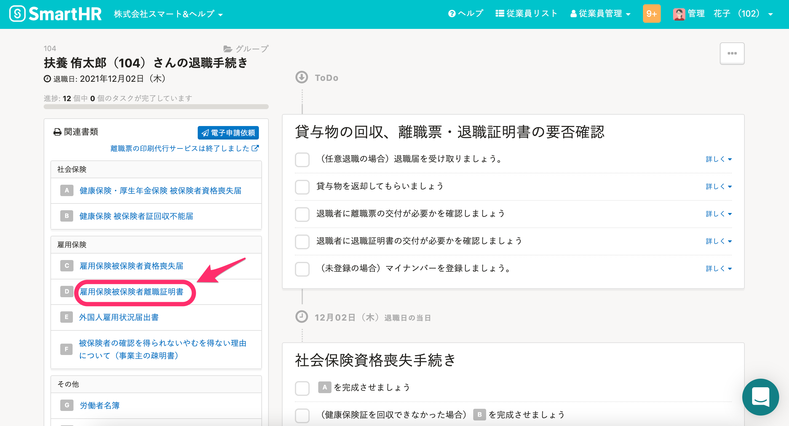
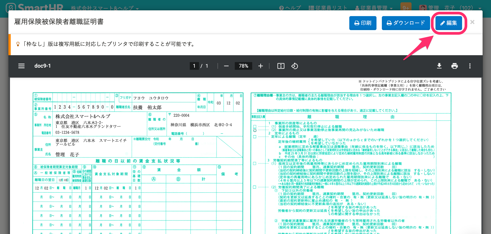
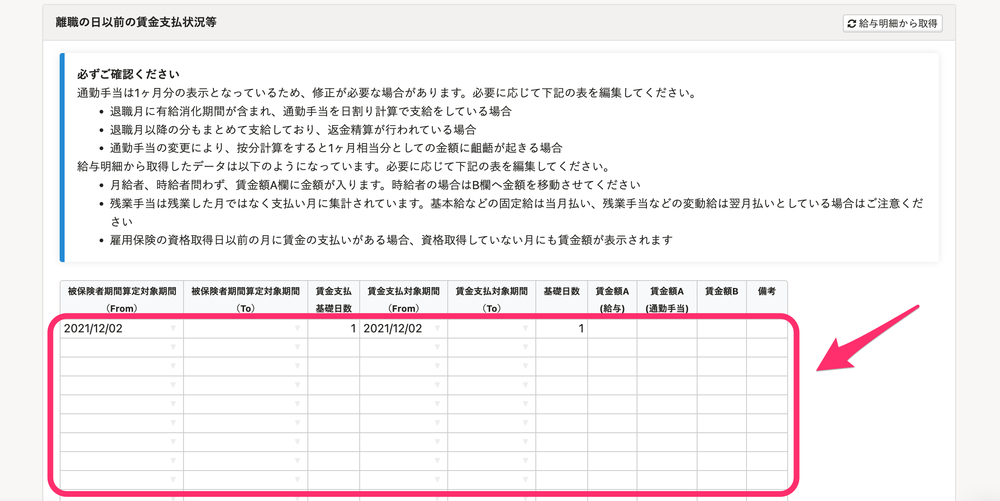

退職手続きの画面から「雇用保険被保険者離職証明書」を編集する手順を説明します。

# 1\. ［関連書類］>［雇用保険被保険者離職証明書］をクリック

従業員の退職手続き画面で **［関連書類］** **\>** **［雇用保険被保険者離職証明書］** をクリックすると、「雇用保険被保険者離職証明書」が表示されます。

# 2\. ［編集］をクリック

 **［編集］** をクリックすると、雇用保険被保険者離職証明書の編集画面が表示されます。

# 3\. 編集して［更新する］をクリック

任意の項目を編集して **［更新する］** をクリックします。

給与の支払状況を編集する場合は、 **［離職の日以前の賃金支払状況等］** の表に情報を直接入力します。

なお、給与明細の金額を反映する場合は、[給与明細の金額を雇用保険被保険者離職証明書に反映するには？](https://knowledge.smarthr.jp/hc/ja/articles/360038707174)を参照してください。
