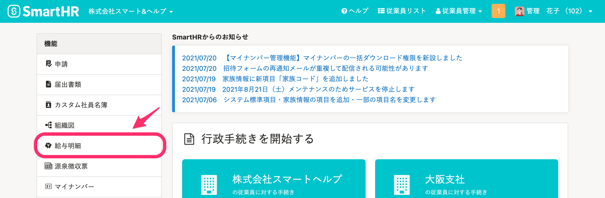
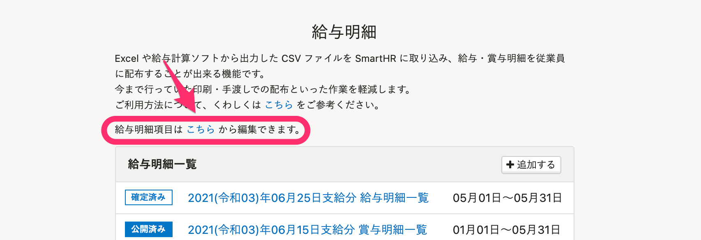
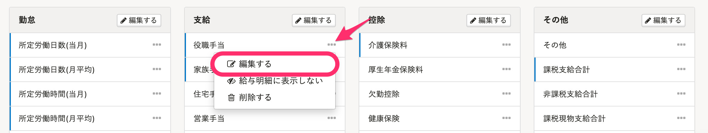
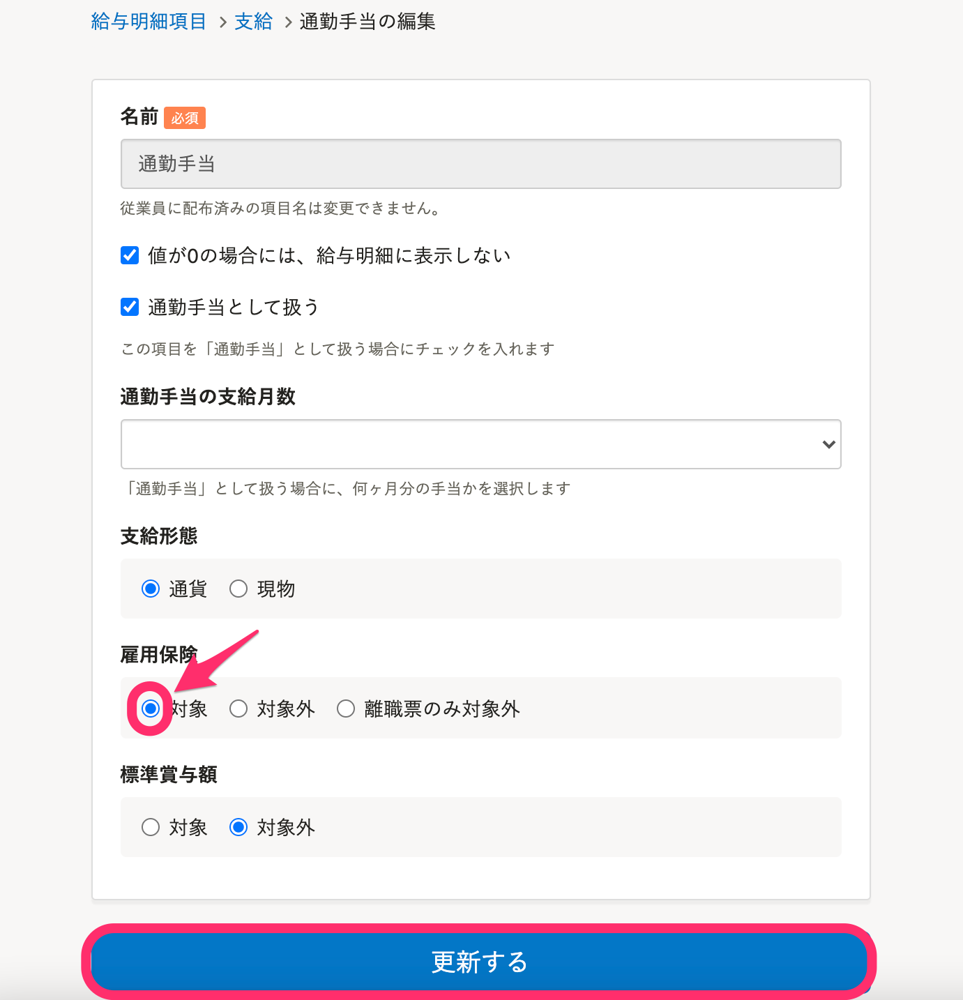
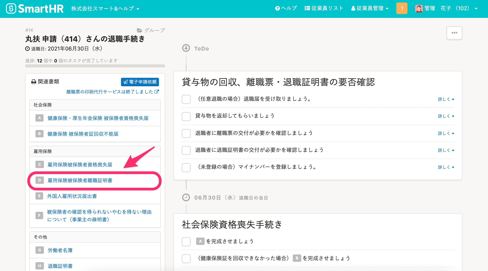
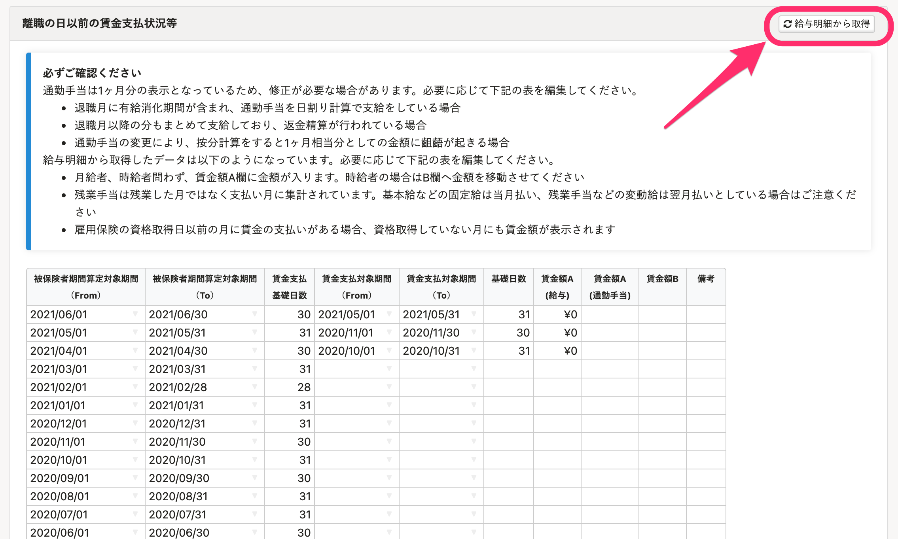
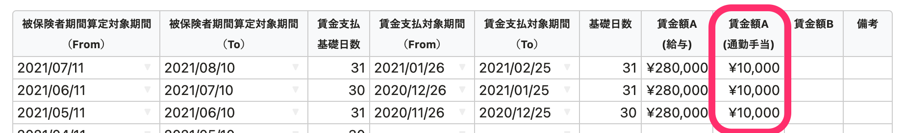
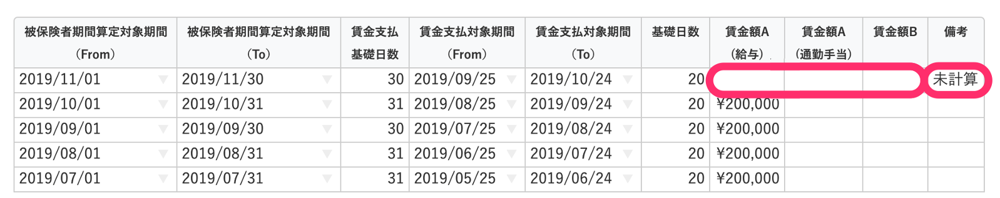

雇用保険被保険者離職証明書には、給与明細の項目編集画面で、雇用保険の対象とする設定をした項目の金額が反映されます。

# 1\. ［給与明細］をクリック

トップページ左側にある **［給与明細］** をクリックします。

# 2\. ［こちら］をクリック

給与明細一覧の上にある **［給与明細項目は こちら から編集できます］** の文章内の **［こちら］** をクリックすると、給与明細項目の設定画面が表示されます。

# 3\. 給与明細項目の［...］メニュー >［編集する］をクリック

支給欄にある項目の **［...］メニュー**  > **［編集する］** をクリックすると、項目の編集画面が表示されます。

# 4\. ［雇用保険］の［対象］を選択

 **［雇用保険］** の **［対象］** にチェックを入れ、 **［更新する］** をクリックすると設定できます。

:::alert
 **［対象外］［離職票のみ対象外］** に設定した項目は、雇用保険被保険者離職証明書に反映されません。
:::

# 5\. 該当従業員の退職手続きを開く

SmartHRのトップページへ戻り、該当従業員の退職手続き画面にある **［関連書類］** **\>** **［雇用保険被保険者離職証明書］** をクリックすると、「雇用保険被保険者離職証明書」が表示されます。

# 6\. ［編集］をクリック

画面上部にある **［編集］** をクリックし、「雇用保険被保険者離職証明書」の編集画面を開きます。

# 7\. ［給与明細から取得］をクリック

 **［離職の日以前の賃金支払状況等］** の右にある **［給与明細から取得］** をクリックすると、給与明細の金額が雇用保険被保険者離職証明書に反映されます。

# 注意点

## ［賃金額A（通勤手当）］に情報を反映する条件

 **［賃金額A（通勤手当）］** に情報を反映するには、直近25件の給与明細が下記をすべて満たしている必要があります。

- 給与締日がすべて同じ
- 給与明細が1ヶ月単位で発行されている
- 給与明細の対象期間に抜けている期間がない
- 給与明細の対象期間が重複していない

また、離職月の賃金計算が終わっていない場合は、［賃金額A・B］は空欄（電子申請の場合は「0」）にし、備考欄に「未計算」と記入できます。

