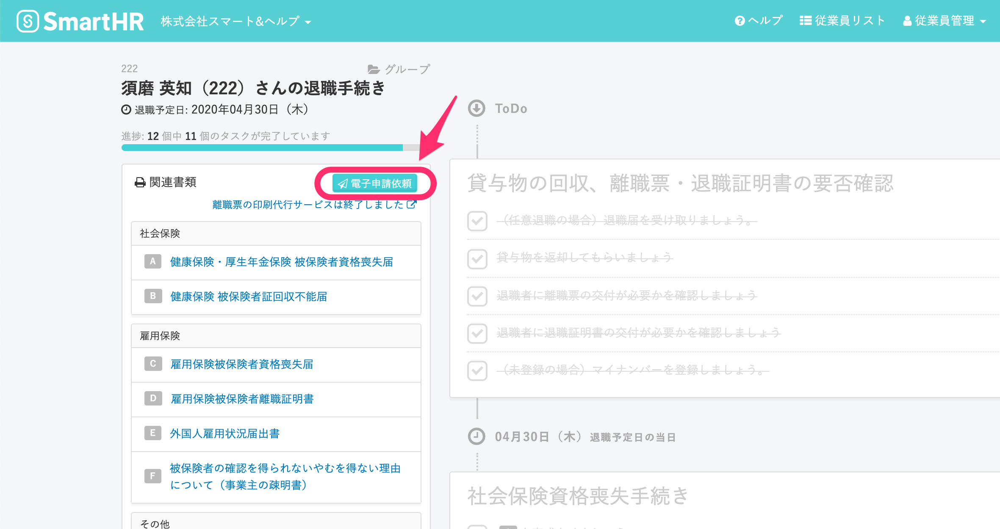

すでにSmartHR上で退職処理を行い、ハローワークにも喪失届を提出済みの元従業員に、後から離職票発行の請求をされた場合は、次のように対応してください。

# 退職手続きを電子申請で行なった場合

電子申請にて退職の手続きを行なった場合は、SmartHRで離職票交付の申請が可能です。

## 1\. \[電子申請依頼\] をクリック

当該の従業員の退職手続き画面を開き、左上にある **\[電子申請依頼\]** をクリックすると、モーダルが表示されます。

## 2\. \[雇用保険被保険者資格喪失届提出後の離職票交付の申請\] をクリック

**\[電子申請\]** ボタンを押すと表示される選択肢にある、**\[雇用保険被保険者資格喪失届後の離職票交付の申請\]** をクリックしてください。

雇用保険被保険者資格喪失届提出後の離職票交付の電子申請が可能です。

# 退職手続きを紙で行なった場合

退職手続きを郵送または窓口で行なった場合、ハローワークの窓口で離職票交付の申請をしてください。

## 提出方法

管轄のハローワークの窓口に、持参または郵送にて提出をお願いします。

:::tips
雇用保険被保険者離職証明書（通称：離職票）を後日提出する手続きは、SmartHR では対応しておりません。
:::

## 必要な書類

- 雇用保険被保険者資格喪失確認通知書 （下記画面です）

※ 雇用保険被保険者資格喪失届の代わりとなります。

雇用保険被保険者離職証明書（通称：離職票）

- 賃金台帳（※離職票に記載されている期間分）
- 出勤簿（※離職票に記載されている期間分）
- 退職理由が分かるもの（例：退職届、雇用契約書など）

:::tips
雇用保険被保険者離職証明書（通称：離職票）については、SmartHRで作成した手続きが既に生成されている場合は、そちらをご活用いただけます。
:::
