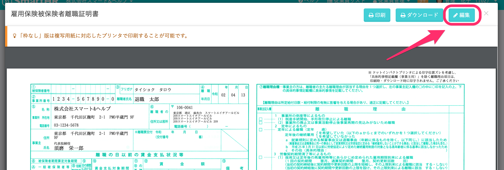
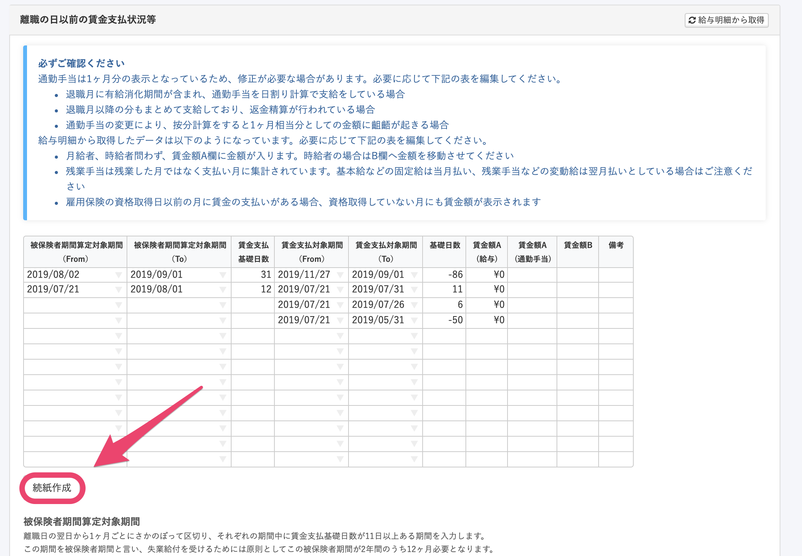
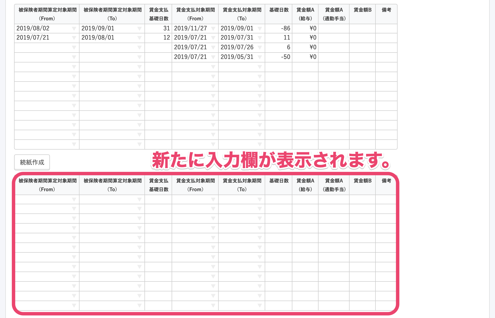
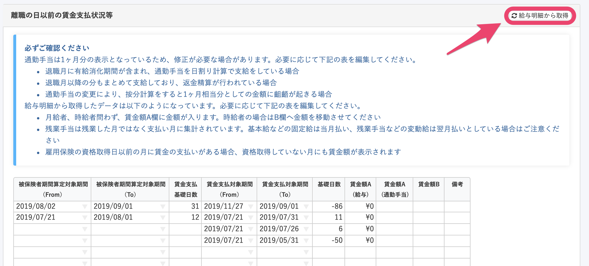
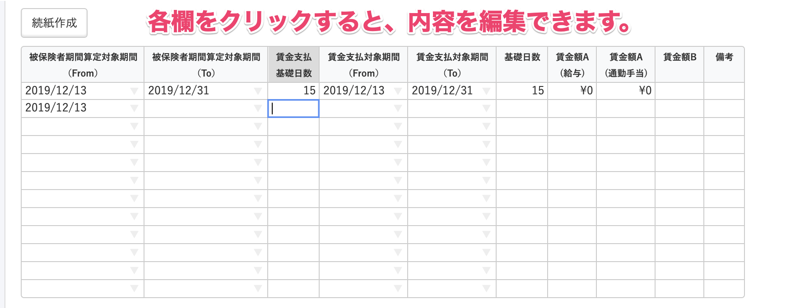
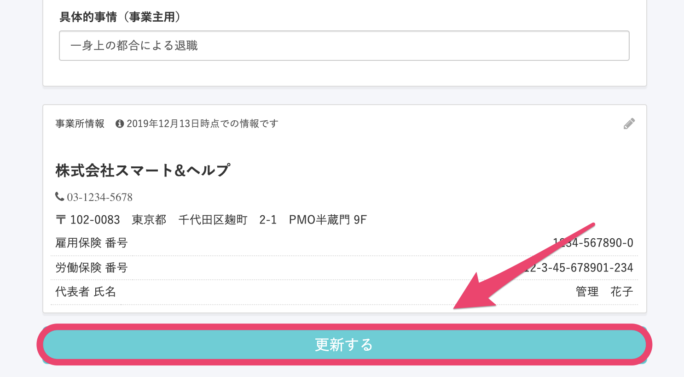

離職証明書の続紙が必要な場合、書類の編集をすることでご対応いただけます。

# 1\. \[雇用保険被保険者離職証明書\] のプレビュー画面にある \[編集\] をクリック

作成した退職手続きの **\[関連書類\]** にある、 **\[雇用保険被保険者離職証明書\]** をクリックして、雇用保険被保険者離職証明書のプレビュー画面を開きます。

次に、プレビュー画面の右上にある **\[編集\]** をクリックして、編集画面に移動してください。

# 2\. \[続紙作成\] をクリック

書類の編集ページの **\[離職の日以前の賃金支払状況等\]** にある **\[続紙作成\]** をクリックすると、続紙部分の入力欄が表示されます。

# 3\. \[給与明細から取得\] をクリック

続紙用入力欄表示後、**\[離職の日以前の賃金支払状況等\]** 欄の右上にある **\[給与明細から取得\]** をクリックすると、登録済みの給与明細データが反映されます。

表の各欄をクリックすると、内容を編集できます。

必要に応じて、修正してください。

# 4\. 書類の情報を更新

編集後、編集画面最下部にある **\[更新する\]** をクリックすると、編集内容が保存され、書類に反映されます。

