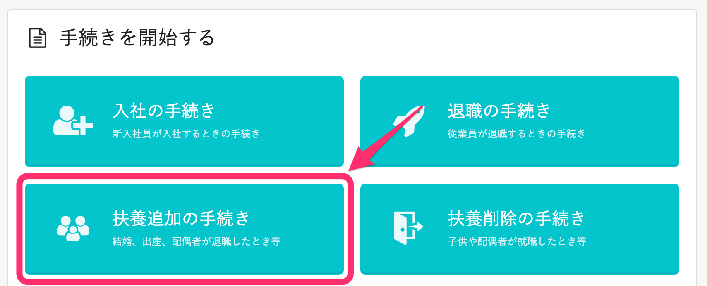
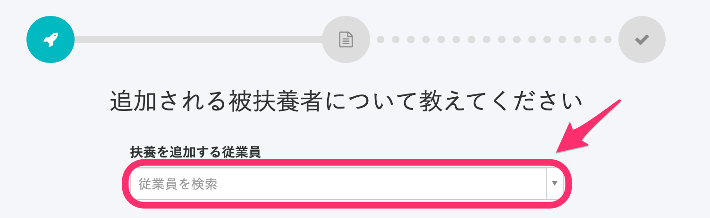
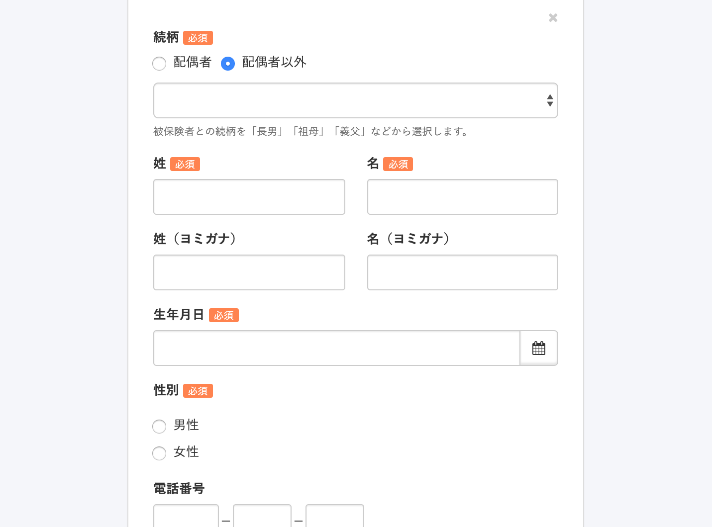
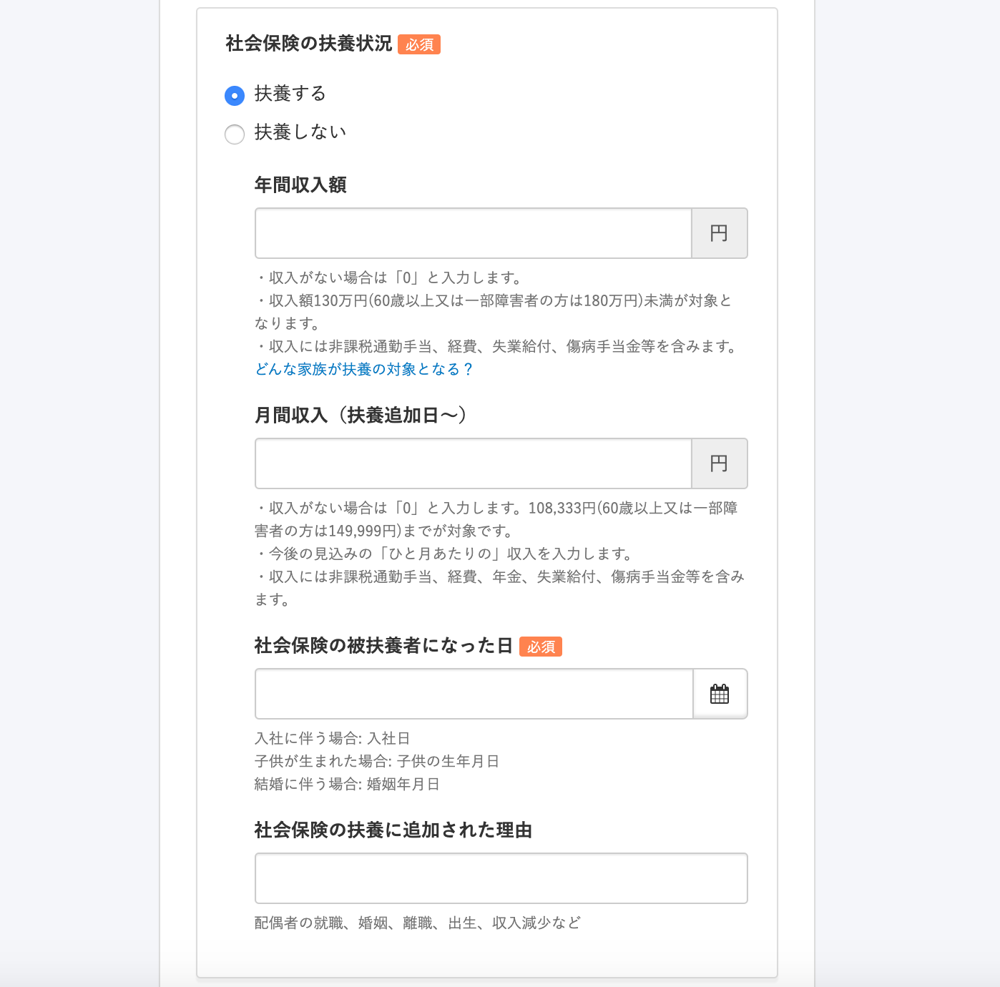
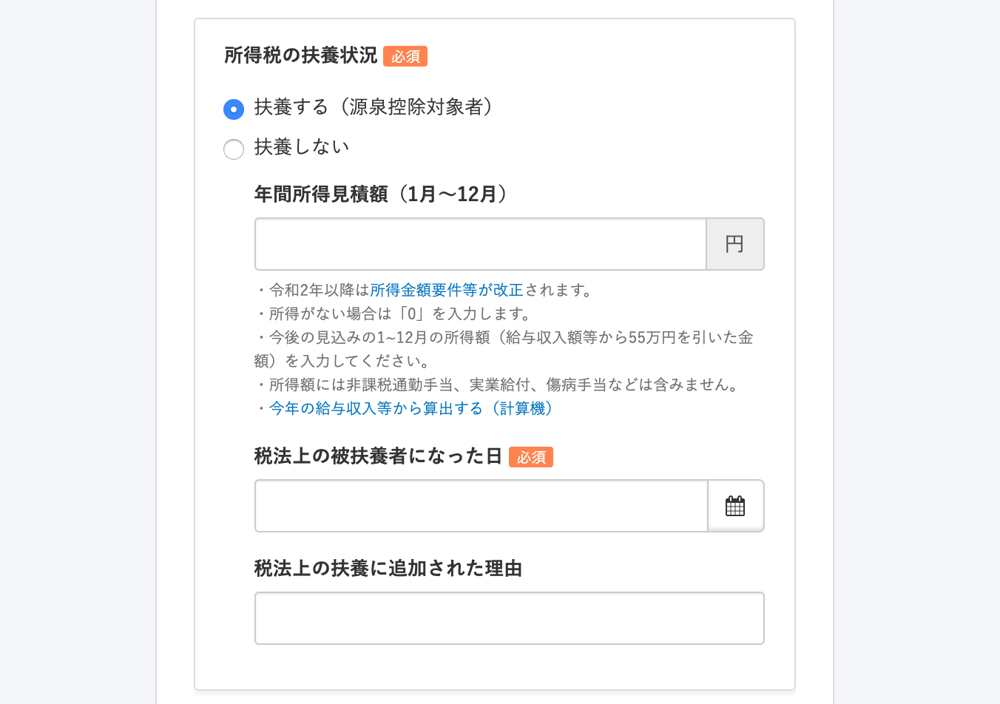
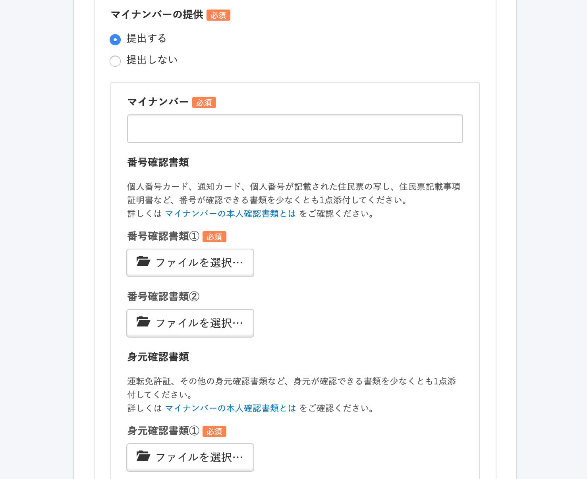
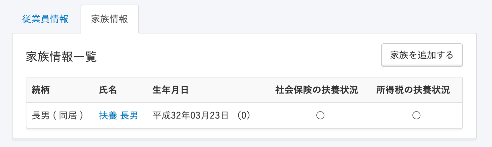
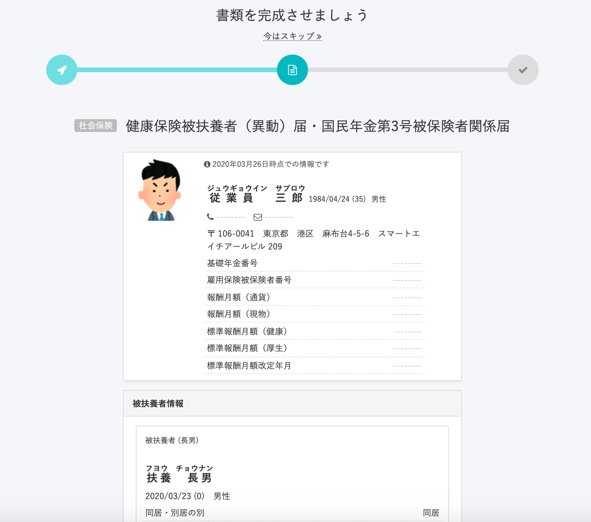
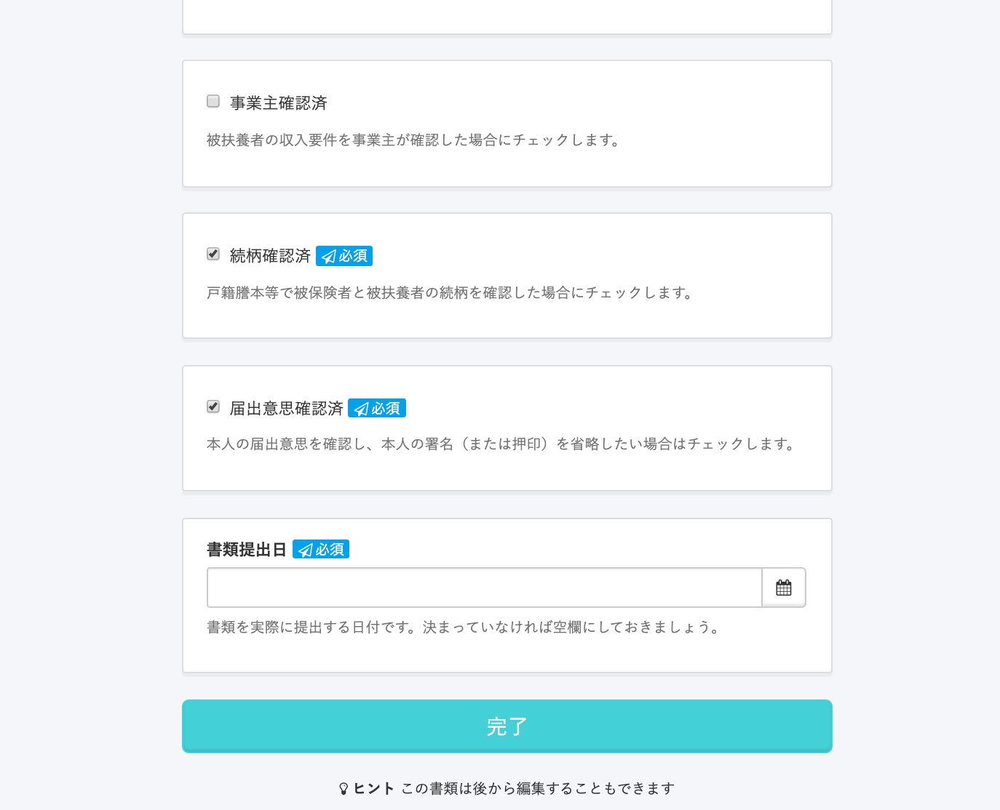
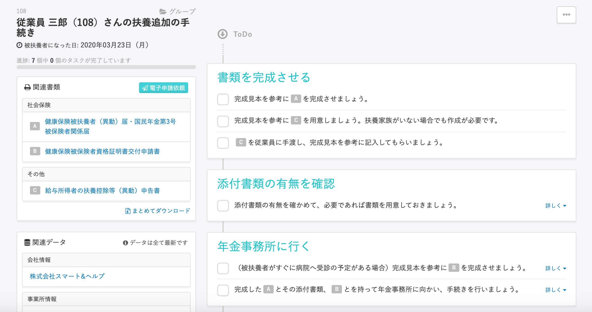

トップページの **［扶養追加の手続き］** から、従業員の扶養追加手続きを作成できます。

このページでは「協会けんぽ」の場合を例に、管理者が扶養追加の手続きをする流れを説明します。

従業員から手続きを申請する場合は、下記のページをご覧ください。

[従業員から扶養追加の手続きを申請する](https://knowledge.smarthr.jp/hc/ja/articles/360026262113)

:::tips
**控除対象でない扶養家族**も、扶養追加の手続きをしてください。
[Q.「控除対象でない16歳未満の扶養家族」も、扶養家族として登録すべきですか？](https://knowledge.smarthr.jp/hc/ja/articles/4412123017369)
:::

# 1\. トップページの［扶養追加の手続き］をクリック

トップページにある **［扶養追加の手続き］** をクリックすると、手続きが開始されます。

# 2\. ［扶養を追加する従業員］を選択

 **［扶養を追加する従業員］** をプルダウンメニューから選択すると、追加される被扶養者の情報の入力欄が表示されます。

# 3\. ［被扶養者情報］を入力

続柄や姓名、生年月日や、「社会保険の扶養にするか」「所得税の扶養にするか」などの情報を入力できます。

:::tips
ここで入力した被扶養者の情報は、従業員情報にある **［家族情報］** にも反映されます。

:::

# 4\. 健康保険被扶養者（異動）届・国民年金第3号被保険者関係届に関する情報を入力

扶養に追加された理由などを入力します。

この画面はスキップして、後から入力することもできます。

# 5\. 作成された書類やToDoリストを確認する

ここまで進めると、書類が作成されます。

書類は画面左側の「関連書類」の欄の書類名をクリックすると、プレビューや編集が可能です。

作成された手続きは、トップページの **［手続きToDo一覧］** からいつでも確認できます。

トップページに表示されていない場合は、右下の **［一覧を見る］** から確認できます。
