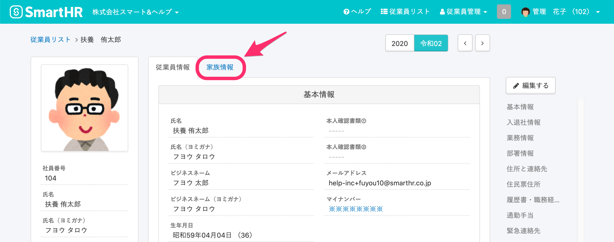
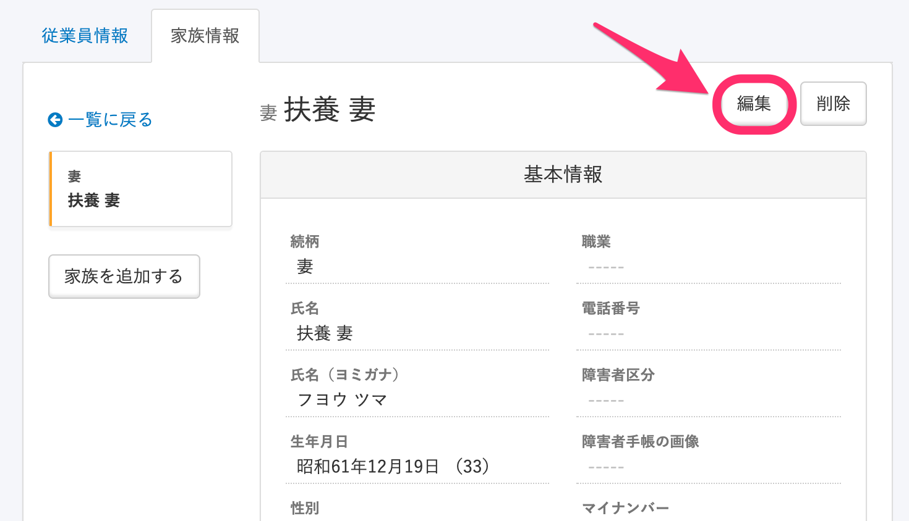
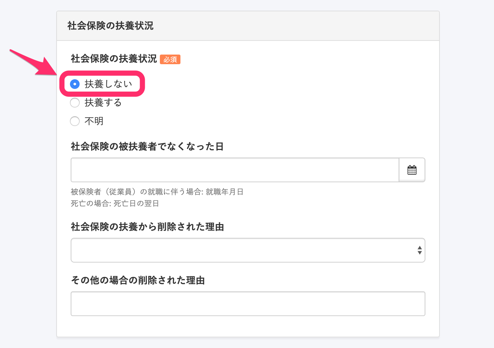
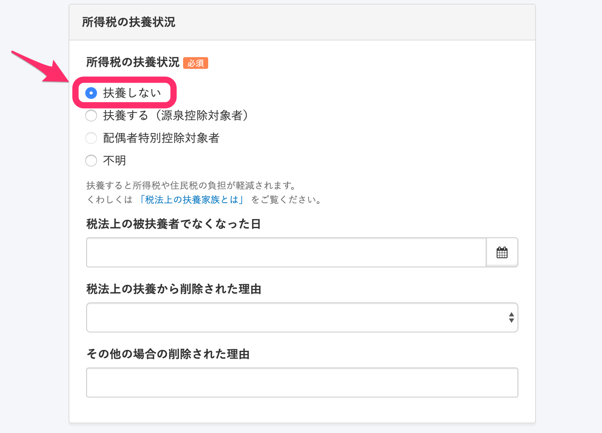
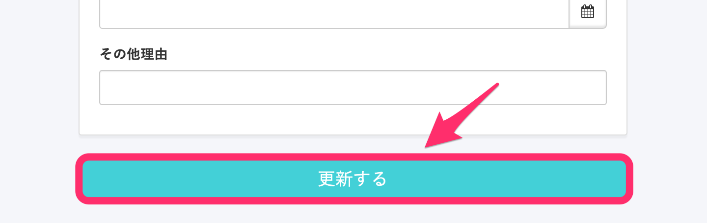
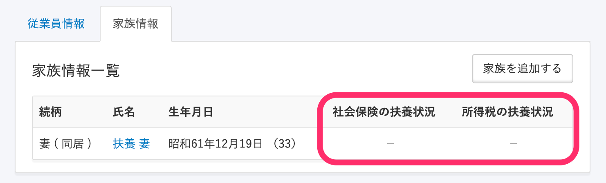
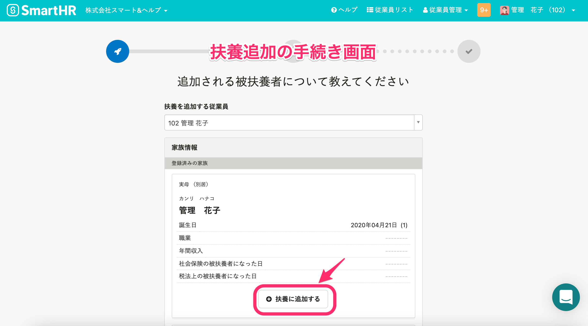

家族情報の **［社会保険の扶養状況］** や **［**  **所得税の扶養状況］** に **［**  **扶養する］** と登録した家族の「扶養追加の手続き」を作成する場合、家族情報を編集し、一旦 **［**  **扶養しない］** として登録する必要があります。

:::alert
収入や見積額、扶養になった日などの情報を登録している場合、 **［**  **扶養する］** から **［**  **扶養しない］** に更新した時点で、扶養に関する情報が削除されます。
手続き作成時に扶養状況を再度入力する必要がありますので、操作の前に登録済みの情報をメモに残すなどバックアップを取っていただき、そのあと、 **［扶養しない］** に変更してください。
:::

# 1\. 従業員情報ページにある［家族情報］のタブをクリック

 **［従業員情報］** タブの横にある **［**  **家族情報］** のタブをクリックすると、従業員に紐付いた家族情報が表示されます。

# 2\. 画面右上の［編集］をクリック

家族情報の詳細画面右上にある **［**  **編集］** をクリックすると、編集画面に移動できます。

# 3\. ［扶養しない］にチェックを入れて［更新する］をクリック

 **［社会保険の扶養状況］** と **［**  **所得税の扶養状況］** の **［**  **扶養状況］** を **［**  **扶養しない］** に変更し、 **［**  **更新する］** をクリックすると、変更内容が保存されます。

 **［家族情報一覧］** にて **［**  **社会保険の扶養状況］** と **［**  **所得税の扶養状況］** ともに **［**  **−］** （扶養なし）となっていることを確認できます。

# 4\. 扶養追加の手続きをする

 **［扶養状況］** が **［**  **扶養しない］** に設定された状態で **［**  **扶養追加の手続き］** を行なうと、 **［**  **登録済みの家族］** の家族情報の下に、 **［**  **扶養に追加する］** が表示され、手続きを作成できます。

扶養追加の手続きについて詳しくは、下記のページをご覧ください。

[扶養追加の手続きをする](https://knowledge.smarthr.jp/hc/ja/articles/360026262033)
