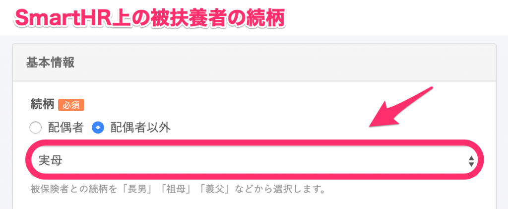
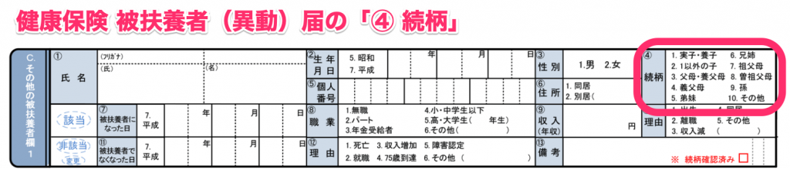

健康保険 被扶養者（異動）届の「**④ 続柄**」の情報は、SmartHR上の被扶養者の **家族情報** に登録されている **\[続柄\]** の登録情報を参照しています。

ここでは、家族情報に入力済みの内容と帳票上の対応表を紹介します。

# 家族情報画面と帳票画面

# 対応表

| 家族情報の \[続柄\] | 健康保険 被扶養者（異動）届の「続柄」区分 |
| --- | --- |
| 実子, 養子, 長男, 長女, 二男, 二女, 三男, 三女, 四男, 四女, 五男, 五女 | 1.実子・養子 |
| その他の子 | 2.1以外の子 |
| 実母, 実父, 養母, 養父, 父, 母 | 3.父母・養父母 |
| 義母, 義父 | 4.義父母 |
| 弟, 妹 | 5.弟妹 |
| 兄, 姉 | 6.兄姉 |
| 祖父, 祖母 | 7.祖父母 |
| 曽祖父, 曾祖母 | 8.曾祖父母 |
| 孫 | 9.孫 |
| 上記以外の続柄が入力された場合 | 10.その他 |
