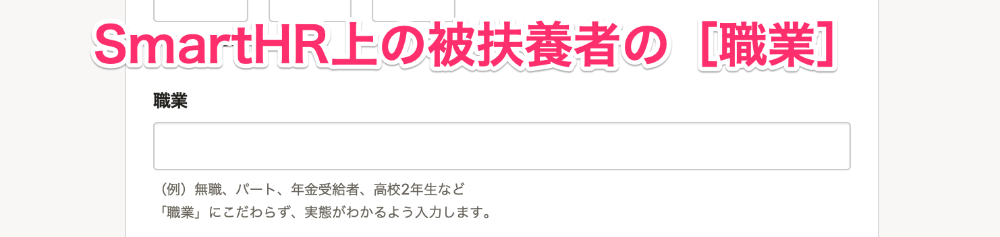
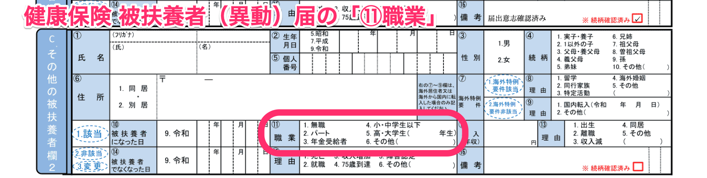

健康保険 被扶養者（異動）届の「⑪ **職業**」の情報は、SmartHR上の被扶養者の **家族情報** に登録されている **［職業］** の登録情報を参照しています。

ここでは、家族情報に入力済みの内容と帳票上の対応表を紹介します。

# 家族情報画面と帳票画面

例えば、SmartHRで **［職業］** に「小学生」と入力すると、「⑪ 職業」の「4. 小・中学生以下」に◯がつきます。

:::tips
関東ITソフトウェア健保に加入されている場合、 **［職業］** に入力された内容が「健康保険 被扶養者（異動）届」の職業欄にそのまま表示されます。
:::

# 対応表

| SmartHRの **［家族情報］** \> **［職業］** に入力した内容 | 健康保険 被扶養者（異動）届の「⑪ 職業」 |
| --- | --- |
| 無職 | 1\. 無職 |
| パート, アルバイト | 2\. パート |
| 年金受給者 | 3\. 年金受給者 |
|   乳児, 幼児 小学生, 小学◇年生 中学生, 中学◇年生 （◇は、全角数字 / 半角数字 / 漢数字 のいずれか）   | 4\. 小・中学生以下 |
|   高校生, 高校◇年生 大学生, 大学◇年生 （◇は、全角数字 / 半角数字 / 漢数字 のいずれか）   | 5\. 高・大学生 |
|   上記以外   | 6\. その他 |
