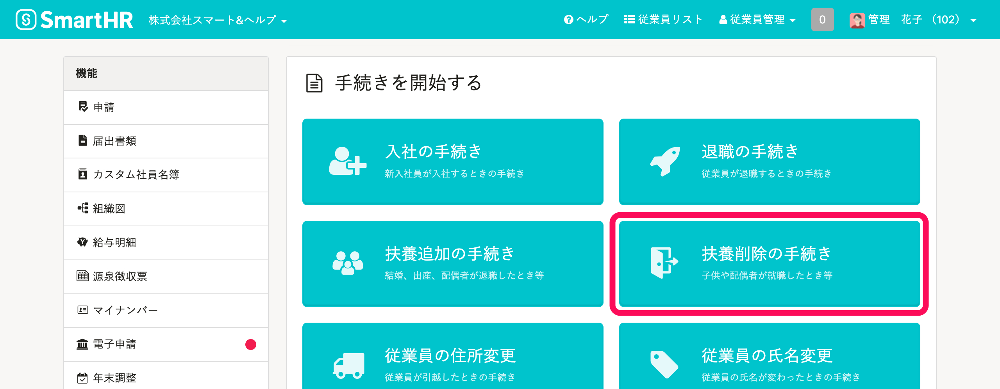

トップページの **［扶養削除の手続き］** から、従業員の扶養削除手続きを作成できます。

このページでは「協会けんぽ」の場合を例に、管理者が扶養削除の手続きをする流れを説明します。

:::tips
協会けんぽの場合、扶養削除時も電子申請ができるようになりました（2022/2/28より）。
操作方法は下記のヘルプページを参照してください。
[被扶養者がいる場合の電子申請の方法は？](https://knowledge.smarthr.jp/hc/ja/articles/360026264753)
:::

# 1\. トップページの［扶養削除の手続き］をクリック

トップページにある **［扶養削除の手続き］** をクリックすると、手続きが開始されます。

# 2.［扶養を削除する従業員］を選択

プルダウンメニューから **［扶養を削除する従業員］** を選択すると、削除される被扶養者の情報の入力欄が表示されます。

# 3\. 削除される被扶養者の情報を入力

削除される被扶養者を選択し、「社会保険の被扶養者から削除するか」「税法上の扶養から削除するか」などを入力します。

# 4\. 健康保険被扶養者（異動）届及び国民年金第3号被保険者にかかる届書に関する情報を入力

扶養から削除された理由などを入力します。

この画面はスキップして、後から入力することもできます。

# 5\. 作成された書類やToDoリストを確認する

ここまで進めると、書類が作成されます。

書類は画面左側の「関連書類」の欄の書類名をクリックすると、プレビューや編集が可能です。

作成された手続きは、トップページの **［手続きToDo一覧］** からいつでも確認できます。

トップページに表示されていない場合は、右下の **［一覧を見る］** から確認できます。

:::alert
扶養削除の手続きをしても家族情報とマイナンバーは保持されます。
:::

マイナンバーの削除については、下記ページをご覧ください。

:::related
[マイナンバーを削除する](https://knowledge.smarthr.jp/hc/ja/articles/360054037573)
:::
