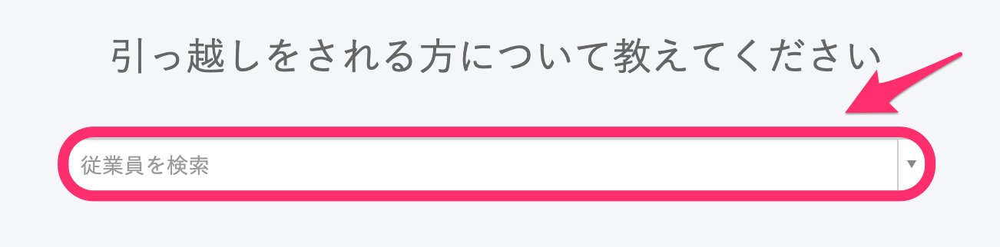

トップページの **［従業員の住所変更］** から、従業員の住所変更手続きを作成できます。

このページでは「協会けんぽ」の場合を例に、管理者が従業員の住所変更手続きをする流れを説明します。

## 1\. トップページの［従業員の住所変更］をクリック

## 2\. 住所変更をする従業員を選択

従業員を選択すると、 **［住所変更手続きを開始する］** が表示されるので、クリックをして、次に進みます。

## 3\. 引越し日や変更後の住所、通勤手当を入力

## 4\. 健康保険・厚生年金保険 被保険者住所変更届に関する情報を入力

「被保険者 住所変更年月日」など、必要な情報を入力します。

この画面はスキップして、後から編集もできます。

## 5\. 作成された書類やToDoリストを確認する

ここまで進めると、書類が作成されます。

書類は画面左側の「関連書類」の欄の書類名をクリックすると、プレビューや編集が可能です。

作成された手続きは、トップページの **［手続きToDo一覧］** からいつでも確認できます。

トップページに表示されていない場合は、右下の **［一覧を見る］** から確認できます。
