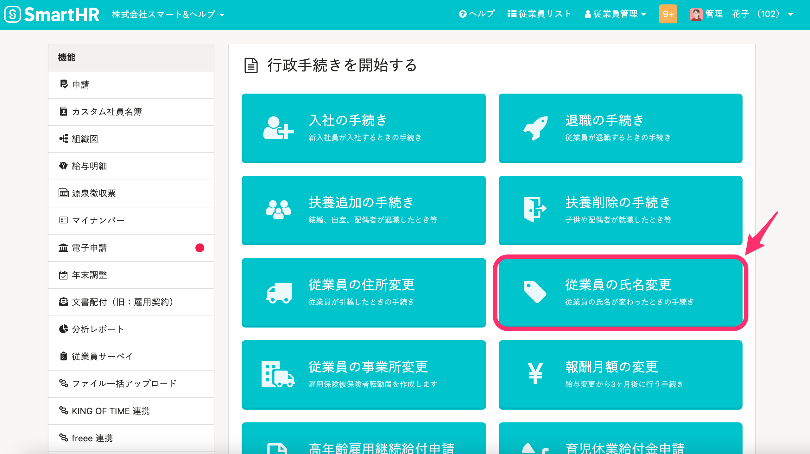
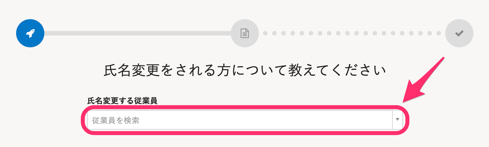
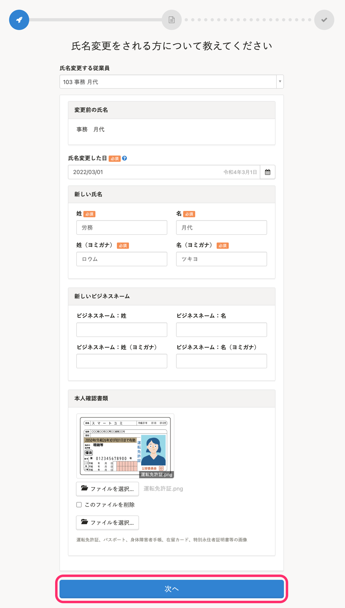
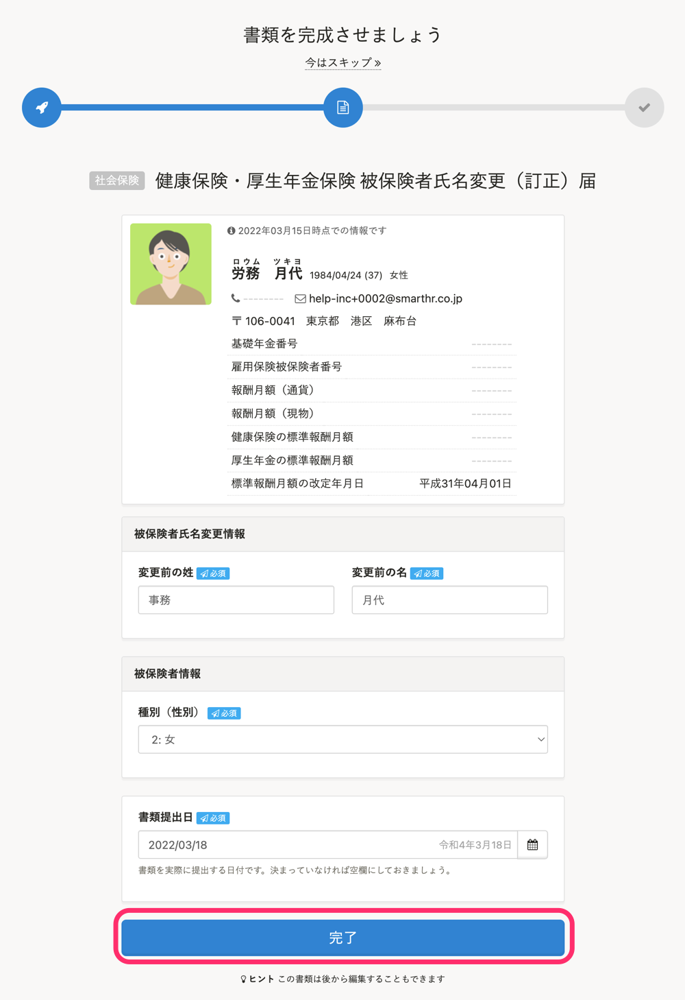
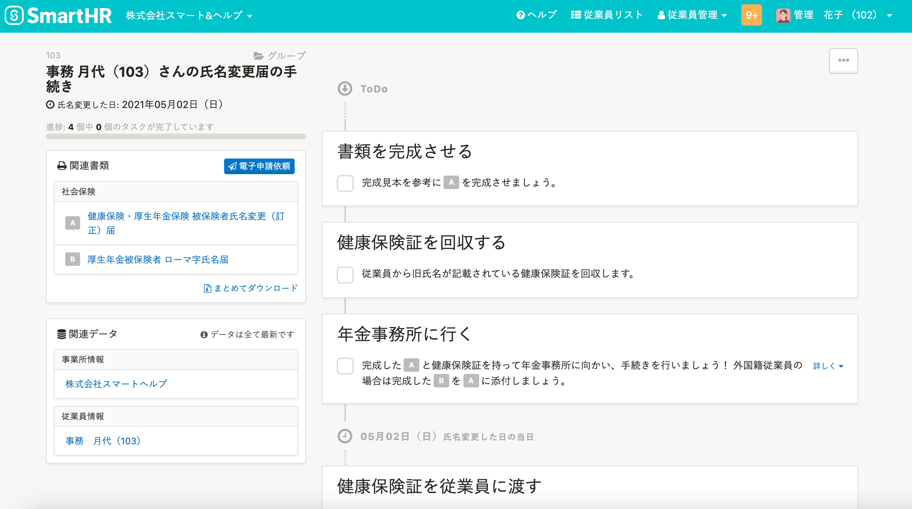

トップページにある **［従業員の氏名変更］** から、従業員の氏名変更手続きを作成できます。

このページでは「協会けんぽ」の場合を例に、管理者が従業員の氏名変更手続きをする流れを説明します。

# 作成手順

## 1\. トップページの［従業員の氏名変更］をクリック

トップページにある **［従業員の氏名変更］** をクリックすると、氏名を変更する従業員を選ぶ画面に移動します。

## 2\. ［氏名変更をする従業員］を選択

 **［氏名変更する従業員］** を選択すると、入力フォームが表示されます。

## 3\. 新しい氏名など情報を入力し、［次へ］をクリック

氏名を変更した日や新しい氏名を入力し **［**  **次へ］** をクリックすると、従業員情報が更新されます。

## 4\. 社会保険：健康保険・厚生年金保険 被保険者氏名変更（訂正）届に関する情報を入力し、［完了］をクリック

必要な情報を入力し、 **［完了］** をクリックします。

この画面はスキップして、後から編集もできます。

## 5\. 作成された書類やToDoリストを確認

画面左側にある **［関連書類］** 欄にて、作成された書類を確認できます。

 **［関連書類］** 欄の書類名をクリックすると、書類のプレビューや編集ができます。

作成された手続きは、トップページの **［手続きToDo一覧］** からいつでも確認できます。

トップページに表示されていない場合は、右下の **［一覧を見る］** から確認できます。
