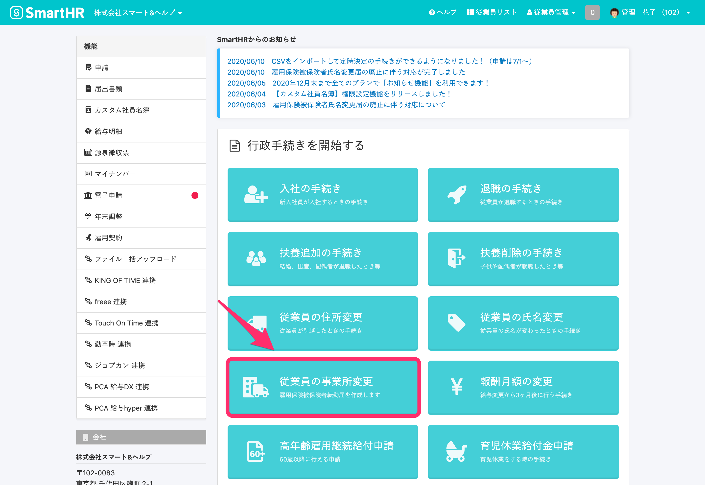
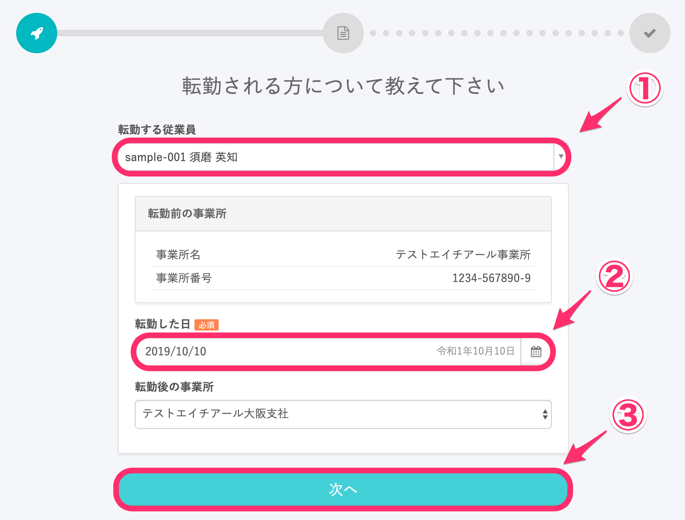
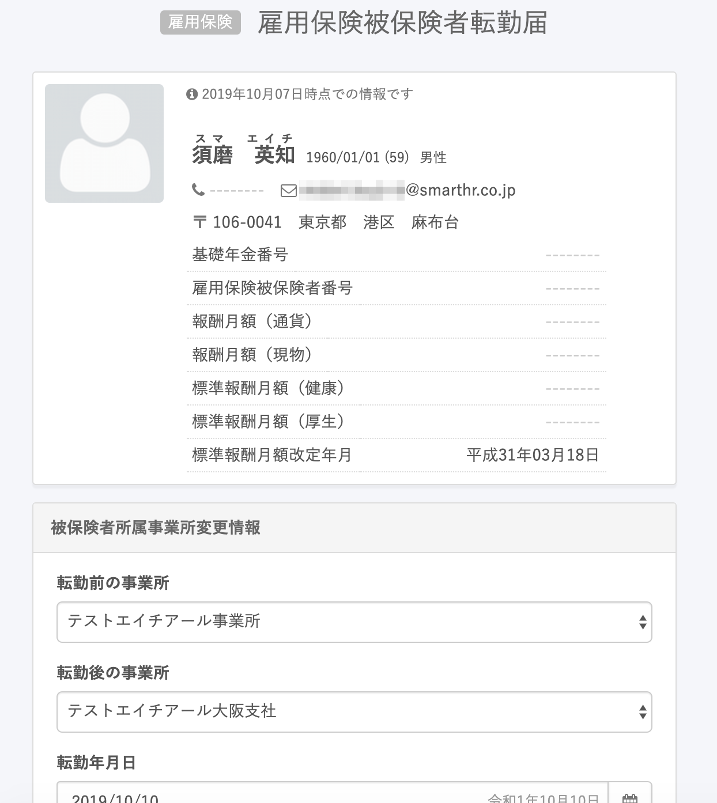
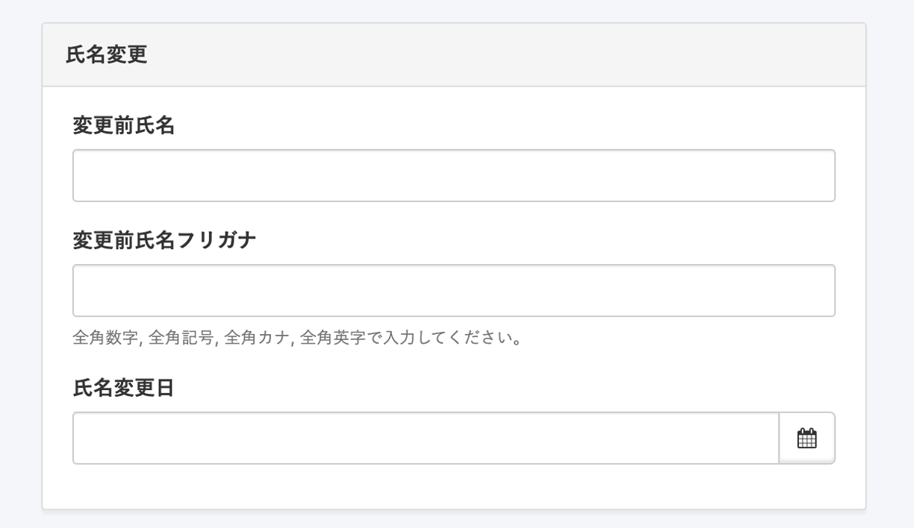
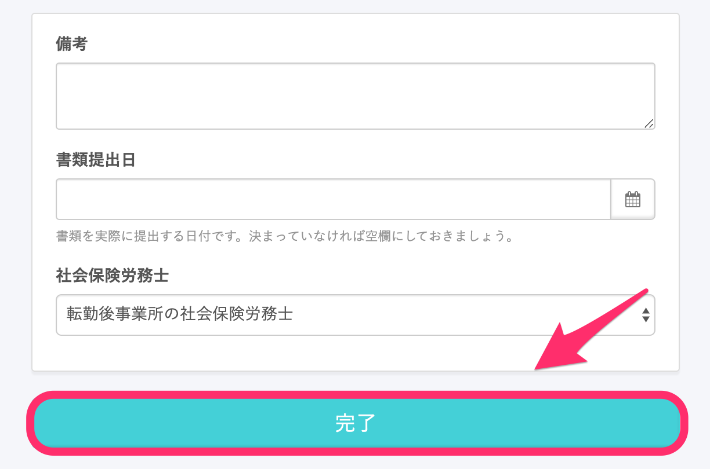
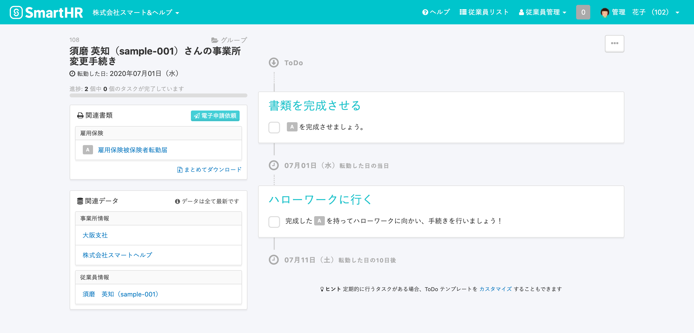

トップページにある **［従業員の事業所変更］** から、従業員の雇用保険被保険者転勤届を作成できます。

# 作成手順

## 1\. トップページの［従業員の事業所変更］をクリック

トップページにある **［従業員の事業所変更］** をクリックすると、転勤する従業員を選ぶ画面に移動します。

## 2\. ［転勤する従業員］と［転勤した日］を入力して［次へ］をクリック

 **［転勤する従業員］** を選択し、 **［転勤した日］** を入力して **［次へ］** をクリックすると、雇用保険被保険者転勤届の入力フォームに移動します。

## 3\. 雇用保険被保険者転勤届に関する情報を入力し、［完了］をクリック

転勤前の事業所・転勤後の事業所など、雇用保険被保険者転勤届に関する情報を入力します。

この画面はスキップして、後から入力することもできます。

氏名が変わっている場合は、 **［氏名変更］** の項目にて変更前の氏名・氏名フリガナ、氏名変更日を入力します。

画面最下部にある **［完了］** をクリックすると、ToDoリスト画面に移動します。

## 4\. 作成された書類やToDoリストを確認

画面左側にある **［関連書類］** 欄にて、作成された書類を確認できます。

 **［関連書類］** 欄の書類名をクリックすると、書類のプレビューや編集ができます。

作成された手続きは、トップページの **［手続きToDo一覧］** からいつでも確認できます。

トップページに表示されていない場合は、右下の **［一覧を見る］** から確認できます。
