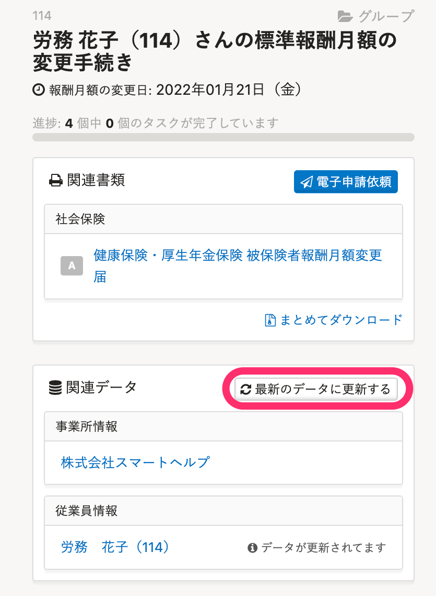

# A. はい、修正できます。各項目の修正方法は以下を参照してください

## ［④改定年月］を修正したい場合

 **［④改定年月］** は、手続き作成時の **［報酬月額の変更日］** に入力した月を起算月として、4ヶ月目の月が自動入力されます。

#### **修正方法**

従業員情報の **［社会保険］＞［標準報酬月額の改定年月日］** を正しい情報に更新し、 **［最新のデータに更新する］** をクリックすると書類に反映されます。

:::tips
手続きToDo画面に表示される日付は変更されないため、修正したい場合は手続きを作成し直してください。
[Q. 手続きTodo画面の日付は変更できますか？](https://knowledge.smarthr.jp/hc/ja/articles/4754141579289)

:::

## ［⑥従前改定月］を修正したい場合

#### **修正方法**

［**⑥従前改定月**］は、「健康保険・厚生年金保険 被保険者報酬月額変更届」の **［編集］** をクリックすると表示される **［健康保険・厚生年金保険 被保険者報酬月額変更届の編集］** から修正できます。

 **［標準報酬月額］>［改定年月日］** を修正し、画面下にある **［更新する］** をクリックすると書類に反映されます。

 

:::related
[報酬月額の変更手続き（報酬月額変更届）を作成する](https://knowledge.smarthr.jp/hc/ja/articles/360039512254)
:::

## ［⑦昇（降）給］の［昇給］［降給］の区分を修正したい場合

 **［⑦昇（降）給］** の **［昇給］［降給］** の区分は、手続き作成時に入力した **［変更後の報酬月額］** と、変更前の報酬月額（従業員情報の **［給与］** 項目に登録されている情報）を比較して、昇給か降給かを自動判定し入力されます。

### 例1：変更前の報酬月額（＝あらかじめ従業員情報に登録してあった報酬月額）が間違っていた場合

#### **内容**

本来30万円だった報酬月額を誤って20万円で登録。手続き作成時に変更後の26万円を入力したところ、本来降給であるはずが昇給と判定された。

#### **修正方法**

 **「健康保険・厚生年金保険 被保険者報酬月額変更届」** の **［編集］** をクリックすると表示される **［健康保険・厚生年金保険 被保険者報酬月額変更届の編集］** から修正できます。

 **［変更前（従前）の報酬月額］** を修正し、画面下にある **［更新する］** をクリックすると書類に反映されます。

### 例2：変更後の報酬月額（＝手続き作成時に入力した新しい報酬月額）が間違っていた場合

#### **内容**

報酬月額を20万円で登録。手続き作成時に、変更後の26万円を誤って16万円で入力。本来昇給であるはずが降給と判定された。

#### **修正方法**

従業員情報の **［給与］＞［報酬月額（通貨）］［報酬月額（現物）］** を正しい情報に更新し、 **［最新のデータに更新する］** をクリックすると書類に反映されます。

:::related
[書類作成後に変更した情報を、作成済みの書類に反映する](https://knowledge.smarthr.jp/hc/ja/articles/360026106774)
:::

## ［⑦昇（降）給］の月を修正したい場合

 **［⑦昇（降）給］** の月は、手続き作成時の **［報酬月額の変更日］** に入力した月が自動入力されます。

#### **修正方法**

[作成した手続きを削除](https://knowledge.smarthr.jp/hc/ja/articles/360026107254)し、新しく作成し直す必要があります。

ただし、一度 **［報酬月額の変更］** 手続きを作成すると、以下2つの従業員項目も新しい情報に更新されます。

-  **［社会保険］>［標準報酬月額の改定年月日］** 
-  **［給与］>［報酬月額（通貨/現物）］** 

そのため、下記いずれかの手順で手続きを作成し直してください。

- 事前に、従業員情報の **［社会保険］>**  **［標準報酬月額の改定年月日］** と **［給与］>［報酬月額（通貨/現物）］** の項目を正しい内容に修正した上で、新しい書類を作成し直す。
- 新しく**作成し直した後**に、本ヘルプページの手順で **［⑥従前改定月］** と **［⑦昇（降）給］** の **［昇給］［降給］** 区分を正しい内容に修正する。
