報酬月額の変更手続き（報酬月額変更届）は、CSVファイルをインポートして一括で改定を行う方法と、個別に改定を行う方法があります。

:::tips
報酬月額の変更手続き（被保険者報酬月額変更届）の概要・対象となる人については、下記ページをご覧ください。
[随時改定（月額変更届）｜日本年金機構](https://www.nenkin.go.jp/service/kounen/hokenryo/hoshu/20150515-02.html)
:::

# CSVファイルをインポートして報酬月額変更届を作成する

:::alert
CSVファイルをインポートして手続きを作成した場合、「健康保険・厚生年金保険 被保険者報酬月額変更届」の書類が作成されないため、年金事務所への書類提出方法は電子申請のみとなります。
:::

## 定時決定の手続き（事業者情報・従業員情報の確認）

CSVファイルの取り込みを行う際、前提として、下記の情報が登録されている必要があります。

- （厚生年金）事業所整理記号
- 厚生年金の被保険者整理番号

:::related
[厚生年金保険 事業所整理記号とは](https://knowledge.smarthr.jp/hc/ja/articles/360026107874)
[厚生年金保険被保険者整理番号とは](https://knowledge.smarthr.jp/hc/ja/articles/360055331634)
[Q. CSV形式の算定基礎届や月額変更届（磁気媒体CSV）とは？](https://knowledge.smarthr.jp/hc/ja/articles/900005692823)
:::

## 1.［報酬月額の変更］をクリック

トップページにある **［報酬月額の変更］** をクリックすると、給与改定の対象者を選択する方法を指定する画面に移動します。

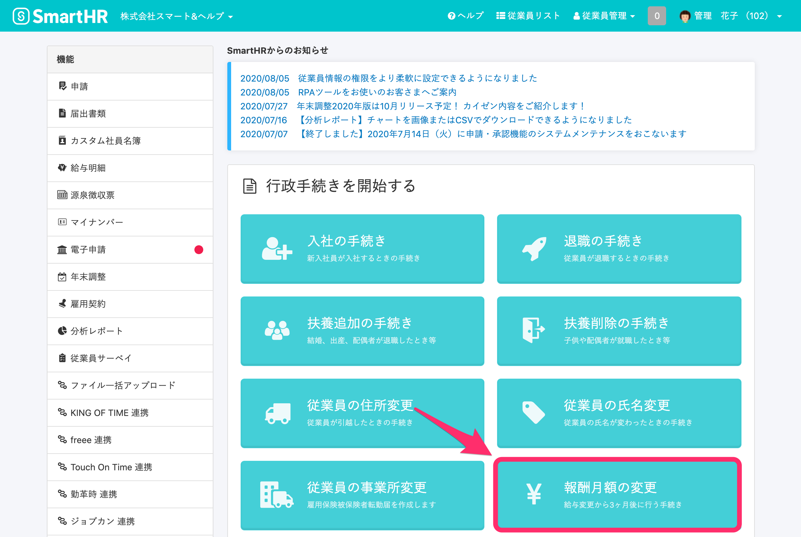

## 2.［磁気媒体CSVをインポート］をクリック

 **［磁気媒体CSVをインポート］** をクリックすると、CSVファイルのアップロード画面が表示されます。

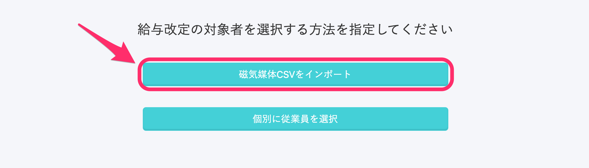

## 3\. 内容を確認し、すべてのチェックボックスにチェックを入れる

事業所が複数登録されている場合は、 **［事業所を選択］** が表示されます。

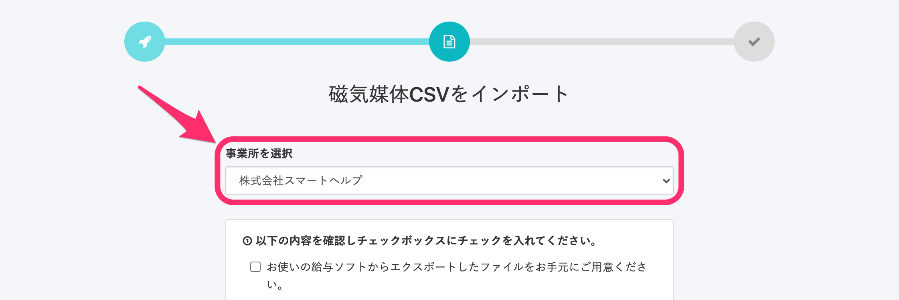

:::tips
複数の事業所がSmartHRに登録され、「（厚生年金）事業所整理番号」が同じ場合は、 **［すべての事業所］** も選択できます。
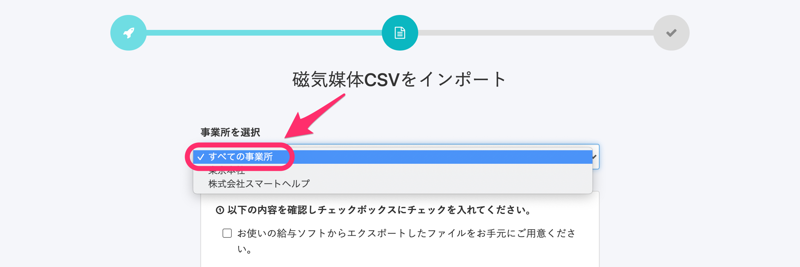
:::

**1\.** の内容を確認し、チェックボックスにチェックを入れてください。

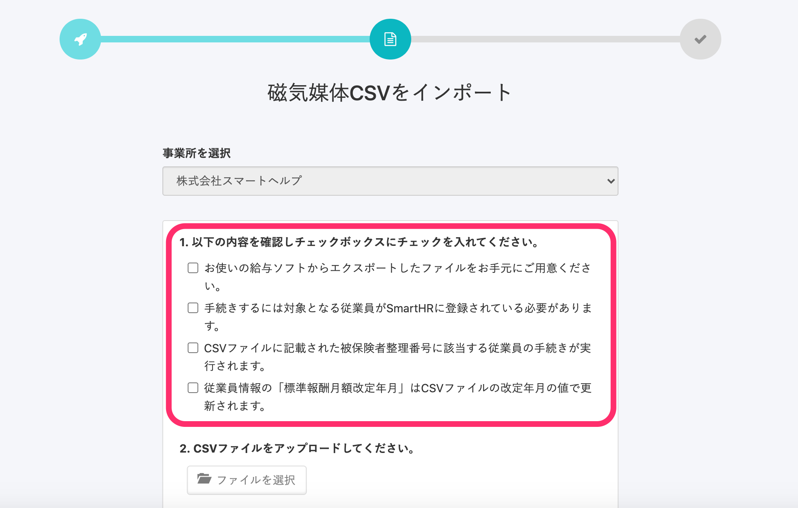

すべての項目にチェックを入れると、**2.** の **［ファイルを選択］** をクリックできるようになります。

## 4.［ファイルを選択］をクリックし、CSVファイルをアップロード

 **［ファイルを選択］** をクリックし、お持ちのCSVファイルを選択してください。

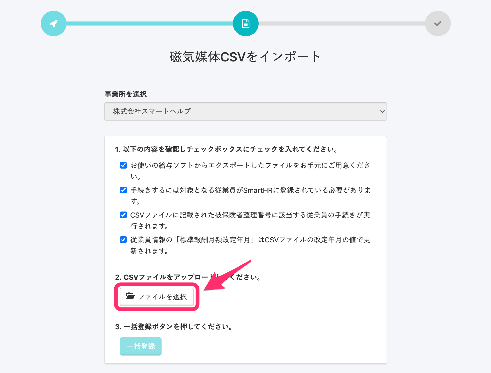

ファイルを選択すると、**3.** の **［一括登録］** をクリックできるようになります。

## 5.［一括登録］をクリック

画面下にある **［一括登録］** をクリックすると、データのインポート処理が開始されます。

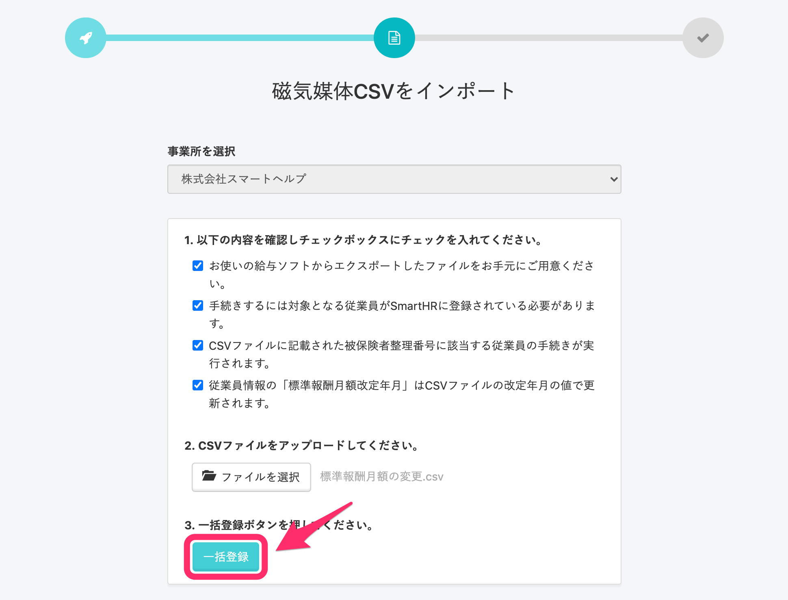

## 6\. バックグラウンド処理一覧を確認する

 **［報酬月額変更の手続き作成予約］** 画面に遷移し、以下のようなメッセージが表示されます。

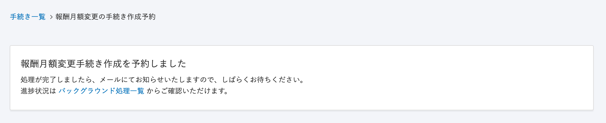

メッセージ内にある **［バックグラウンド処理一覧］** をクリックする、または  **画面右上のアイコン >［共通設定］>［バックグラウンド処理一覧］** の順にクリックして、アップロードの結果を確認してください。

アップロードが正常に行われると、報酬月額の変更手続き作成が完了し、バックグラウンド処理一覧の状態には **［完了］** が表示されます。

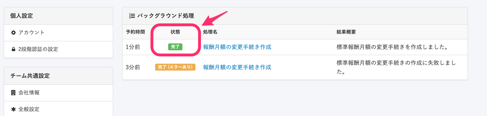

状態に **［完了（エラーあり）］** または **［失敗］** と表示されていた場合の対処法は、以下のページをご覧ください。

[エラーが出たり、処理に失敗した場合は？](https://knowledge.smarthr.jp/hc/ja/articles/360033711133)

# 個別に従業員を選択して報酬月額変更届を作成する

## 1.［報酬月額の変更］をクリック

トップページにある **［報酬月額の変更］** をクリックすると、給与改定の対象者を選択する方法を指定する画面に移動します。

## 2.［個別に従業員を選択］をクリック

 **［個別に従業員を選択］** をクリックすると、従業員を選択する画面に移動します。

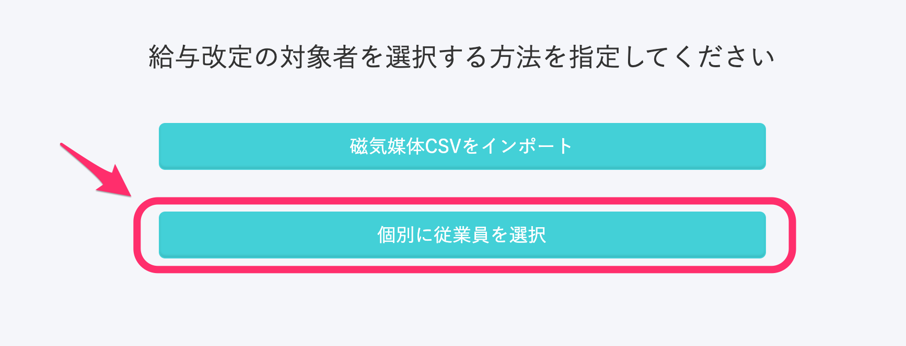

## 3.［給与を改定する従業員］を選択する

画面上にあるプルダウンリストで、手続きを作成する従業員を選択します。

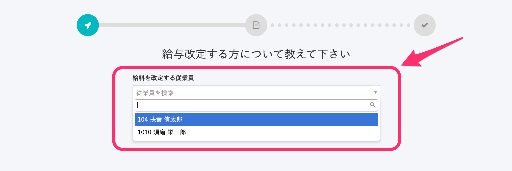

## 4\. 項目を入力し、［次へ］をクリック

従業員を選択したら、 **［報酬月額変更日］** 、 **［報酬月額（通貨）］** 、 **［報酬月額（現物）］** の項目に記入してください。

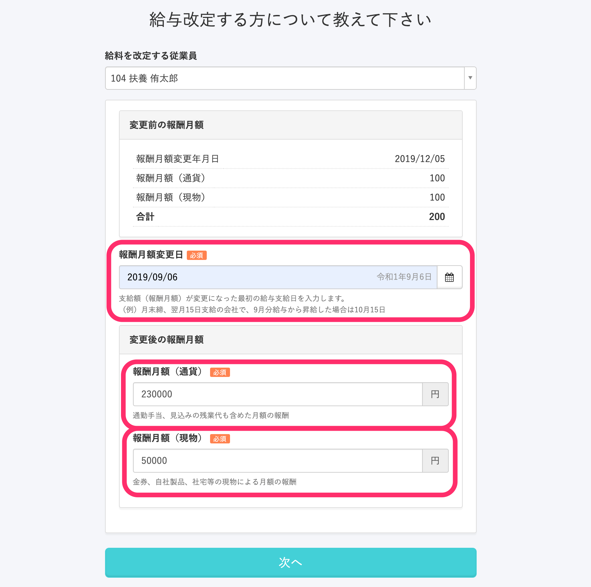

入力し終わったら、画面下にある **［次へ］** をクリックします。

:::related
[報酬月額とは](https://knowledge.smarthr.jp/hc/ja/articles/360026105734)
:::

## 5\. 報酬月額変更届に記入し、［完了］をクリック

 **［次へ］** を押すと、 **［健康保険・厚生年金保険 被保険者報酬月額変更届］** の記入画面が表示されます。

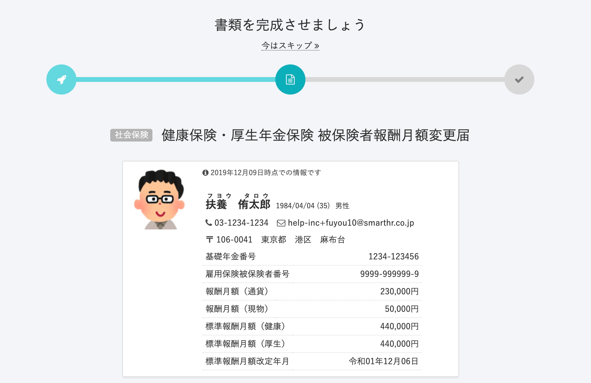

「変更前（従前）の報酬月額」、「算定対象月」、「さかのぼって昇給・降給があった場合」、「備考」、「書類提出日」それぞれのフィールドを確認し、記入を終えたら画面の下にある **［完了］** をクリックしてください。

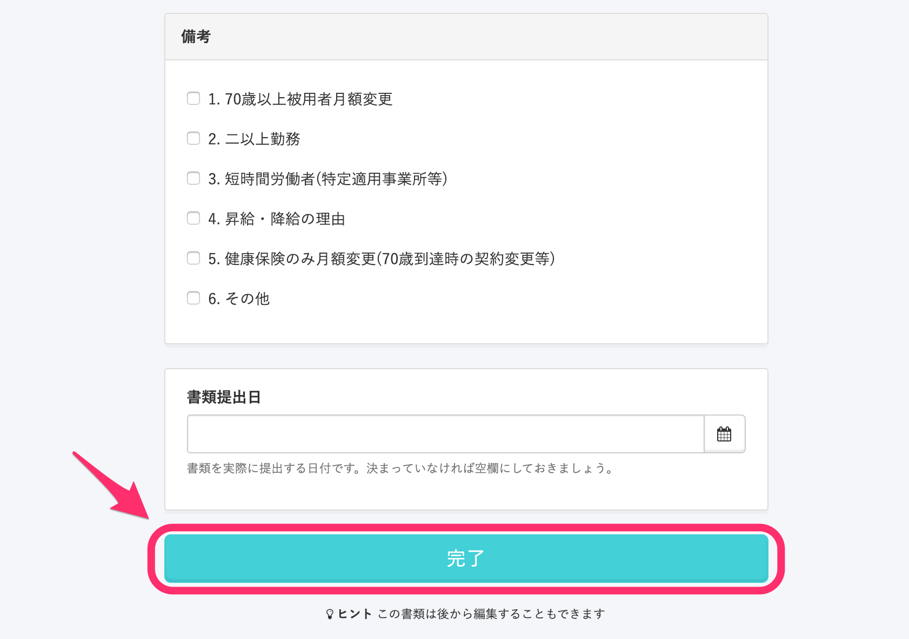

:::tips
 **［健康保険・厚生年金保険 被保険者報酬月額変更届］** の書類は後で編集することも可能です。
:::

## 6\. 報酬月額の変更手続きが作成される

 **［完了］** をクリックすると、報酬月額の変更手続き画面が表示されます。

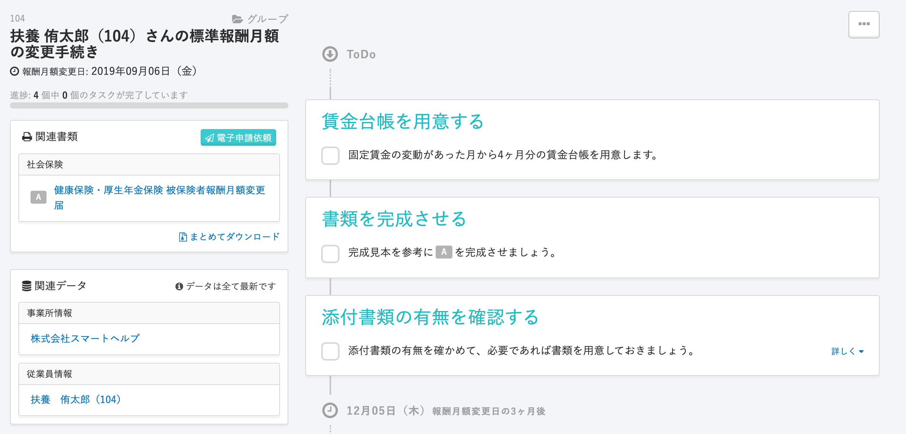

## 報酬月額変更届を編集する

個別に従業員の手続きを作成した場合、以下の手順で報酬月額変更届を編集できます。

### 1\. 手続きを開き、［健康保険・厚生年金保険 被保険者報酬月額変更届］をクリック

該当の従業員の手続きを開き、画面左の **［関連書類］** にある **［健康保険・厚生年金保険 被保険者報酬月額変更届］** をクリックしてください。

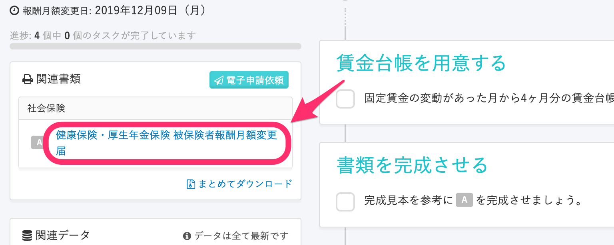

 **［健康保険・厚生年金保険 被保険者報酬月額変更届］** をクリックすると、書類のプレビュー画面が表示されます。

### 2.［編集］をクリック

右上にある **［編集］** をクリックしてください。

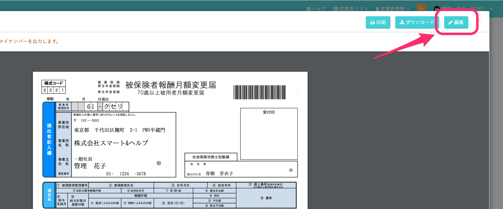

 **［編集］** をクリックすると、報酬月額変更届の編集画面に遷移します。

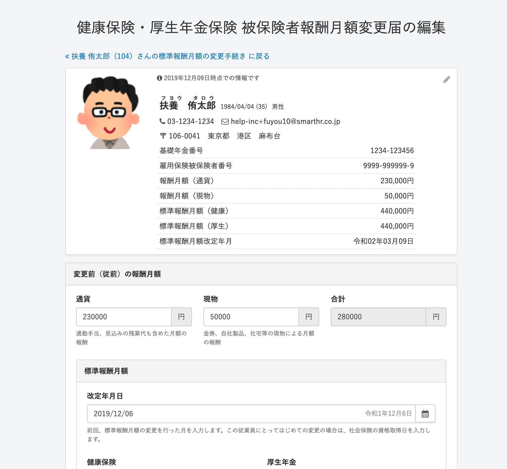

### 3\. 項目を編集し、［更新する］をクリック

項目を編集した後、画面の下にある **［更新する］** をクリックすると変更内容が保存されます。

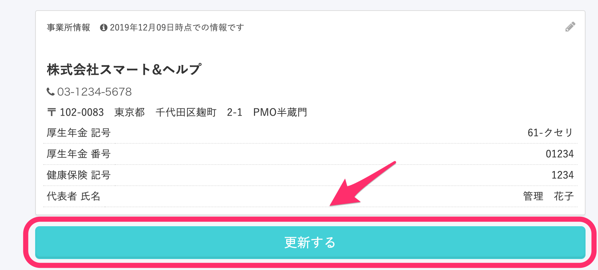
