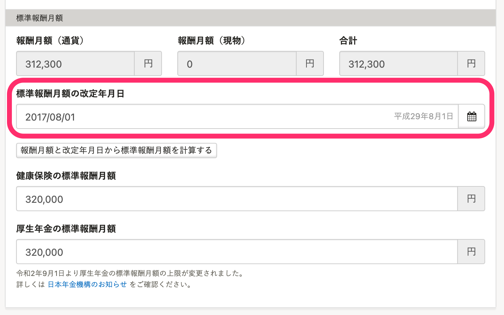

# 「標準報酬月額の改定年月日」とは

報酬をもとに標準報酬月額が決定されます。決定された日を改定年月日とします。

**資格取得**をした日（入社した日を含む）、**定時決定**を行った日、**随時改定**を行った日、**産前産後休業・育児休業終了時改定**を行った日が、それにあたります。

# SmartHR での 「標準報酬月額の改定年月日」

従業員情報ページ > **\[社会保険\]** > **\[標準報酬月額\]** > **\[標準報酬月額改定年月日\]** に表示されます。

## 入社の手続きを作成する場合

**\[入社年月日\]** に入力した日付が、手続き作成後、 **\[標準報酬月額の改定年月日\]** に自動で登録されます。

変更が必要な場合は、手動で更新をお願いします。

## 既存従業員の場合

**\[標準報酬月額の改定年月日\]が空欄の場合**：改定年月を直接入力してください。

**定時決定をSmartHRで行った場合**：自動では従業員情報に反映されないため、改定年月を直接入力してください。

**随時改定をSmartHRで行った場合**：\[健康保険・厚生年金保険 被保険者報酬月額変更届の編集\]画面の **\[改定年月日\]** に入力した日付が、手続き作成後、 **\[標準報酬月額の改定年月日\]** に自動で登録されます。

:::tips
システム上、日付まで入力が必要となります。各月の1日でご登録ください。
（改定月に対して、登録した日付の内容に影響はありません。）
例： 改定年月が 2017年1月 の場合 → 2017/01/01
:::
