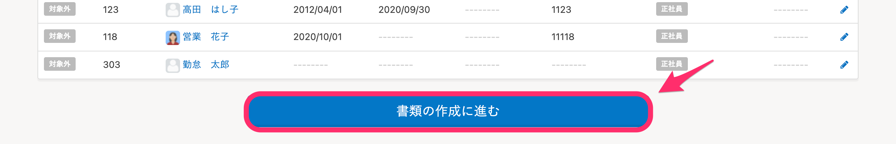
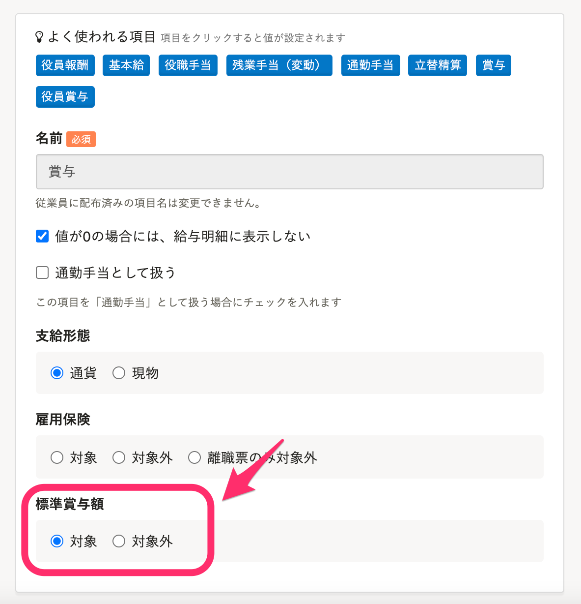

トップページの **［賞与支払届の手続き］** から、「健康保険・厚生年金保険被保険者 賞与支払届」と「健康保険・厚生年金保険被保険者 賞与不支給報告書」を作成できます。

# 「賞与支払届」「賞与不支給報告書」の記入例

「健康保険・厚生年金保険被保険者 賞与支払届」「健康保険・厚生年金保険 賞与不支給報告書」の記入例は、以下のページをご覧ください。

[賞与を支給したとき、賞与支払予定月に賞与が不支給のとき｜日本年金機構](https://www.nenkin.go.jp/service/kounen/todokesho/shoyo/20140821.html)

# 賞与支払届を作成する

## 1\. トップページ >［賞与支払届の手続き］をクリック

トップページの **［賞与支払届の手続き］** をクリックします。

## 2\. 社会保険の資格取得日と喪失日の設定を確認し、対象の賞与明細を選択

 **［ご利用前に］** のチェックボックスにチェックを入れ、対象となる賞与明細を選択すると、 **［賞与支払届の手続きを開始する］** がクリックできるようになります。

 **［賞与支払届の手続きを開始する］** をクリックすると、対象者の確認画面に進みます。

## 3\. 対象者を確認し、［書類の作成に進む］をクリック

「社会保険資格取得日が、選択した賞与支払届の支給日以前」かつ「社会保険資格喪失日が未設定または選択した賞与支払届の支給日翌日以降」に該当する従業員が対象者として表示されます。

対象者を確認し、問題がなければ、画面下部にある **［書類の作成に進む］** をクリックしてください。

バックグラウンド処理が開始されます。

 

:::tips
明細のタイプが **［賞与］** になっている明細のうち、 **［標準賞与額］** を **［対象］** に設定している支払い項目が、賞与支払届の計算対象となります。

:::

## 4\. 作成された書類やToDoリストを確認する

バックグラウンド処理が完了すると、書類が作成されます。

画面左側の「関連書類」の欄の書類名をクリックすると、書類のプレビューや編集が可能です。

:::tips
作成された手続きは、トップページの **［手続きToDo一覧］** からいつでも確認できます。
トップページに表示されていない場合は、右下の **［一覧を見る］** から確認できます。
:::

# 賞与不支給報告書を作成する

## 1\. トップページ >［賞与支払届の手続き］をクリック

トップページの［賞与支払届の手続き］をクリックします。

## 2.［賞与不支給報告書を作成する］をクリック

画面下部にある **［賞与不支給報告書を作成する］** をクリックすると、バックグラウンド処理が開始されます。

## 3\. 作成された書類やToDoリストを確認する

バックグラウンド処理が完了すると、書類が作成されます。

画面左側の「関連書類」の欄の書類名をクリックすると、書類のプレビューや編集が可能です。

:::tips
作成された手続きは、トップページの **［手続きToDo一覧］** からいつでも確認できます。
トップページに表示されていない場合は、右下の **［一覧を見る］** から確認できます。
:::
