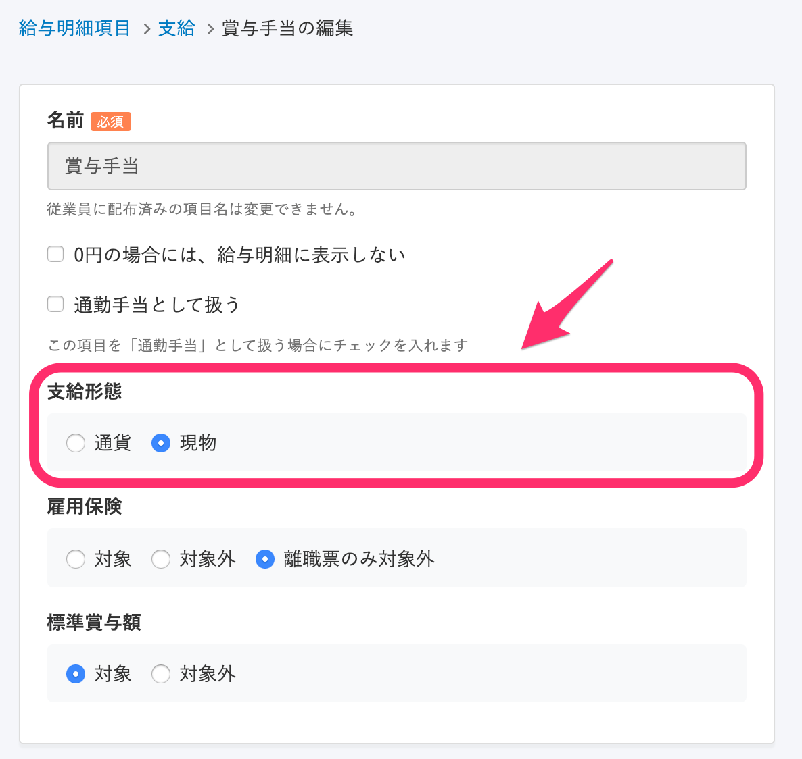
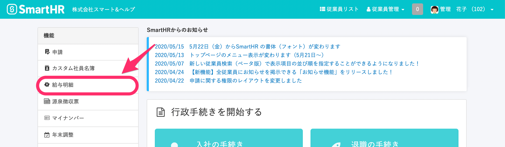
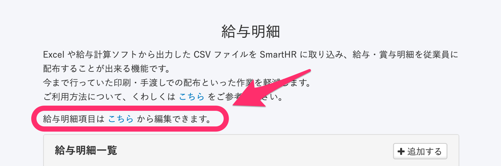
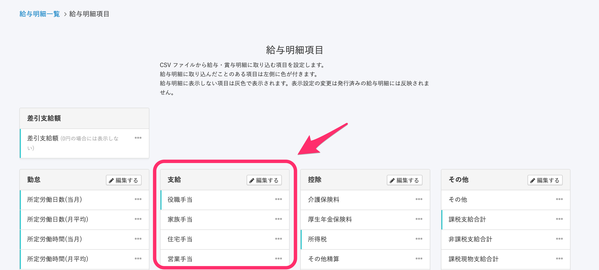
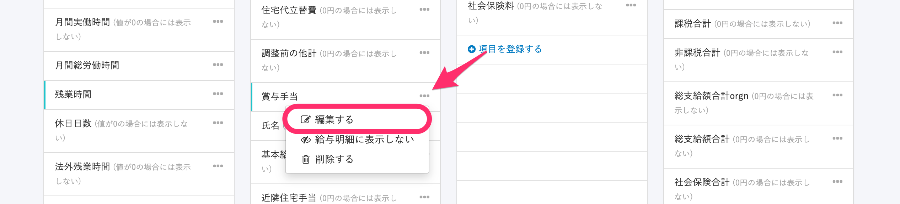
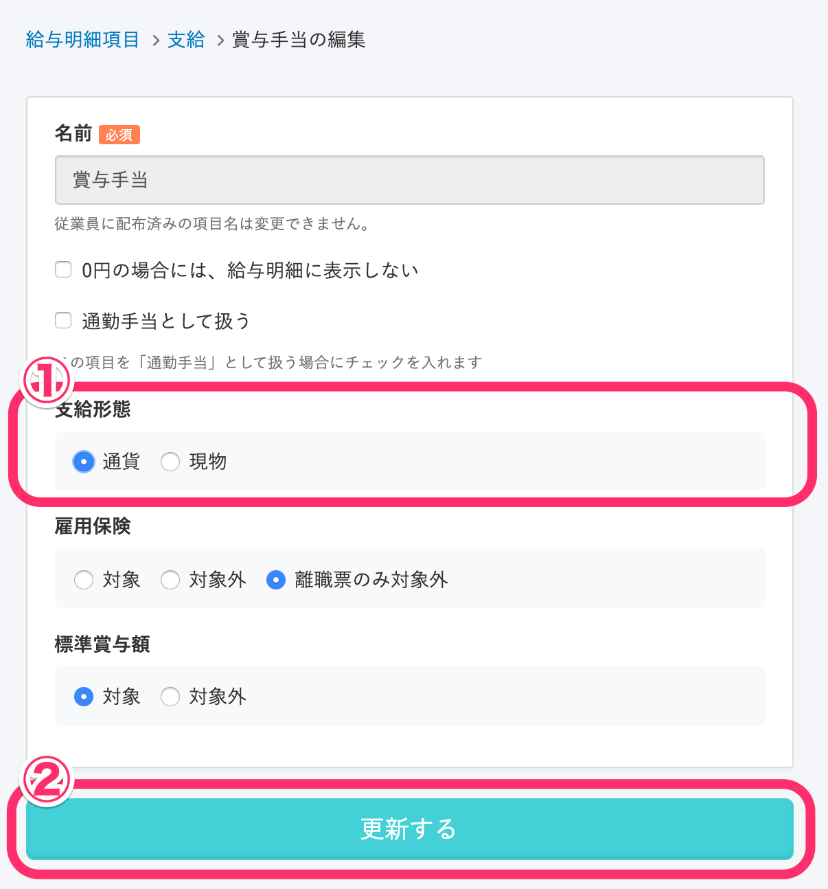
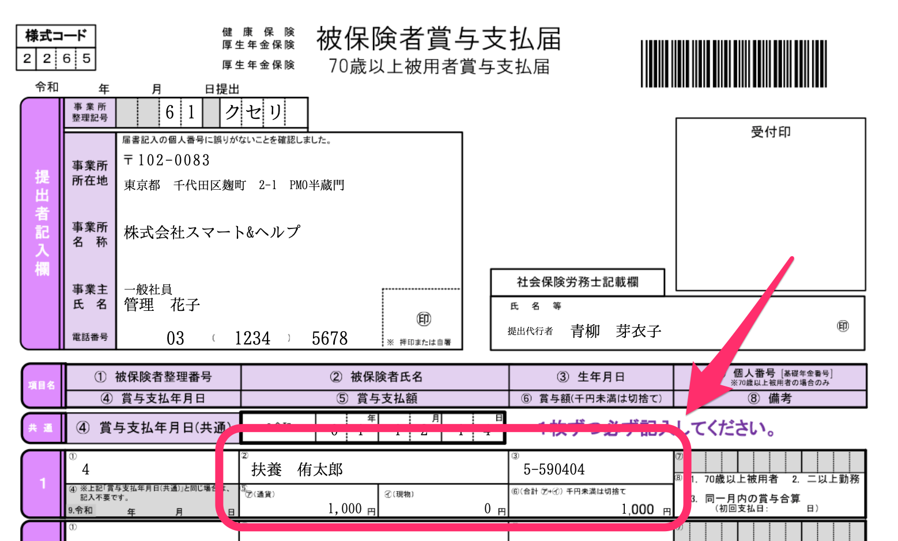
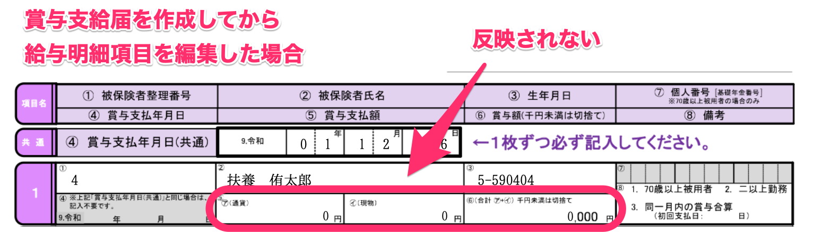

賞与支払届の「ア（通貨）」「イ（現物）」に賞与明細上の金額が反映されない場合、給与明細項目の編集画面にある **\[支給形態\]** 項目を **\[通貨\]** か **\[現物\]** に選択した上で、賞与支払届を作成し直してください。

# 1\. トップページにある \[給与明細\] をクリック

トップページの左側にある **\[給与明細\]** をクリックします。

# 2\. 「給与明細は こちら から編集できます」の \[こちら\] をクリック

**\[給与明細\]** 画面上部に、「給与明細は こちら から編集できます」という説明書きが表示されます。

文中の **\[こちら\]** をクリックしてください。

# 3\. \[支給\] 欄にある、給与明細項目の \[...\] メニュー をクリック

**\[支給\]** 欄にある、該当の給与明細項目の **\[...\] メニュー** をクリックします。

# 4\. \[...\] メニュー > \[編集する\] をクリック

**\[...\] メニュー** にある **\[編集する\]** をクリックすると、項目の編集画面に遷移します。

# 5\. \[支給形態\] を選び、\[更新する\] をクリック

**\[支給形態\]** 項目で **\[通貨\]** または **\[現物\]** を選び、 **\[更新する\]** をクリックします。

**\[支給形態\]** が **\[通貨\]** か **\[現物\]** に設定された状態で賞与支払届を作成すると、「ア（通貨）」または「イ（現物）」に、賞与明細でアップロードした金額が反映されます。

## 既に作成した賞与支払届での表示は？

既に作成してある賞与支払届には、給与明細項目の設定変更が反映されません。

あらかじめ作成した賞与支払届は一度削除し、給与明細項目の設定を行なったあとで、もう一度賞与支払届を作成してください。
