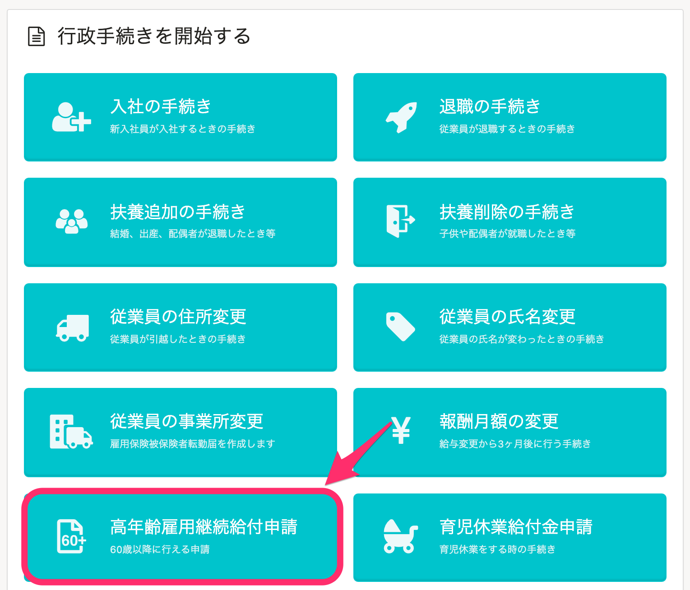
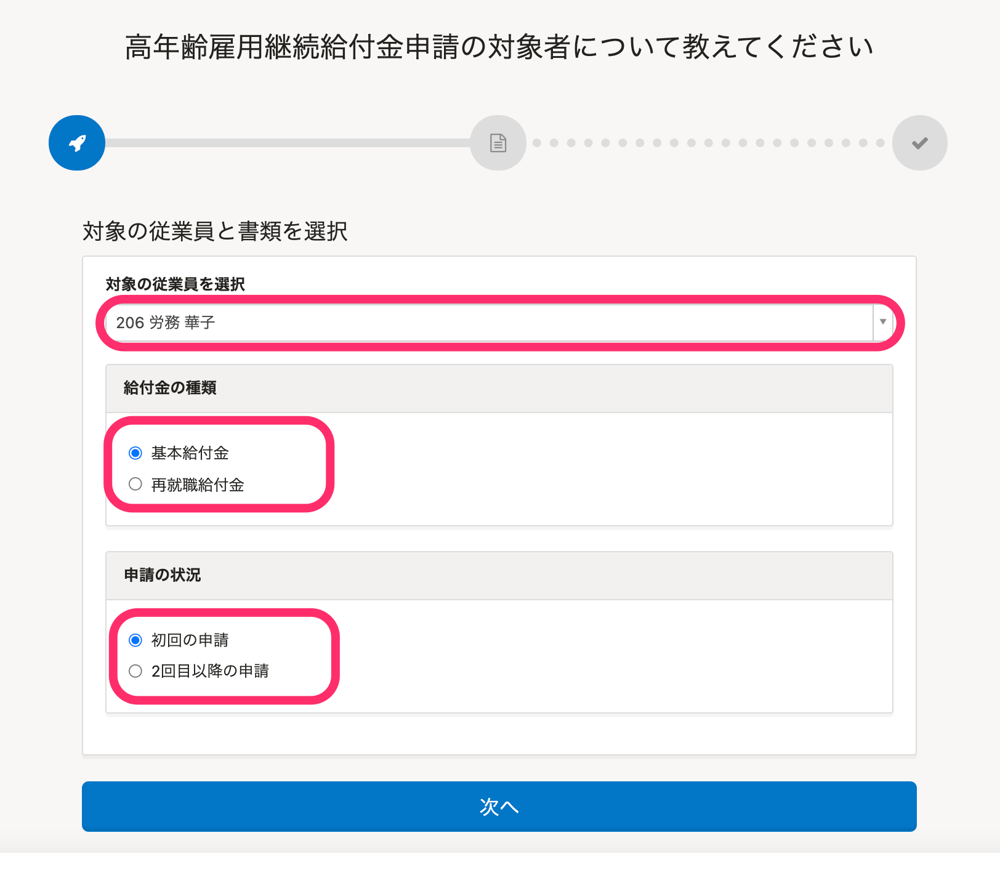
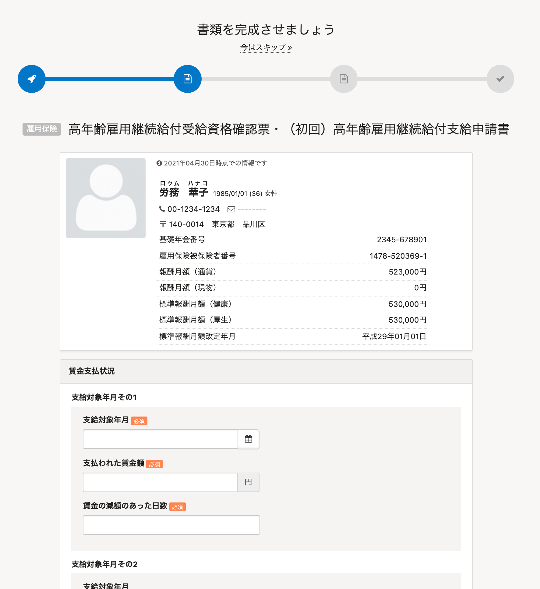
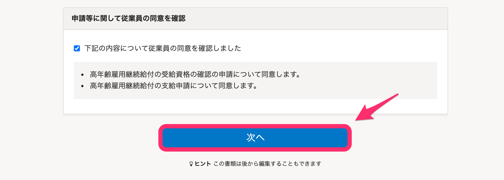
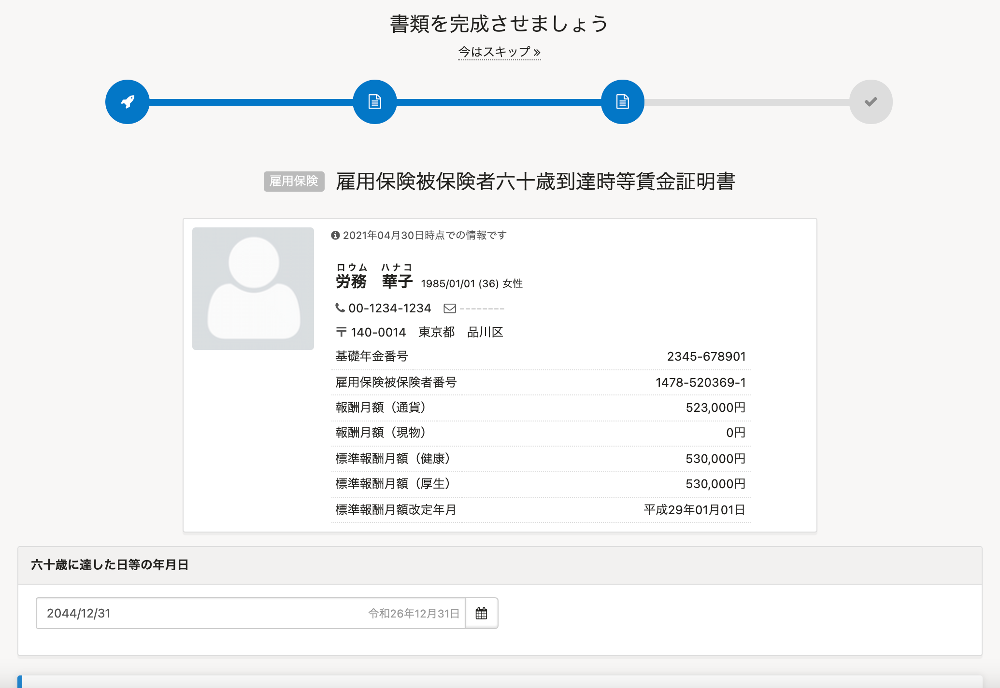
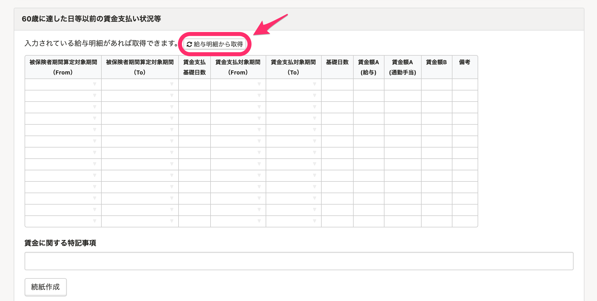
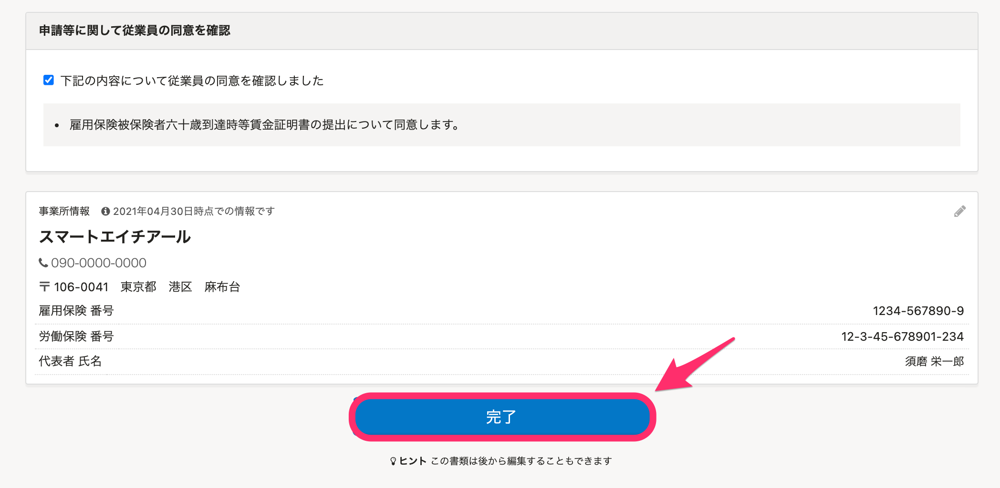
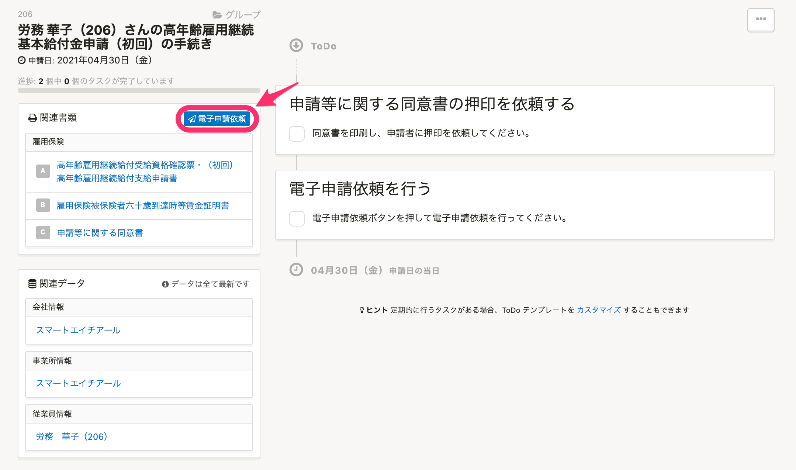

トップページの **［高年齢雇用継続給付金申請］** から、高年齢雇用継続基本給付金申請の手続きと高年齢再就職給付金申請の手続きを行なえます。

このページでは、高年齢雇用継続基本給付金申請（初回）の手続きを例に、手続きの流れを説明します。

:::tips
高年齢雇用継続給付金申請は、電子申請のみに対応しており、紙の書類は作成できません。
:::

# 1\. トップページの［高年齢雇用継続給付金申請］をクリック

トップページにある **［高年齢雇用継続給付金申請］** をクリックすると、高年齢雇用継続給付金申請の手続き画面が表示されます。

# 2\. 対象の従業員と給付金の種類、申請の状況を入力

高年齢雇用継続給付金申請の手続き画面で、対象の従業員と給付金の種類、申請の状況を選択してください。

選択後、画面下部にある **［次へ］** をクリックすると、書類の情報入力画面が表示されます。

# 3\. 高年齢雇用継続給付受給資格確認票・（初回）高年齢雇用継続給付支給申請書の情報を入力する

 **［高年齢雇用継続給付受給資格確認票・（初回）高年齢雇用継続給付支給申請書］** の作成画面で、支払対象年月や申請日など、必要な情報を入力してください。

情報の入力後に、画面下部にある **［次へ］** をクリックすると、 **［雇用保険被保険者六十歳到達時等賃金証明書］** の入力画面が表示されます。

この画面はスキップして、あとで情報を追加することもできます。

:::tips
2回目以降の申請の場合や、高年齢再就職給付金申請の手続きの場合は、手順4の画面には移動せず、手順5のToDoリストの画面に移動します。
:::

# 4\. 雇用保険被保険者六十歳到達時等賃金証明書の情報を入力する

 **［雇用保険被保険者六十歳到達時等賃金証明書］** の作成に必要な情報を入力してください。

 **［60歳に達した日等以前の賃金支払い状況等］** の欄は、SmartHRの給与明細機能に明細情報が登録されている場合、 **［給与明細から取得］** をクリックすると自動入力されます。

情報の入力後に、画面下部にある **［完了］** をクリックすると、ToDoリストの画面が表示されます。

この画面はスキップして、あとで情報を追加することもできます。

# 5\. 作成された書類やToDoリストを確認する

ここまで進めると、電子申請依頼ができます。

画面左側の **［関連書類］** 欄にある **［電子申請依頼］** をクリックして、電子申請依頼を作成してください。

電子申請依頼の作成後は、下記のページでご案内している手順で、電子申請を実行してください。

[電子申請手順 ② 申請を実行する](https://knowledge.smarthr.jp/hc/ja/articles/360026264453)
