育児休業給付金申請の電子申請を作成方法を説明します。

育児休業給付金申請は、育児休業給付金申請情報の作成と、各回の申請の作成の2ステップに分かれています。

:::alert
育児休業給付金申請は、電子申請のみに対応しており、紙の書類は作成できません。
:::

# 1\. 育児休業給付金申請を作成する

## 1\. トップページの［育児休業給付金申請］をクリック

トップページにある **［育児休業給付金申請］** をクリックすると、育児休業給付金申請の手続き画面が表示されます。

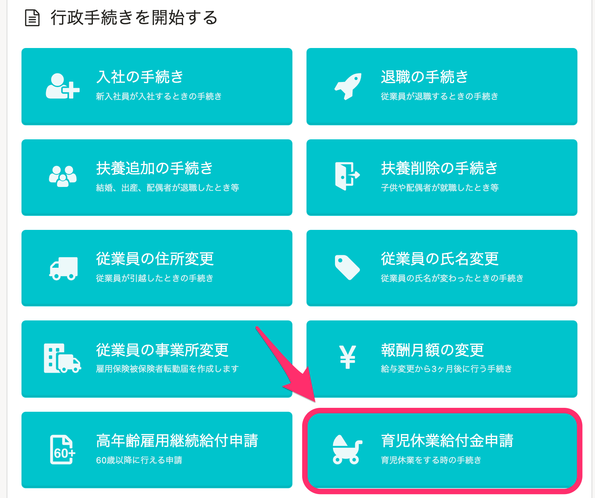

## 2\. ［申請を追加］をクリックし、対象となる従業員を選択する

育児休業給付金申請の手続き画面にある、 **［申請を追加］** をクリックすると、対象となる従業員を選択する画面が表示されます。

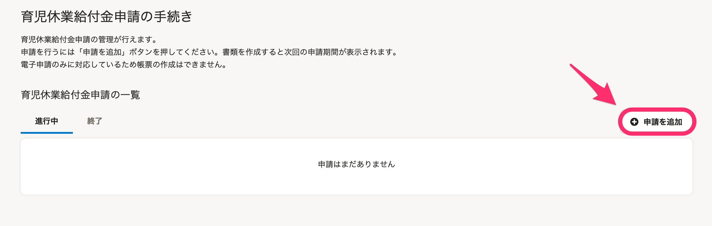

 **［育児休業を申請する従業員］** を選択し、 **［追加］** をクリックすると、 **［育児休業情報フォーム］** が表示されます。

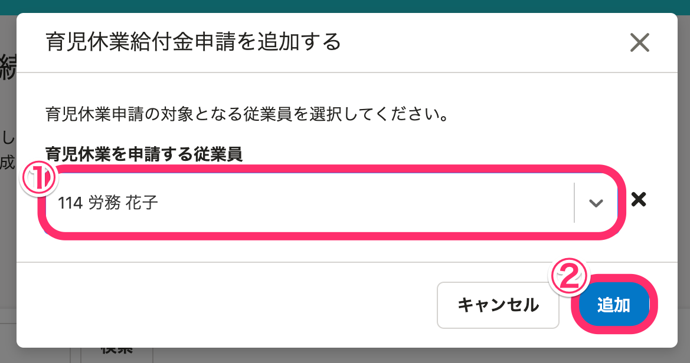

## 3\. 育児休業情報を登録する

申請の利用状況や出産日、産まれた子の情報など、必要な情報を入力してください。

 **［通帳・キャッシュカードの画像］** や **［母子手帳の画像］** のファイル形式は、jpegまたはpdf形式で、サイズの上限は10MBです。

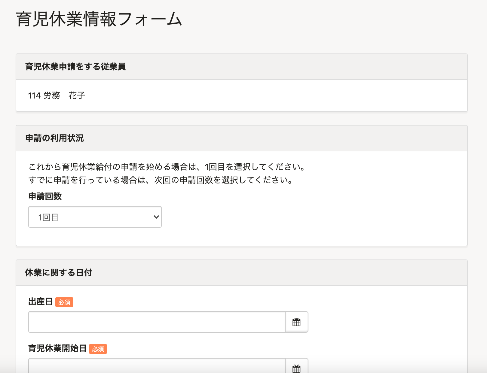

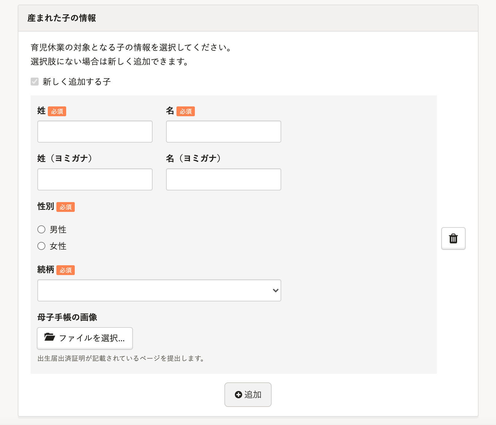

情報入力後、画面下部にある **［登録］** をクリックすると、育児休業給付金申請の画面が表示されます。

:::alert
### ［登録］をクリックする前にご確認ください
［出産日］［申請回数］［育児休業開始日］は、登録後には修正できません。
情報を修正するには、申請を削除し、新しく作成し直す必要がありますので、ご注意ください。
:::

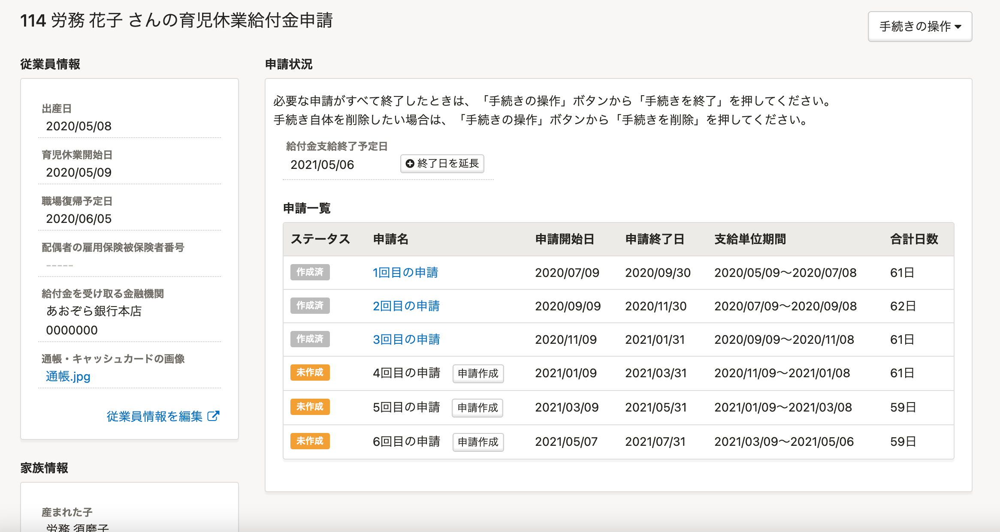

:::tips
育児休業給付金申請した従業員の育休情報は、従業員情報にも登録されます。
管理者は、従業員情報から編集できます。なお、申請で利用しているものは、削除ができません。
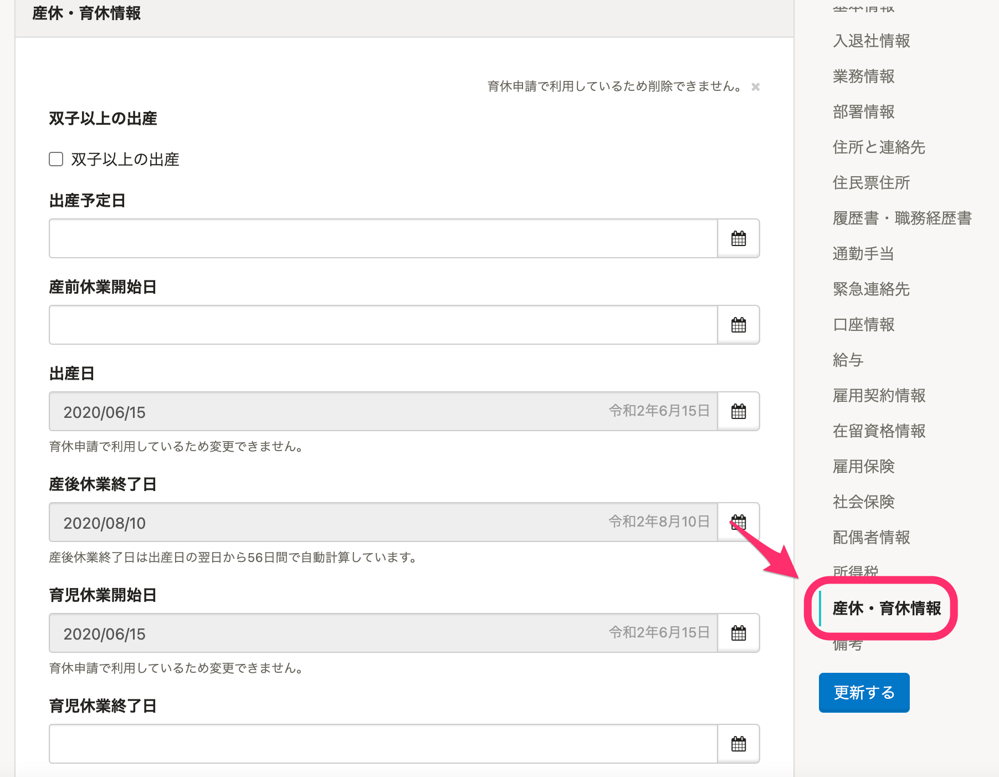
:::

# 2\. 育児休業給付金申請の各申請を作成する

## 1\. 育児休業給付金申請画面の［申請一覧］にある［申請作成］をクリック

トップページにある **［育児休業給付金申請］** をクリックして、 **［育児休業給付金申請の手続き］** 画面の一覧に表示されている手続き名をクリックすると、育児休業給付金申請の一覧画面が表示されます。

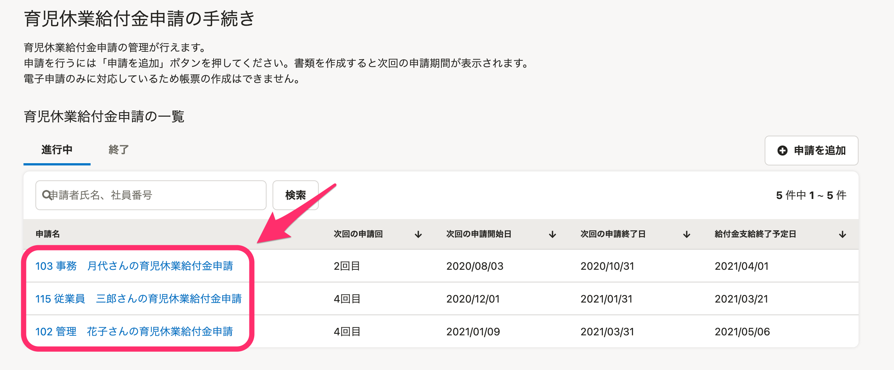

育児休業給付金申請画面の **［申請一覧］** にある **［申請作成］** をクリックすると、書類の情報入力画面が表示されます。

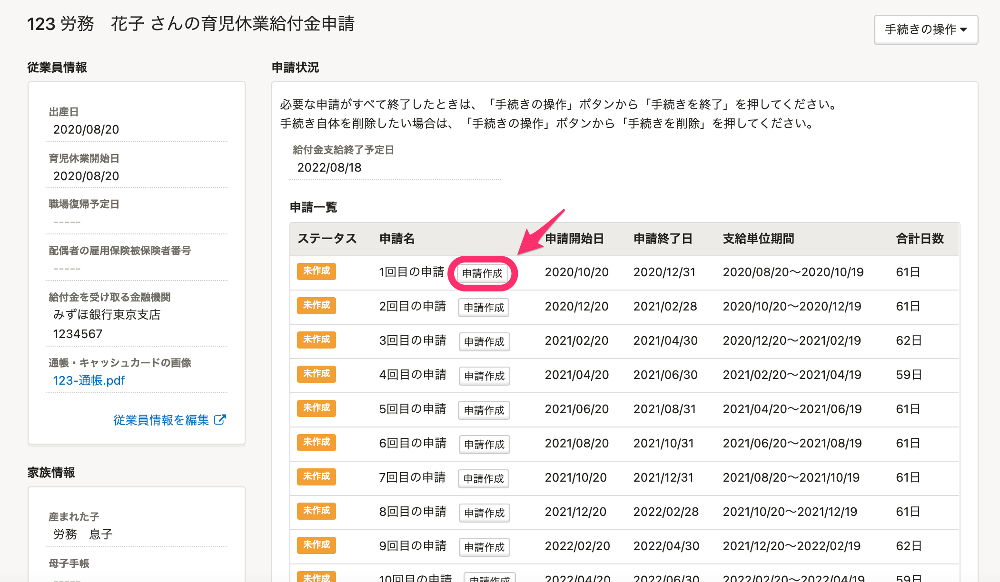

:::tips
以下は1回目の申請の場合を例に説明します。
2回目以降の申請の場合は、育児休業給付金申請書の情報入力画面が表示されます。
:::

## 2\. 育児休業給付受給資格確認票・（初回）育児休業給付金申請書の情報を入力する

支給単位期間や申請日など、必要な情報を入力してください。

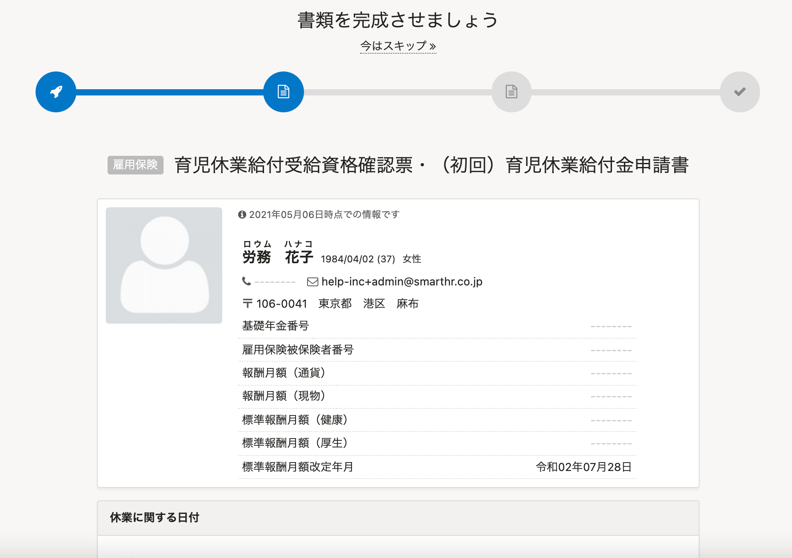

書類の情報を入力後、画面下部にある **［次へ］** をクリックすると、休業開始時賃金証明書の情報入力画面が表示されます。

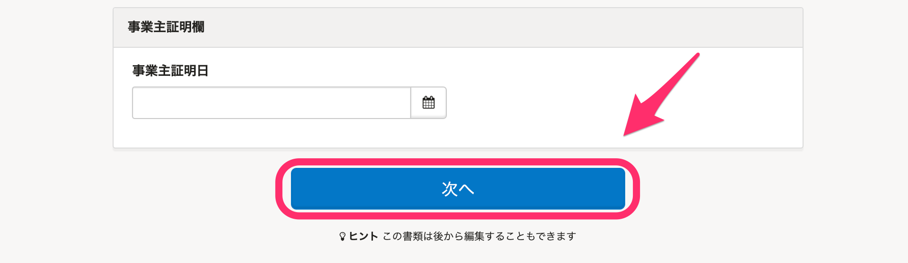

## 3\. 休業開始時賃金証明書の情報を入力する

休業等を開始した日前の賃金支払状況など、必要な情報を入力してください。

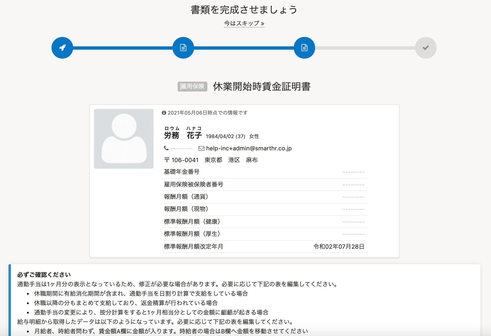

休業等を開始した日前の賃金支払状況等の欄は、 **［給与明細から取得］** をクリックすることで、SmartHRの給与明細機能に登録されている情報が取得できます。

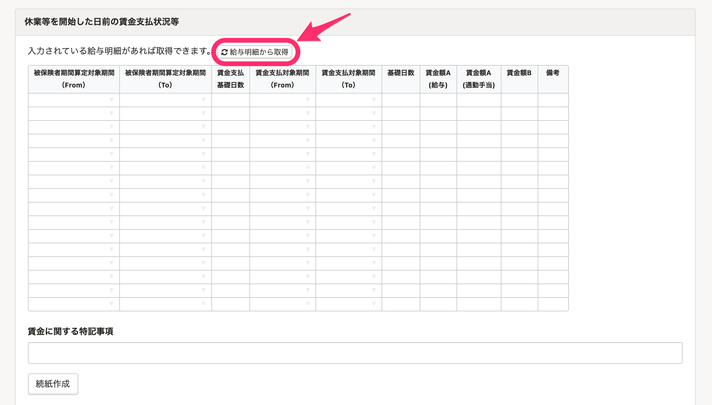

情報入力後、画面下部にある **［完了］** をクリックすると、ToDoリスト画面が表示されます。

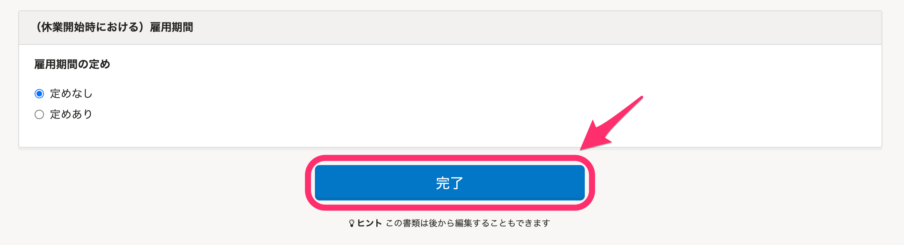

## 4\. ［電子申請依頼］をクリックして、電子申請を作成する

画面左側の **［関連書類］** 欄にある **［電子申請依頼］** をクリックすると、電子申請依頼が作成できます。

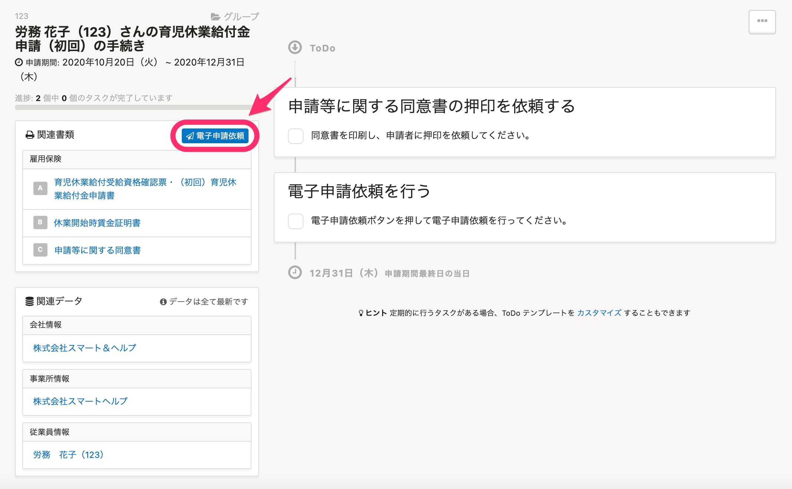

電子申請依頼の作成後は、下記のページでご案内している手順で、電子申請を実行してください。

[電子申請手順 ② 申請を実行する](https://knowledge.smarthr.jp/hc/ja/articles/360026264453)
