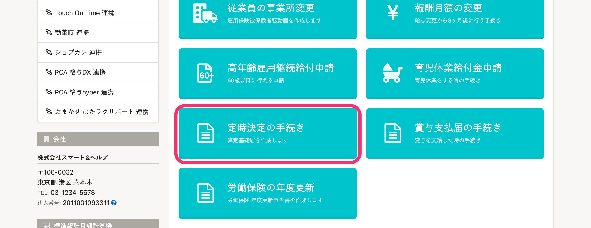
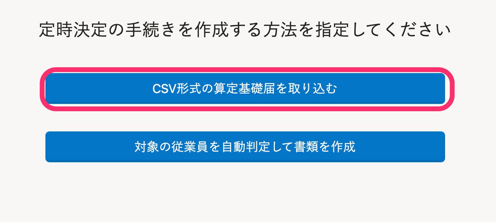
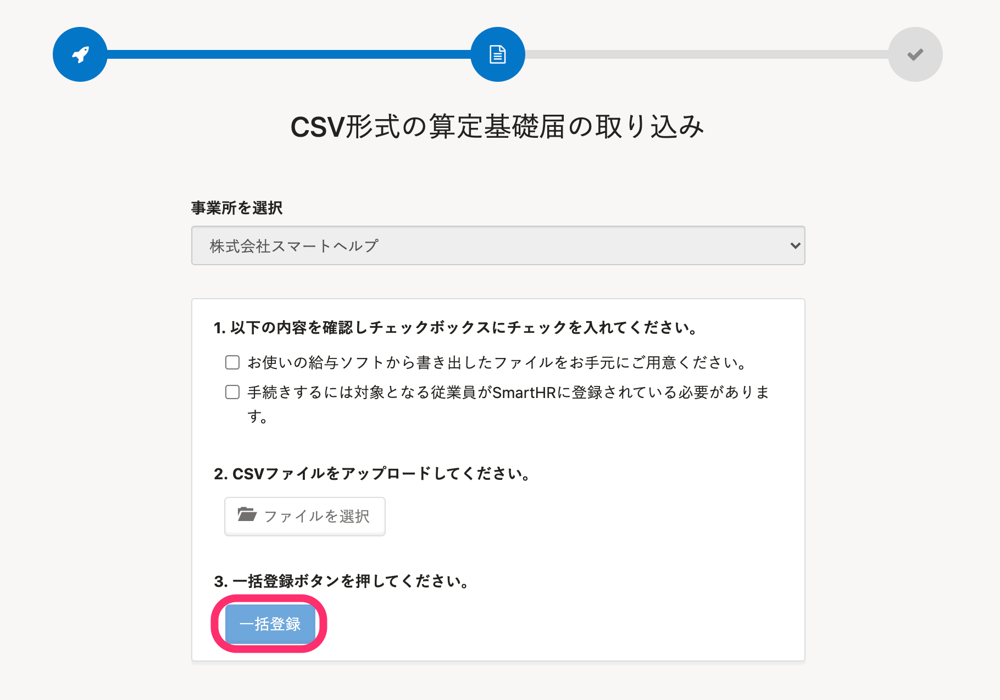
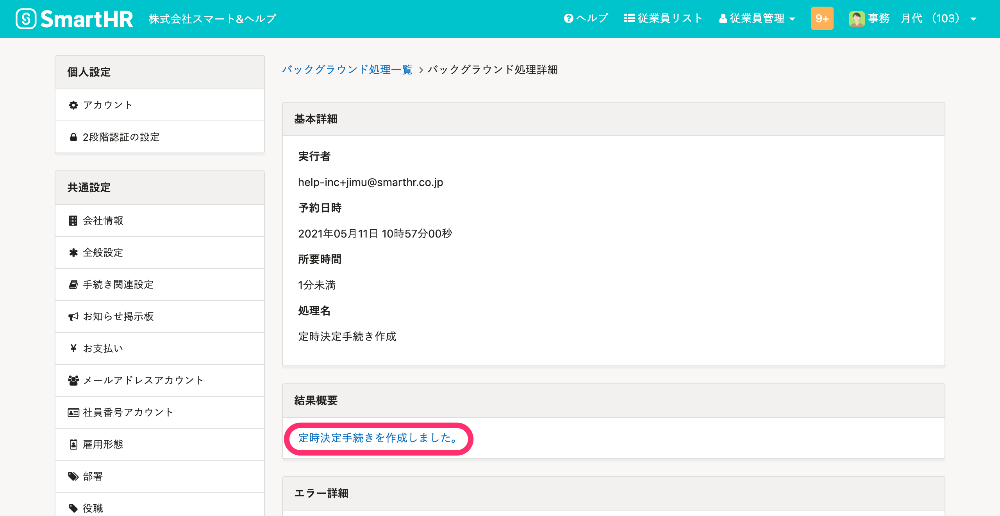
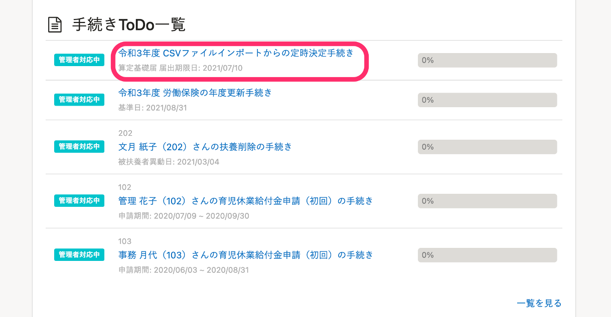
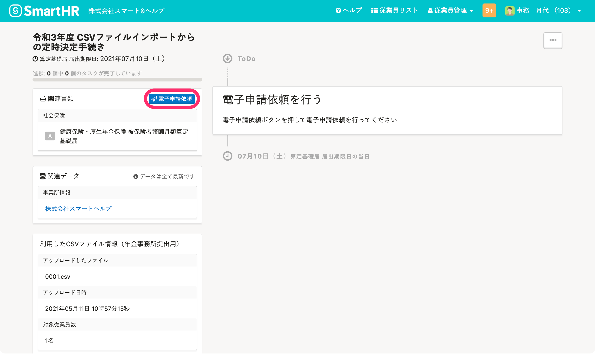

定時決定の手続きの電子申請について、給与ソフトなどから書き出した算定基礎届のCSVファイルを使用する方法を説明します。

:::tips
CSV形式の算定基礎届を取り込む場合、書類が生成されないため、印刷はできません。
書類の印刷が必要な場合は、定時決定の手続きを作成する方法を指定する際に、 **［対象の従業員を自動判定して書類を作成］** を選択してください。詳細は下記のヘルプページをご覧ください。
[対象となる従業員を自動判定して定時決定の手続きをする](https://knowledge.smarthr.jp/hc/ja/articles/360026265793)
:::

# 定時決定の概要・対象となる人

下記のヘルプページをご覧ください。

[社会保険料の定時決定（算定基礎届）とは](https://knowledge.smarthr.jp/hc/ja/articles/360026265013)

# 事前準備

## 従業員情報の確認

SmartHRに下記いずれかの情報の登録が必要です。

- 被保険者整理番号
- マイナンバー
- 基礎年金番号

:::tips
SmartHRに登録されている従業員情報と、CSVファイルに記載の被保険者整理番号、マイナンバー、基礎年金番号のいずれかが一致しないと、手続きが作成されません。
:::

従業員情報への標準報酬月額の入力については、下記のヘルプページをご覧ください。

[標準報酬月額改定年月を入力する](https://knowledge.smarthr.jp/hc/ja/articles/360026264393)

## CSV形式の算定基礎届を用意する

給与ソフトから算定基礎届のCSVファイルを書き出してください。

:::related
[Q. CSV形式の算定基礎届や月額変更届（磁気媒体CSV）とは？](https://knowledge.smarthr.jp/hc/ja/articles/900005692823)
:::

# 定時決定の手続きの進め方

## 1\. ［定時決定の手続き］をクリック

トップ画面の **［定時決定の手続き］** をクリックすると、手続きの作成方法の選択画面が表示されます。

## 2\. ［CSV形式の算定基礎届を取り込む］をクリック

 **［CSV形式の算定基礎届を取り込む］** をクリックすると、確認画面が表示されます。

## 3\. CSVファイルをアップロードし、［一括登録］をクリック

 **［以下の内容を確認しチェックボックスにチェックを入れてください］** の各項目を確認のうえ、チェックを入れます。

 **［ファイルを選択］** をクリックして、CSVファイルをアップロードします。

最後に **［一括登録］** をクリックすると、バックグラウンド処理による定時決定手続きの作成が予約されます。

## 4\. ［定時決定手続きを作成しました。］をクリック

バックグラウンド処理詳細の **［結果概要］** の **［定時決定手続きを作成しました。］** をクリックすると、定時決定の手続きToDo画面が表示されます。

トップページの手続きToDo一覧からも、定時決定の手続きToDo画面を表示できます。

## 5\. ［電子申請依頼］をクリック

定時決定の手続きToDo画面で **［電子申請依頼］** をクリックして、電子申請を行ないます。

:::tips
2021年4月1日の制度変更に伴い、算定基礎届総括表の作成機能を廃止しました。
なお、過去に作成した算定基礎届総括表は、引き続き閲覧できます。
詳しくは、下記のお知らせをご覧ください。
[算定基礎届・賞与支払届の総括表を廃止し、賞与不支給報告書を新設します｜SmartHR](https://smarthr.jp/update/23748)
:::
:::tips
令和4年度は、電子申請ボタンは7月頃に表示されます。
具体的な利用開始日については、アップデート情報でお知らせします。
:::

電子申請の進め方は、下記ページをご覧ください。

:::related
[電子申請手順 ① 申請を依頼する](https://knowledge.smarthr.jp/hc/ja/articles/360026266073)
:::
