対象の従業員を自動判定して、定時決定の手続き（算定基礎届）を作成する方法を説明します。

定時決定の手続きは、管理者のみ利用できます。

:::tips
令和2年度より、**CSV形式の算定基礎届**を取り込んで、電子申請できるようになりました。
事前準備や手続きの進め方が異なりますので、詳しくは、下記のヘルプページをご覧ください。
[CSV形式の算定基礎届を取り込んで定時決定の手続きをする](https://knowledge.smarthr.jp/hc/ja/articles/360049895434)
:::
:::alert
定時決定の手続きを作成しても、従業員情報の **［標準報酬月額］［標準報酬月額の改定年月日］** は**更新されません**。
手続きに利用したデータをもとに、手動で更新してください。
- [報酬月額の変更手続き（報酬月額変更届）を作成する](https://knowledge.smarthr.jp/hc/ja/articles/360039512254)
- [標準報酬月額の改定年月日を入力する](https://knowledge.smarthr.jp/hc/ja/articles/360026264393)
:::
:::alert
給与明細機能で取り込んだデータは連携されません。
- [給与・賞与明細情報を取り込む](https://knowledge.smarthr.jp/hc/ja/articles/360059997153)
- [マネーフォワード クラウド給与の給与明細データをSmartHRに取り込む](https://knowledge.smarthr.jp/hc/ja/articles/360026105654)
- [マネーフォワード クラウド給与からCSVで出力した給与明細を取り込む](https://knowledge.smarthr.jp/hc/ja/articles/360026264053)
給与ソフトなどで集計した結果を、直接入力してください。
:::

# 定時決定の概要・対象となる人

下記のヘルプページをご覧ください。

[社会保険料の定時決定（算定基礎届）とは](https://knowledge.smarthr.jp/hc/ja/articles/360026265013)

# 事前準備

## 従業員情報の確認

SmartHRに以下の情報の登録が必要です。

- 社会保険資格取得日、喪失日
- 下記のいずれか
    - 被保険者整理番号
    - マイナンバー
    - 基礎年金番号
- 従前の（年金事務所に届け出ている）報酬月額
- 生年月日
- 戸籍上の性別

従業員情報への標準報酬月額の入力については、下記のヘルプページをご覧ください。

[標準報酬月額の改定年月日を入力する](https://knowledge.smarthr.jp/hc/ja/articles/360026264393)

# 定時決定の手続きの進め方

## 1\. ［定時決定の手続き］をクリック

トップページの **［定時決定の手続き］** をクリックすると、手続きの作成方法の選択画面が表示されます。

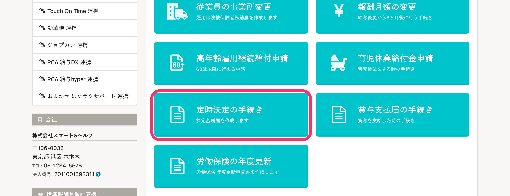

## 2\. ［対象の従業員を自動判定して書類を作成］をクリック

 **［対象の従業員を自動判定して書類を作成］** をクリックすると、確認画面が表示されます。

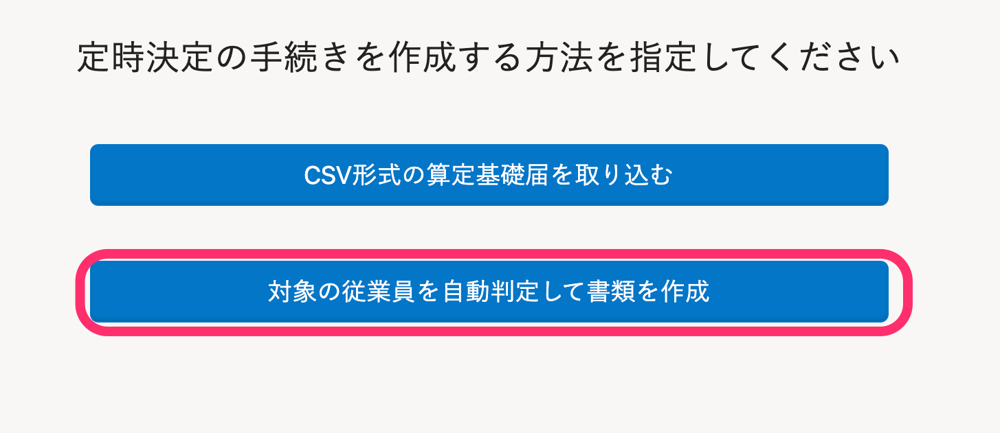

## 3\. ［定時決定の手続きを開始する］をクリック

 **［ご利用前に］** の各項目を確認のうえ、チェックを入れます。

 **［定時決定の手続きを開始する］** をクリックすると、対象従業員の確認画面が表示されます。

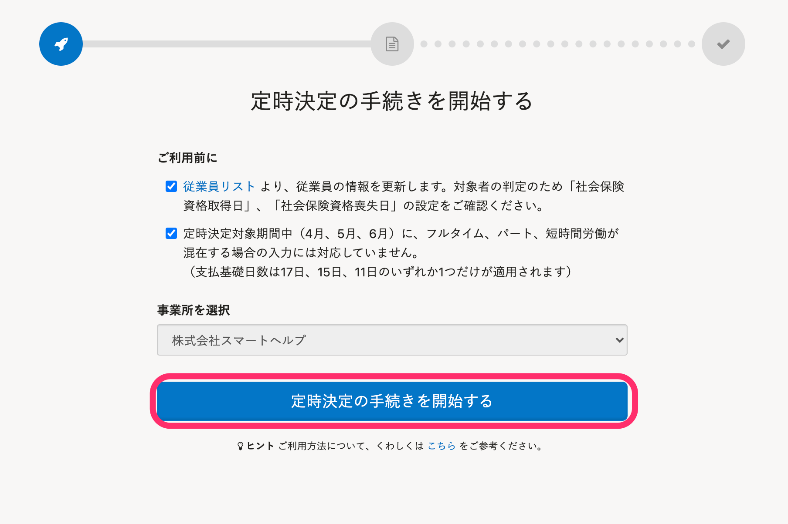

## 4\. ［書類の作成に進む］をクリック

従業員一覧に定時決定の対象／対象外が表示されるので確認します。

 **［書類の作成に進む］** をクリックすると、バックグラウンド処理による定時決定手続きの作成が予約されます。

- 従業員情報を表示するには、従業員の **［氏名］** をクリックします。
- 従業員情報の編集画面を表示するには、一番右の **鉛筆アイコン**をクリックします。

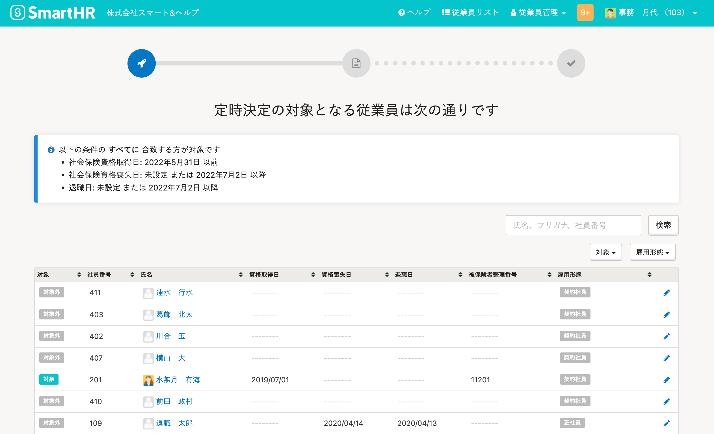

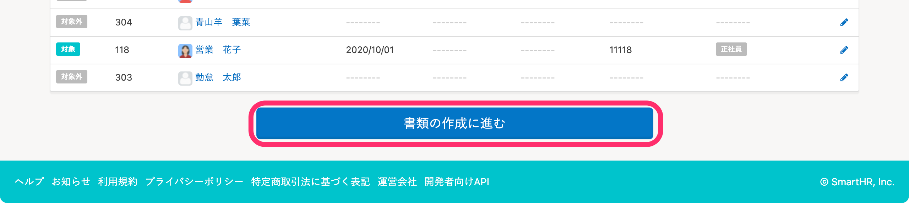

## 5\. ［定時決定手続きを作成しました。］をクリック

バックグラウンド処理詳細の **［結果概要］** の **［定時決定手続きを作成しました。］** をクリックすると、定時決定の手続きToDo画面が表示されます。

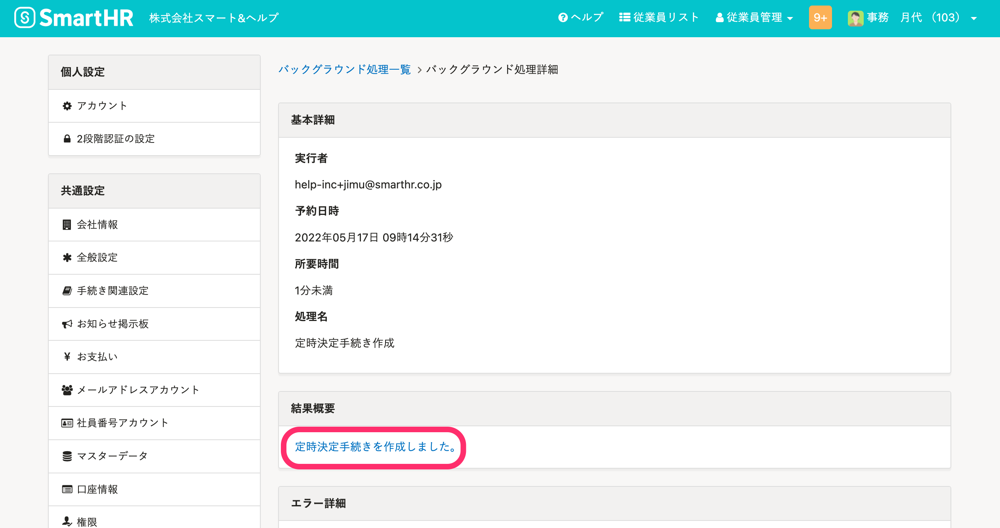

トップページの手続きToDo一覧からも、定時決定の手続きToDo画面を表示できます。

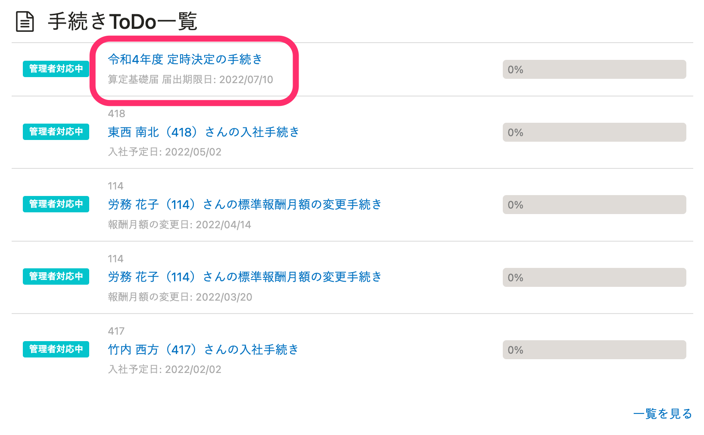

# 算定基礎届の編集

## 1\. 定時決定の手続き > 算定基礎届 をクリック

定時決定の手続きToDo画面で **［健康保険・厚生年金保険 被保険者報酬月額算定基礎届］** をクリックすると、書類のプレビュー画面が表示されます。

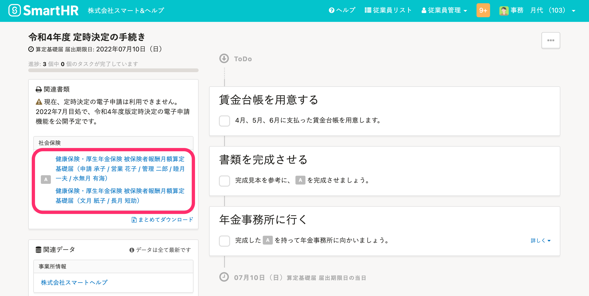

## 2\. 画面右上の［編集］をクリック

書類のレイアウト画面の右上にある **［編集］** をクリックすると、書類の編集画面が表示されます。

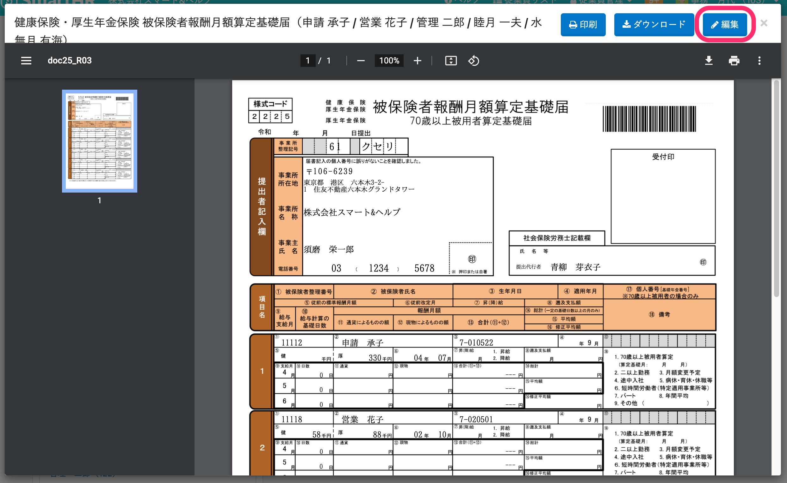

## 3\. 画面下部の［更新する］をクリック

算定基礎届編集画面で、従業員ごとの入力欄に支払対象日数、支給額などを記入します。

全員分の入力を終えたら、画面下部にある **［書類提出日］** を記入します。

最後に **［更新する］** をクリックすると、書類の内容が保存されます。

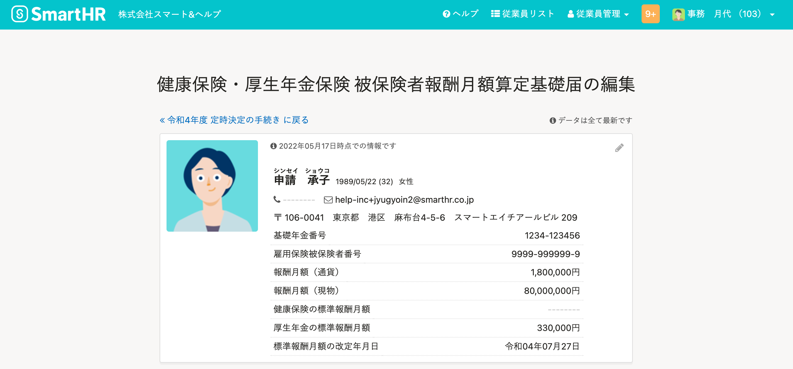

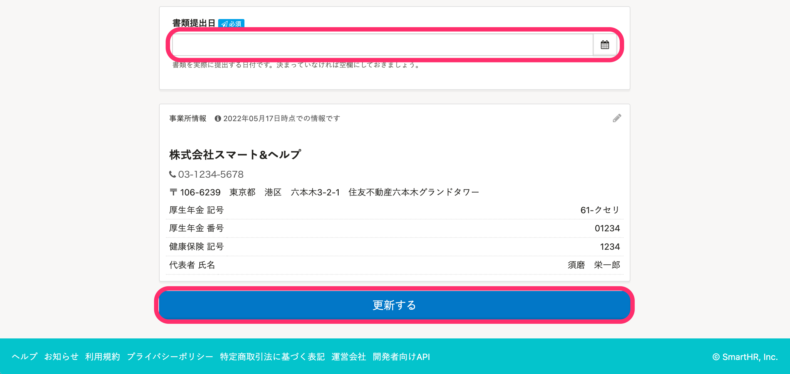

### 従業員ごとの月額報酬入力画面

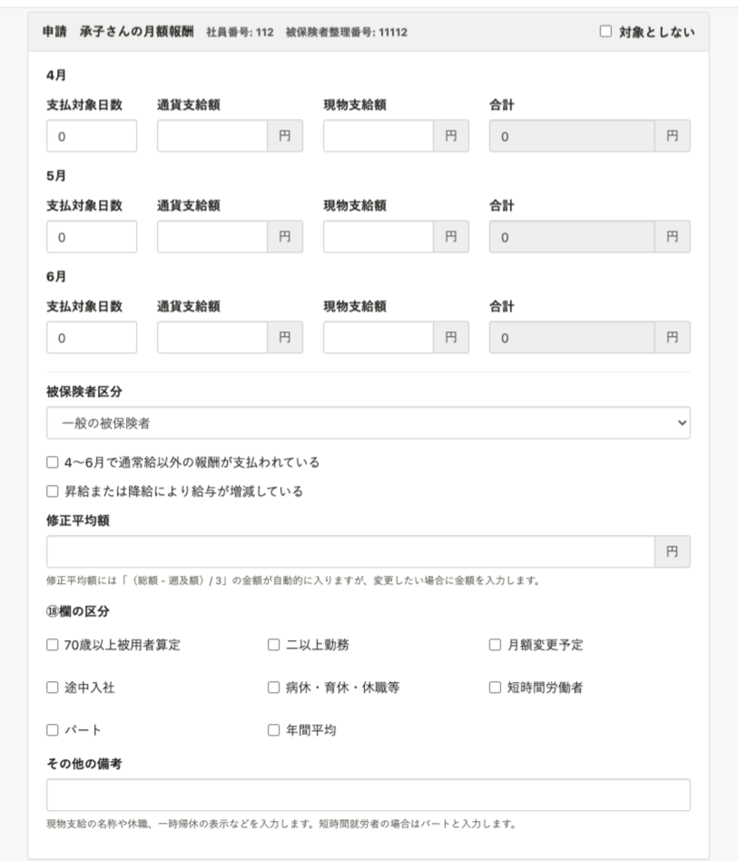

:::tips
2021年4月1日の制度変更に伴い、算定基礎届総括表の作成機能を廃止しました。
なお、過去に作成した算定基礎届総括表は、引き続き閲覧できます。
詳しくは、下記のお知らせをご覧ください。
[算定基礎届・賞与支払届の総括表を廃止し、賞与不支給報告書を新設します｜SmartHR](https://smarthr.jp/update/23748)
:::
:::tips
令和4年度は、電子申請ボタンは7月頃に表示されます。
具体的な利用開始日については、アップデート情報でお知らせします。
:::

電子申請の進め方は、下記ページをご覧ください。

:::related
[電子申請手順 ① 申請を依頼する](https://knowledge.smarthr.jp/hc/ja/articles/360026266073)
:::
