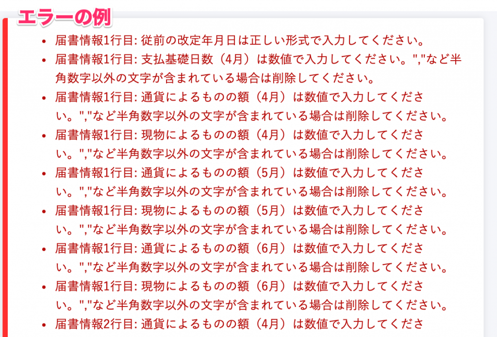
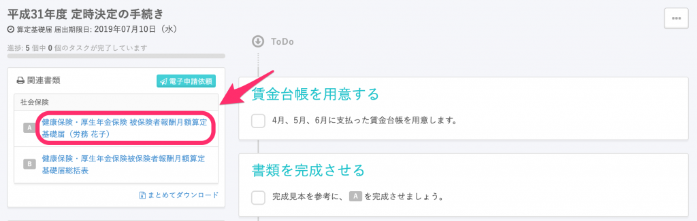
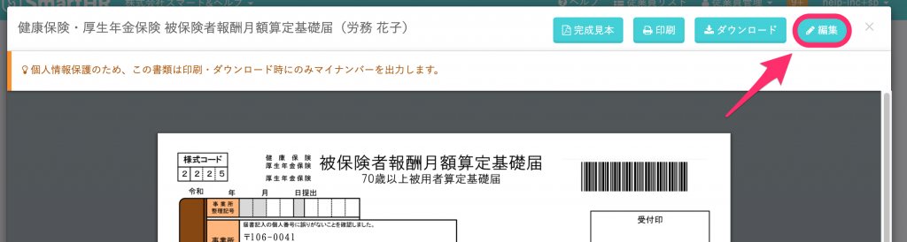
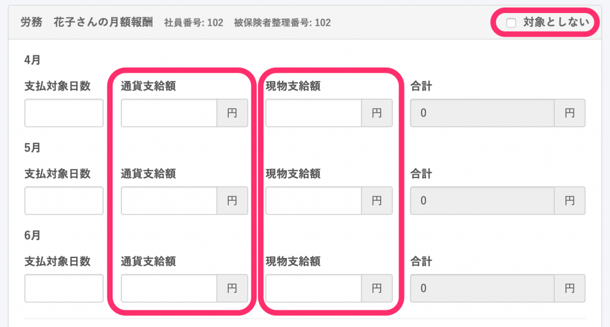
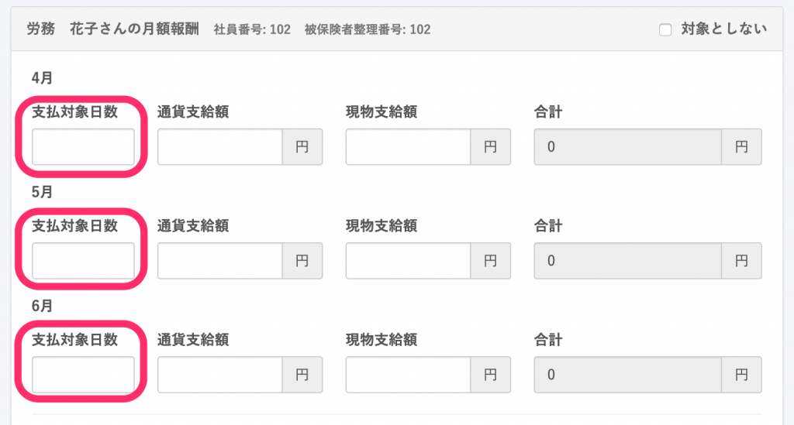
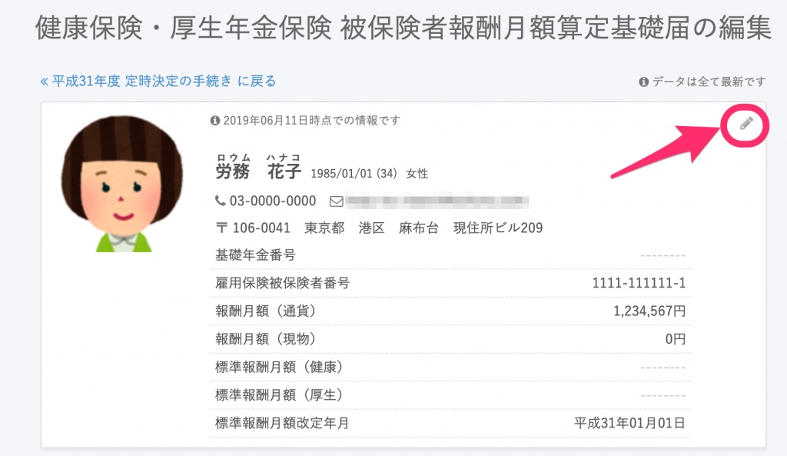
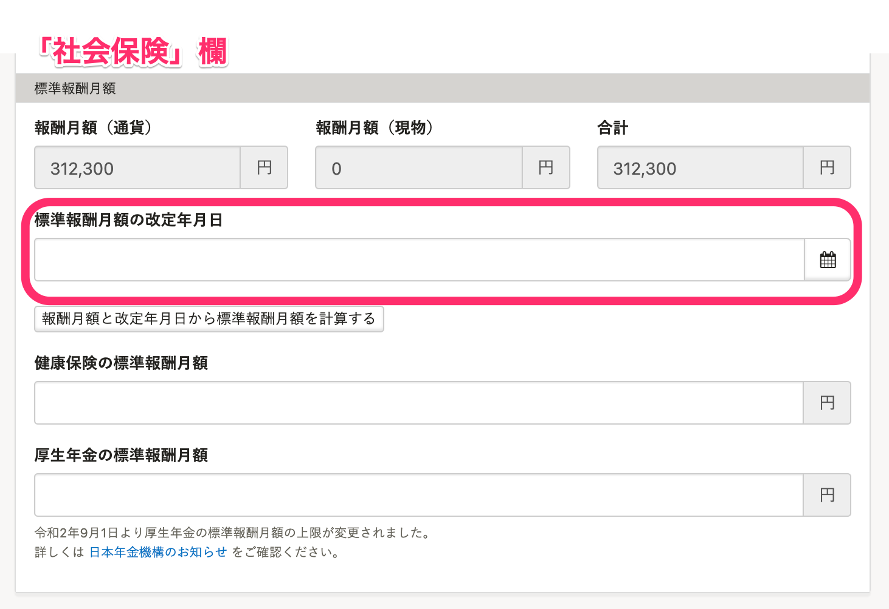
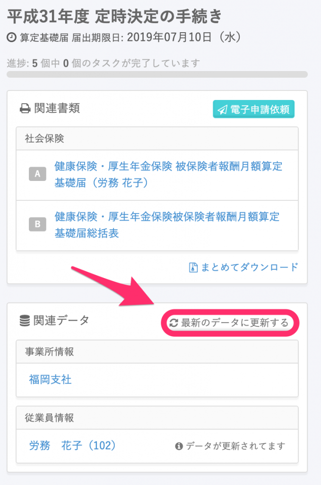

定時決定で作成した算定基礎届の電子申請の際に発生する可能性がある主なエラーと対応法についてまとめました。

# 「届書情報◯行目」の意味

この部分は、書類に表示されている順番を表しています。1行目となっている場合は1人目の従業員、2行目となっている場合は2人目の従業員をご確認ください。

# エラー：通貨によるものの額（◯月）は数値で入力してください。”,”など半角数字以外の文字が含まれている場合は削除してください。

## 原因

書類編集ページの **\[通貨支給額\] \[現物支給額\]** が空欄になっている

## 対応方法

ToDoリストの左側にある関連書類から **\[健康保険・厚生年金保険 被保険者報酬月額算定基礎届\]** のプレビューを開き、編集画面で **\[通貨支給額\]** 欄と **\[現物支給額\]** 欄に金額を入力してください。
0円の場合も「0」と入力する必要があります。

対象としない従業員の場合は、右上にある **\[対象としない\]** にチェックを入れてください。

# エラー：支払基礎日数（◯月）は数値で入力してください。”,”など半角数字以外の文字が含まれている場合は削除してください

## 原因

**\[支払対象日数\]** が空欄になっている

## 対応方法

ToDoリストの左側にある関連書類から **\[健康保険・厚生年金保険 被保険者報酬月額算定基礎届\]** のプレビューを開き、編集画面で **\[支払対象日数\]** 欄に日数を入力してください。

# エラー：従前の改定年月日は正しい形式で入力してください。

## 原因

従業員情報の **\[社会保険\]** 欄にある **\[標準報酬月額の改定年月日\]** が空欄になっている

## 対応方法

ToDoリストの左側にある関連書類から **\[健康保険・厚生年金保険 被保険者報酬月額算定基礎届\]** のプレビューを開き、編集画面から対象の従業員情報の編集画面へ移動してください。

次に、従業員情報編集画面の **\[社会保険\]** の欄にある **\[標準報酬月額の改定年月日\]** を入力してください。

その後、ToDoリストの画面に戻り、**\[関連データ\]** 欄にある **\[最新のデータに更新する\]** をクリックし、変更を書類に反映させてください。

