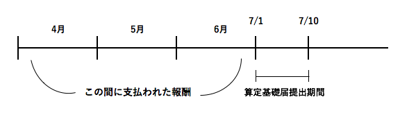
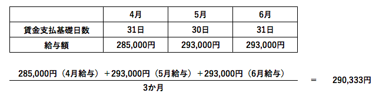
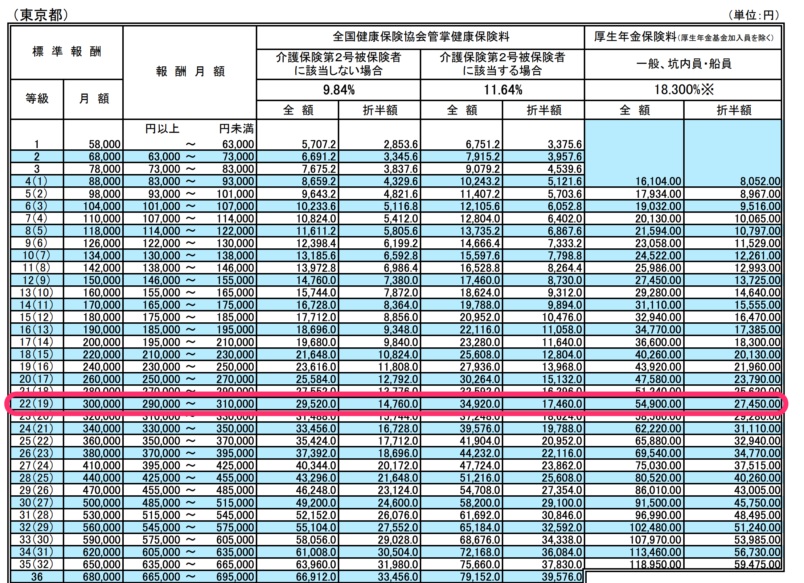
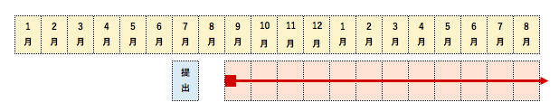

定時決定とは、毎年1回決まった時期に、すべての被保険者について[標準報酬月額](https://knowledge.smarthr.jp/hc/ja/articles/360026266613)の見直しを行なうために、4月から6月までの給与額をもとに標準報酬月額を算出し決定することです。

定時決定の手続き時に作成する帳票が「算定基礎届」です。作成方法は以下のページをご覧ください。

[対象となる従業員を自動判定して定時決定の手続きをする](https://knowledge.smarthr.jp/hc/ja/articles/360026265793)

定時決定に関する詳細は、以下のページをご覧ください。

[定時決定｜日本年金機構](https://www.nenkin.go.jp/service/kounen/hokenryo-kankei/hoshu/20121017.html)

# 定時決定手続き概要

| 区分 | 内容 |
| :-- | :-- |
| 提出期限 | 毎年7月上旬 ※詳細は提出先にご確認ください |
| 提出するもの | 算定基礎届 |
| 提出先 | 健康保険組合 / 年金事務所 ※協会けんぽの方は年金事務所のみ |
| 提出方法 | 電子申請、郵送、窓口持参 |

# 手続きの対象となる従業員

7月1日時点で雇用しているすべての被保険者

# 手続きの対象とならない従業員

（1）～（4）のいずれかに該当する方は算定基礎届の提出が不要です。

（1）その年の6月30日以前に退職した方
（2）その年の6月1日から7月1日までに資格取得（保険に加入）した方
（3）その年の7月から9月までに月額変更届を提出する方
（4）その年の7月から9月までに育児休業等終了時報酬月額変更届を提出する方

# 報酬月額の算出方法

4月・5月・6月の3カ月（いずれも賃金支払支払基礎日数17日以上）に受けた報酬の総額を、その期間の総月数で割った額を報酬月額として標準報酬月額を決定します。

:::alert
[特定適用事業所](https://www.nenkin.go.jp/oshirase/topics/2016/0516.files/20160516.pdf)に勤務する短時間労働者の支払基礎日数は11日以上となります。
:::

## 例：一般的な場合（月給制、欠勤控除なし）

- 4月・5月・6月の3カ月の賃金支払基礎日数（給与計算の暦日数）を記入します。

**毎月15日締め切り ・ 当月25日払いの場合** ：4月は3月16日から4月15日までの給与計算となるため、4月の支払基礎日数欄に「31日」を記入

- 4月・5月・6月の3カ月の給与額を記入します。

上の図のように算出した金額を、標準報酬月額表と照らし合わせ、標準報酬月額が決定します。

この場合、報酬月額が290,333円となりますので標準報酬月額は「300,000」円となります。

出典：[東京都の標準報酬月額表](https://www.kyoukaikenpo.or.jp/~/media/Files/shared/hokenryouritu/r3/ippan/r30213tokyo.pdf)

# 標準報酬月額の有効期間

その年の9月から翌年8月まで1年間適用されます。

新しい標準報酬月額に基づいた保険料の支払いは、9月分からとなります。

# 届出用紙（算定基礎届等）について

毎年5月下旬から6月までの間に順次、事前に送付されます。

届出用紙には、5月中旬頃までに届出された被保険者の氏名、生年月日、以前の標準報酬月額などが印字されています。
