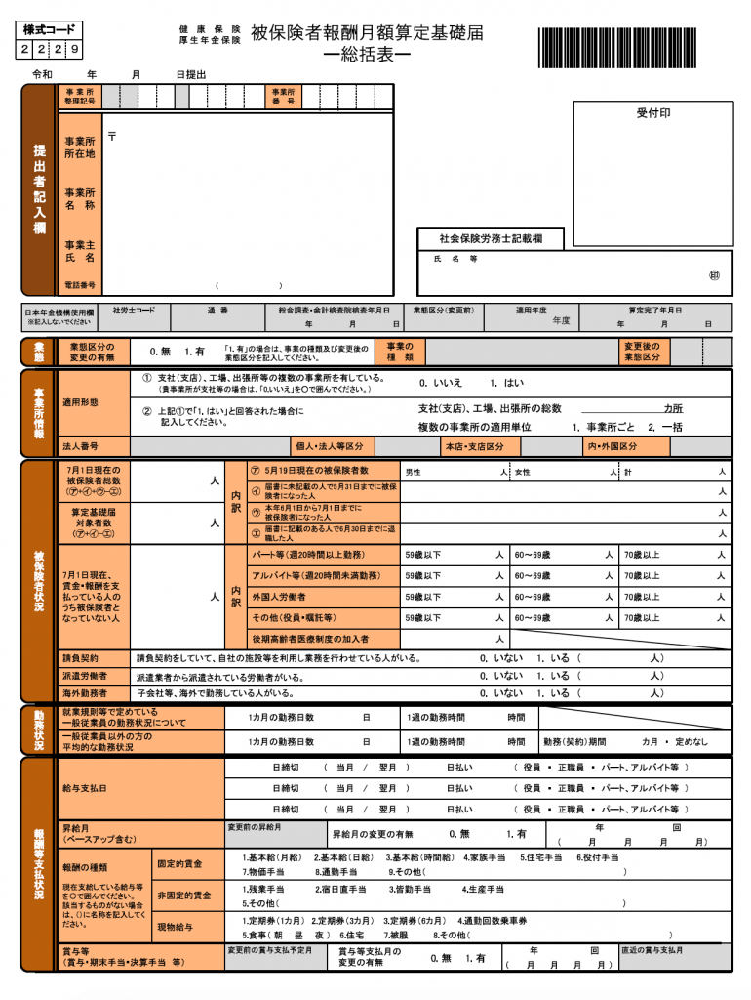
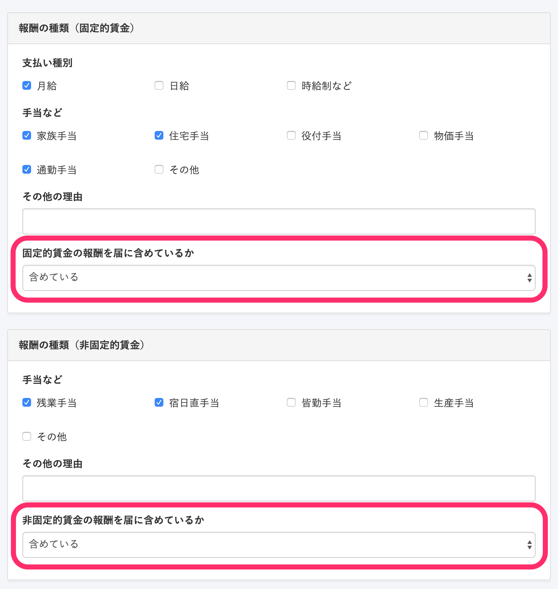
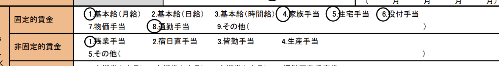

算定基礎届と一緒に提出する、「算定基礎届総括表」について説明します。

:::tips
2021年4月1日の制度変更に伴い、算定基礎届総括表の作成機能を廃止しました。
なお、過去に作成した算定基礎届総括表は、引き続き閲覧できます。
詳しくは、下記のお知らせをご覧ください。
[算定基礎届・賞与支払届の総括表を廃止し、賞与不支給報告書を新設します｜SmartHR](https://smarthr.jp/update/23748)
:::

# 算定基礎届総括表とは

算定基礎届に記載している内容を健康保険組合または年金事務所が確認するために、事業所の被保険者（保険に加入している従業員）の現況や報酬など、すべての内容をまとめた表のことです。

## 固定的賃金・非固定的賃金とは

固定的賃金とは、毎月金額が決まっている賃金の事を指します。
例：基本給、役員報酬、住宅手当など

非固定的賃金とは、毎月金額が決まっていない賃金の事を指します。
例：残業手当、深夜手当、営業インセンティブなど

## 算定基礎届総括表の「固定的賃金・非固定的賃金」について

賃金の対象となるものを算定基礎届に含めているか・含めていないかの確認を意味しています。

SmartHRの画面では、**\[報酬の種類\]** 項目にある **\[固定的賃金/日固定的賃金の報酬を届に含めているか\]** の欄で設定できます。

実際の算定基礎届総括表に反映されます。

:::tips
算定基礎届総括表の内容は標準報酬月額の決定には影響しません。
:::

算定基礎届の編集方法については、以下のリンクをご覧ください。

[対象となる従業員を自動判定して定時決定の手続きをする](https://knowledge.smarthr.jp/hc/ja/articles/360026265793)
