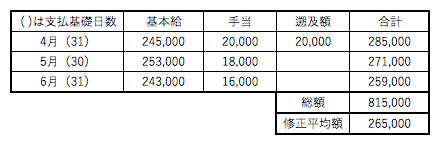
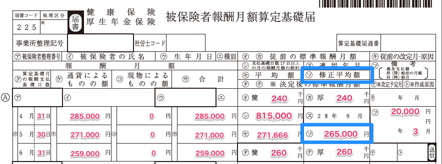

# 事業所整理記号とは

事業所ごとに付与された「数字 – カタカナ」の文字列のことをいいます。

詳しくは下記のページをご覧ください。

[厚生年金保険 事業所整理記号とは](https://knowledge.smarthr.jp/hc/ja/articles/360026107874)

# 被保険者整理番号とは

健康保険被保険者証に記載されている番号のことをいいます。

詳しくは下記のページをご覧ください。

[健康保険被保険者整理番号（年金整理番号）とは](https://knowledge.smarthr.jp/hc/ja/articles/360026107714)

# 健保の従前 ・ 厚年の従前とは

（その年）7月1日時点で年金事務所等に届け出ている標準報酬月額を記載します。

# 支払基礎日数とは

報酬を計算する基礎となった日数のことをいいます。

支払基礎日数は、給与体系により異なります。

**1.月給制で欠勤控除なしの場合**
給与支払対象期間の暦日数を記載します。

（例）
給与支払対象期間が、4/1〜4/30なら30日と記載
給与支払対象期間が、5/11〜6/10なら31日と記載

**2.月給制で欠勤控除がある場合(基本給などの固定給から欠勤日数分の給与を控除している場合)**
就業規則、給与規定等に基づいて事業所が定めた所定労働日数から欠勤日数を差し引いた日数が支払基礎日数となります。

（例）
4/1〜4/30の所定労働日数が21日、欠勤控除が2日間行われている場合
→ 21日（所定労働日数）- 2日（欠勤日数）＝19日となり、支払基礎日数は19日と記載します。

**3.日給制・時給制の場合**
各月の出勤日数が支払基礎日数となります。

# 月給制とは

給与支払対象期間の日数によって基本給などに変動がない（所定労働日が暦によって20日でも22日でも基本給等が変わらない）支給方法の場合を指します。

# 支払基礎日数の表示場所について

4月、5月、6月欄の支払基礎日数は、それぞれの月の「支給日」で判断します。

（例1）支払対象期間が4/1〜4/30で支給日が4/30の場合は、4月欄に支払基礎日数・報酬月額を記載します。
（例2）支払対象期間が4/1〜4/30で支給日が5/15の場合は、5月欄に支払基礎日数・報酬月額を記載します。(支払基礎日数は、支払対象期間の暦日数（30日）を記載します。）

# 報酬月額の通貨によるものとは

現金（銀行振込・手渡し）で支払われているものを指します。

# 報酬月額の現物によるものとは

現金以外の方法で支給されたものが対象です。

給与は、現金で支給されるのが一般的ですが、住宅（社宅・寮など）の貸与、食事、自社製品、通勤定期券などで支給するものを現物給与といいます。

食事や社宅などの価額は、都道府県ごとに厚生労働大臣が定める価額に換算して報酬を算出します。
詳しくは、[全国現物給与価格一覧表｜日本年金機構](https://www.nenkin.go.jp/service/kounen/hokenryo/hoshu/20150511.html)をご覧ください。

SmartHRでは、現物給与の計算方法についてご説明できません。
ご不明点は、社労士や年金事務所へお問い合わせをお願いします。

# 適用年月とは

算定基礎届により標準報酬月が改定される年月のことをいいます。

定時決定の適用年月日は9月となります。

# 修正平均額とは

4月、5月、6月以前に昇給した給与を何らかの理由で遡って支払われた場合（遡及といいます）には、その遡及分は定時決定の算定基礎額には算入しません。そのため、遡及分を入れずに平均額を計算します。

算定基礎届では、その平均額のことを、「修正平均額」といいます。

（例）2月に昇給した差額分（20,000円）を4月に支払ったとき

< 算定基礎届の記入 >

< 修正平均額の計算方法 >　　※ 昇給の場合について
・遡って昇給差額が支給された場合は、その差額を控除して計算します。
・総額(815,000円)- 遡及額（20,000円) ÷ 3ヶ月 = 265,000円となります
・ソ欄「修正平均額」には、265,000円と記入
・タ欄・チ欄「決定後の標準報酬月額」には、260千円と記入
・ツ欄「遡及支払額」には、差額分の金額を記入

# 備考欄について

算定基礎届の備考欄には、遡及支払額、昇降給の差額やその月、休職や一時帰休など報酬に関係する内容について記載します。

（例1）短時間就労者の場合は、「パートタイマー」と記載
（例2）算定期間の中途入社で1ヶ月分の報酬がない場合は、資格取得日を記載
（例3）現物支給が合った場合、内容を記載（通勤定期券など）
