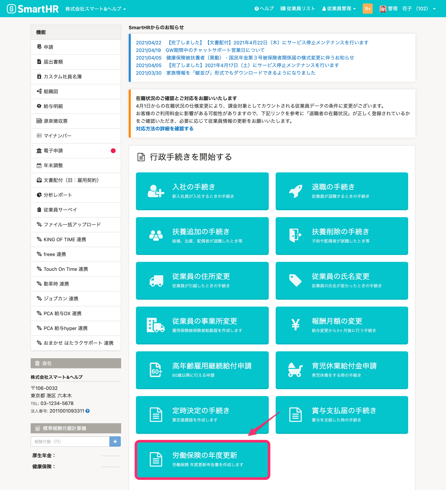
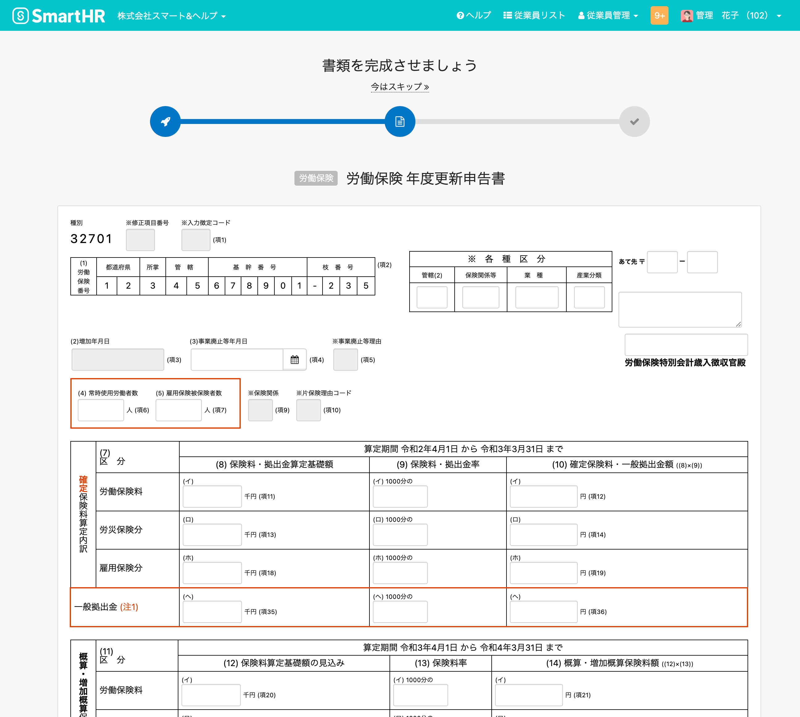
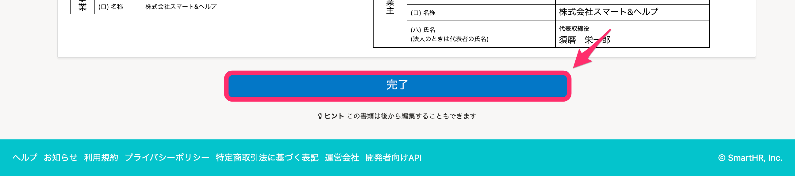
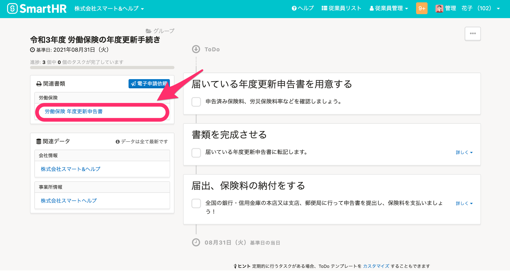
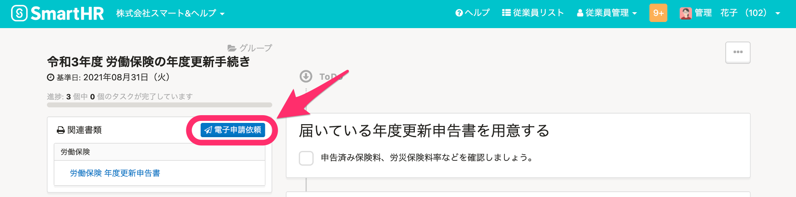
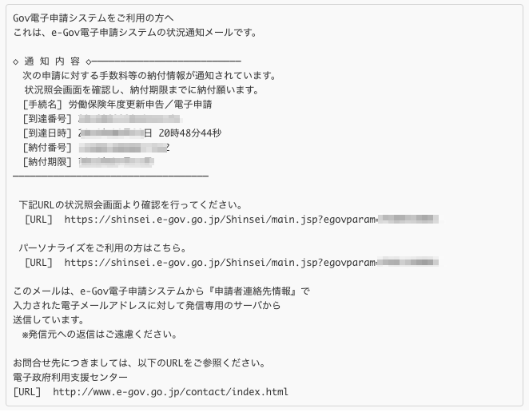

申告書と同様のフォーマットに申告内容を入力して、労働保険の年度更新を電子申請できます。

労働保険の年度更新は、管理者のみ利用できます。

:::alert
電子申請のみに対応しているため、**作成した申告書は印刷できません。**
電子申請を行なわない場合は、会社に郵送される紙の申告書に記入し、提出してください。
:::
:::tips
2017年度版はSmartHRに登録されている給与明細の情報を集計していましたが、2018年度版以降はこの機能を廃止しました。
:::

# 事前準備

給与計算ソフトや「確定保険料・一般拠出金算定基礎賃金集計表」などで、年度更新に必要な内容を集計・計算してください。

# 申告書の作成

## 1\. トップページにある［労働保険の年度更新］をクリック

トップページにある **［労働保険の年度更新］** をクリックします。

その後表示されるページで **［労働保険の年度更新手続きを開始する］** をクリックすると、年度更新の申告書記入画面に移動します。

## 2\. 必要な情報を入力し、［完了］をクリック

年度更新の申告書の提出に必要な情報を入力し、  **［完了］** をクリックすると、ToDoリスト画面が表示されます。

 

## 3.［労働保険 年度更新申告書］をクリック

年度更新手続きのToDoリスト画面左上にある **［労働保険 年度更新申告書］** をクリックすると、 **［労働保険 年度更新申告書の編集］** 画面に移動し、申告書を確認、修正できます。

# 電子申請の方法

手続きのToDoリスト画面にある **［電子申請依頼］** をクリックし、電子申請を行なってください。

:::tips
令和4年度は、電子申請ボタンは6月頃に表示されます。
具体的な利用開始日については、アップデート情報でお知らせします。
:::

# 保険料の納付

## 電子納付する場合

しばらくすると  **［電子納付する］** が表示されるので、ご利用中の金融機関が電子納付に対応している場合は、その後の手続きを行なってください。

:::related
[年度更新を電子申請後、保険料を電子納付する](https://knowledge.smarthr.jp/hc/ja/articles/360026106994)
:::
:::tips
### e-Govから届くメールについて
電子申請を行なうと、e-Govから下記のようなメールが届く場合がありますが、**SmartHRをご利用の方はこのメール本文内のURLへのアクセス不要です。**e-Govにアクセスする必要はありません。（アクセスするための番号はSmartHRを経由した電子申請（API経由）では入手できません。）

:::

## 電子納付しない場合

ご利用中の金融機関が電子納付に対応していない場合は、Pay-easy（ペイジー）に対応したATMで納付できます。

この場合は、申請データの送信後の申請データの受付結果通知画面の「収納機関番号」、「納付番号」および「納付確認番号」が必要となります。
