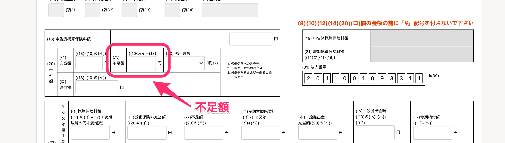

「労働保険の年度更新手続き」を電子申請した際に、書類に必要事項が入力されていないことが原因で発生するエラーとその対処方法について紹介します。

# エラー内容と修正箇所

エラー内容により、書類の編集画面から直接入力するのか、事業所情報を更新して書類に反映するのか、修正手順が異なります。

エラー内容が以下図A・Bのどちらに含まれているかを確認し、対応している編集項目から修正してください。

- Aの範囲に表示されているエラー：書類の編集画面から修正します。
- Bの範囲に表示されているエラー：事業所情報を更新し、ToDo画面で **［最新のデータに更新する］** をクリックして、正しい情報を書類に反映します。

エラー内容と、対応している編集項目および操作方法は以下を参照してください。

# A：書類の編集画面で編集が必要なエラー

エラー内容と、対応している編集項目を説明します。

## エラー：あて先郵便番号 配達局番号・町域番号を入力してください。

### 対処方法

上記のエラーが出た場合は **［あて先〒］項目** に郵便番号を入力してください。

## エラー：あて先住所を入力してください。

### 対処方法

上記のエラーが出た場合は、 **［あて先〒］の下にある自由記載欄** （※）に、あて先住所を入力してください。

※下図で「あて先住所」と文字が入力されている欄を指します。

## エラー：あて先を入力してください。

### 対処方法

上記のエラーが出た場合は、 **［労働保険特別会計歳入徴収官殿］の真上にある自由記載欄** （※）に、あて先を入力してください。

※下図で「あて先」と文字が入力されている欄を指します。

## エラー：申告済保険料額を入力してください。

### 対処方法

上記のエラーが出た場合は、 **［（18）申告済概算保険料額］項目** に金額を入力してください。

## エラー：充当額を入力してください。

### 対処方法

上記のエラーが出た場合は、 **［（イ）充当額］項目** に金額を入力してください。

## エラー：還付額を入力してください。

### 対処方法

上記のエラーが出た場合は、 **［（ロ）還付額］項目** に金額を入力してください。

## エラー：不足額を入力してください。

### 対処方法

上記のエラーが出た場合は、 **［（ハ）不足額］項目** に金額を入力してください。

## エラー：事業の種類を入力してください。

### 対処方法

上記のエラーが出た場合は、 **［（25）事業又は作業の種類］項目** に事業の種類を入力してください。

## エラー：納付 納付額を入力してください。

### 対処方法

上記のエラーが出た場合は、 **［（ト）今期納付額］項目** に金額を入力してください。

## エラー：納付 労働保険料を入力してください。

### 対処方法

上記のエラーが出た場合は、 **［（ニ）今期労働保険料］項目** に金額を入力してください。

## エラー：納付 一般拠出金を入力してください。

### 対処方法

上記のエラーが出た場合は、 **［（ヘ）一般拠出金額］項目** に金額を入力してください。

# B：事業所情報での編集が必要なエラー

## エラー：労働保険番号 府県を入力してください。

## エラー：労働保険番号 所掌を入力してください。

## エラー：労働保険番号 管轄を入力してください。

## エラー：労働保険番号 基幹番号を入力してください。

## エラー：労働保険番号 枝番号を入力してください。

## 上記エラーの対処方法

上記のエラーが出た場合は、以下の手順で事業所情報の更新と、書類への情報反映を行います。

### 1\. 年度更新手続きのToDo画面で事業所情報欄にある 「事業所名」をクリック

事業所名をクリックすると、事業所情報の編集ページへ移ります。

### 2\. 労働保険項目の［労働保険番号］を入力し、［更新する］をクリック

 **［更新する］** をクリックすると、労働保険の年度更新手続きのToDo画面へ戻ります。

### 3\. ［最新のデータに更新する］をクリックし、書類に最新データを反映する

ToDo画面の左側にある［ **最新のデータに更新する］** をクリックすると、確認のダイアログが表示されます。

 **［OK］** をクリックして古いデータを更新すると、ToDo画面に戻ります。

ToDo画面の関連データ欄に **［データは全て最新です］** というメッセージが表示されていれば、更新した情報が書類に反映されています。

