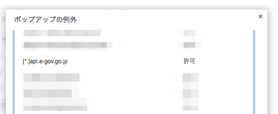
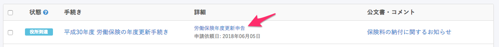
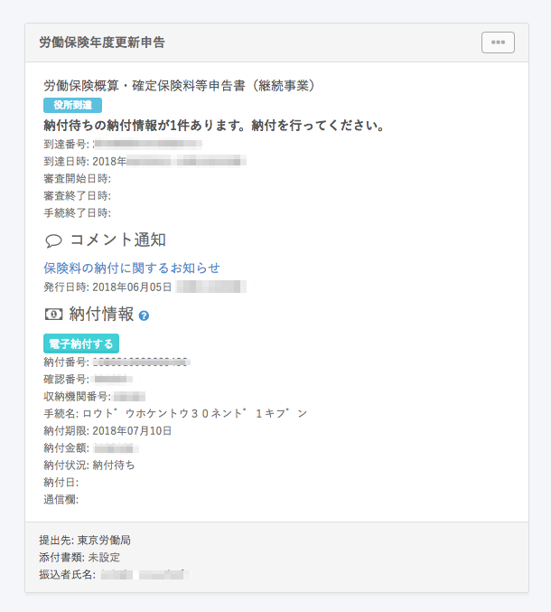
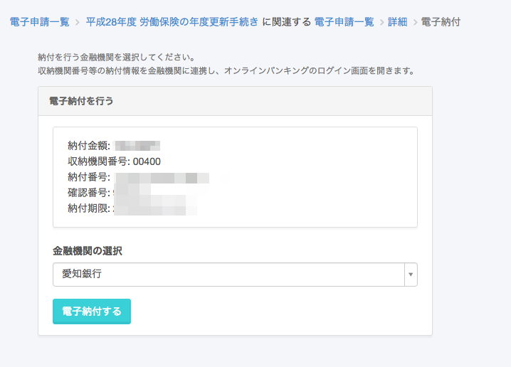
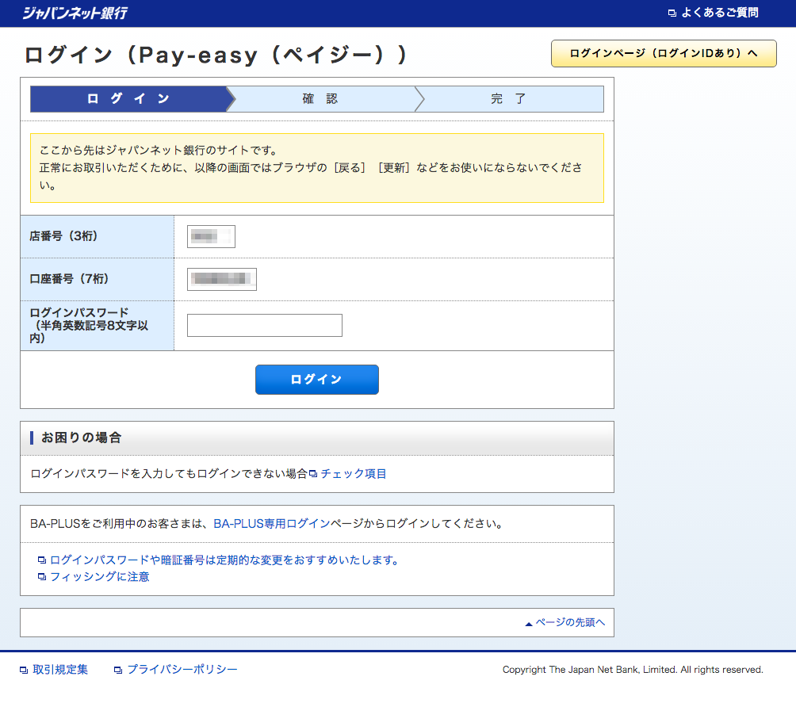
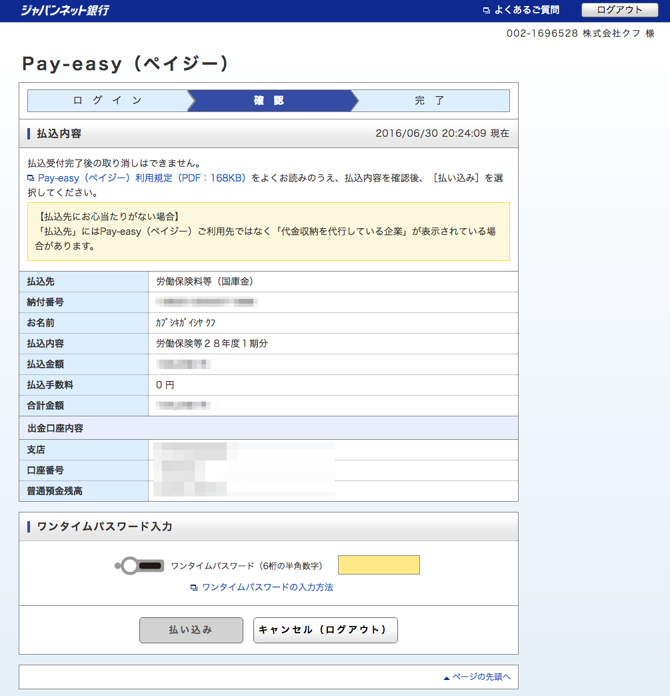
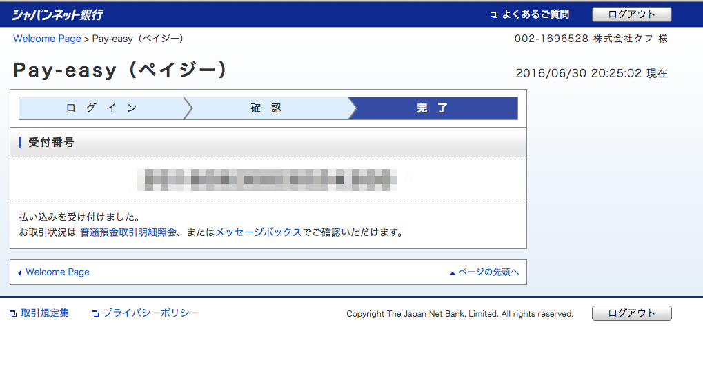
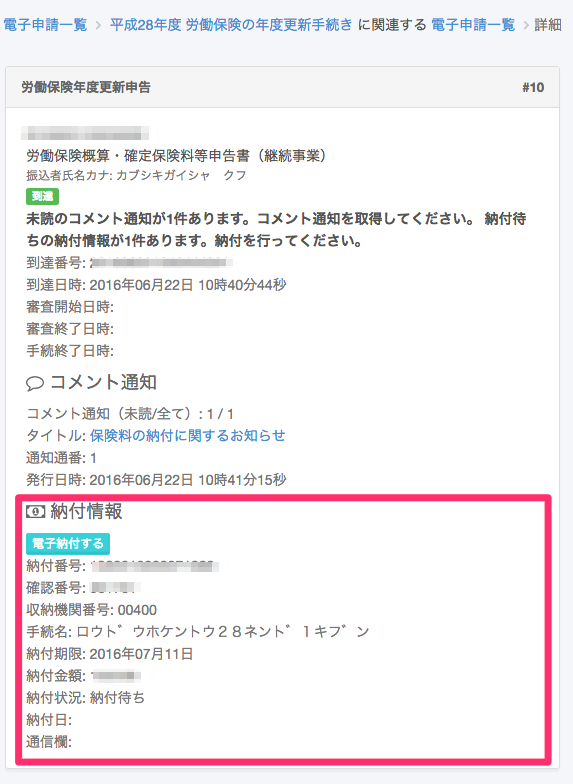
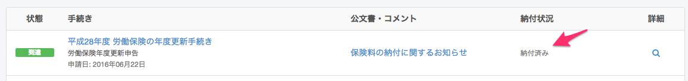

労働保険の年度更新手続きでは、電子申請後、インターネットバンキングを通じて保険料を電子納付できます。

:::alert
7月10日締切※の納付のみ、電子納付に対応しております。
「延納の申請 納付回数」を「3回」で指定した場合も、7月10日締切※の一期分のみ電子納付が可能です。
一期分のみ電子納付した場合の残りの納付については、管轄の労働基準監督署および労働局にお問い合わせください。
※ 7月10日が土曜日・日曜日の場合は、次の月曜日が締切になります。
:::

# 電子納付3つの方法

電子申請による年度更新申告手続きを行なった後には、以下の3通りの方法により、電子納付ができます。

- A. 電子申請による年度更新申告手続きと同時に電子納付する
- B. 電子申請による年度更新申告手続き後、後日電子納付する
- C. 電子申請による年度更新申告手続き後、後日ATMにより電子納付する

# A. 電子申請による年度更新申告手続きと同時に電子納付をする

## 1\. ポップアップブロックを解除

ポップアップブロックを解除します。

ブラウザによってはポップアップブロックの解除が必要です。`api.e-gov.go.jp` をポップアップブロックの例外として設定してください。

:::tips
ポップアップブロックの例外に設定する方法は、下記のページを参照してください。
**Google Chromeの場合：**[Chrome でポップアップをブロックまたは許可する｜Google Chromeヘルプ](https://support.google.com/chrome/answer/95472?hl=ja)
**Microsoft Edgeの場合：**[Windows 10のMicrosoft Edgeでポップアップブロックを有効/無効に設定する方法](https://faq.nec-lavie.jp/qasearch/1007/app/servlet/relatedqa?QID=022172)
:::

## 2\. 電子申請一覧の詳細をクリック

電子申請一覧の詳細をクリックしてください。

申請データの送信後、数分〜数時間すると **［電子申請］ページ**  において **［電子納付する］ボタン** が表示されます。

このボタンをクリックし、画面の案内に従って操作すると、インターネットバンキングを利用して電子納付ができます。

:::alert
ステータスが「役所到達」となったあと、納付ボタンが表示されるまでに数時間〜数日程度かかる可能性があります。すぐには表示されませんのでご注意ください。 
:::

基本的に「B. 電子申請による年度更新申告手続き後、後日電子納付を行なう」の方法と変わりはありませんが、画面遷移先のインターネットバンキングに納付情報が送信されるため、電子納付する際に「収納機関番号」「納付番号」などの入力を省略することができ、便利です。

:::alert
 **［電子納付する］** をクリックしたら 30 分以内に電子納付を行なってください。時間を経過しますと、この方法による電子納付はできなくなります。
:::

## 同時に電子納付を行なう場合の流れ（JNB の場合）

### 1\. 電子納付を開始する

対象の手続きから **［電子納付する］** をクリックします。

### 2\. 金融機関を選択

金融機関を選択します。

ご利用中の Pay-easy に対応した金融機関を選択し **［電子納付する］** をクリックします。

### 3\. 金融機関にログインする

店番号、口座番号、ログインパスワードなどを入力して金融機関にログインします。

### 4\. 金額を確認し、払い込みを行なう

金額を確認して、払い込みを行ないます。

### 5\. 完了

完了画面にて受付番号を控えます。

# B. 電子申請による年度更新申告手続き後、後日電子納付をする

申請データの送信後、後日に各金融機関のPay-easy（ペイジー）に対応したインターネットバンキングを利用して、電子納付ができます。

この場合申請データの送信後の申請データの「収納機関番号」、「納付番号」および「納付確認番号」が必要となります。

「電子申請」詳細画面をあらかじめ印刷しておくと便利です。（画面上部の **［電子申請］メニュー**  ＞ **［虫眼鏡］** から移動できます。）

## 後日電子納付をする場合（三菱 UFJ 銀行の場合）

[三菱ＵＦＪダイレクトの「税金・各種料金払い込み（Pay-easy：ペイジー）」 | 三菱ＵＦＪ銀行](http://direct.bk.mufg.jp/shop/payeasy/) より、Pay-easy の入力画面へ移動し、振り込みをします。

# C. 電子申請による年度更新申告手続き後、後日ATMにより電子納付をする

申請データの送信後、後日に各金融機関のPay-easy（ペイジー）に対応したATMを利用して、電子納付ができます。

この場合、申請データの送信後の申請データの「収納機関番号」、「納付番号」および「納付確認番号」が必要となります。

「電子申請」詳細画面をあらかじめ印刷しておくと便利です。（画面上部の **［電子申請］メニュー**  ＞ **［虫眼鏡］** から移動できます。）

# 注意点

- 電子納付後、SmartHR 上での納付ステータスの反映にはお時間がかかる場合がございます。ご留意ください。
- 納付が完了すると **［電子納付する］ボタン** が消え **［納付済み］** と表示されるようになります。

- 電子納付以外の方法で納付を行なった場合には、納付ステータスが変更されません。
- インターネットバンキングまたは ATM を利用して電子納付を行なう場合は、ご利用の金融機関が Pay-easy（ペイジー）に対応していることが必要です。
- 対応金融機関は[Pay-easy（ペイジー）ホームページ](http://www.pay-easy.jp/where/index.html)を参照してください。
- 労働保険料を電子納付した場合、厚生労働省から領収証書を発行することはありませんので、ご留意ください。

# よくある質問

ご不明点がありましたら、e-Gov の電子納付に関するよくある質問をご参照ください。

[よくあるご質問（FAQ）｜e-Gov電子納付](https://shinsei.e-gov.go.jp/contents/payment/help/faq/)
