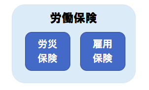

事業主（会社）は、「新年度の概算保険料を納付するための申告・納付」と「前年度の保険料を精算するための確定保険料の申告・納付」の手続きが必要となります。

この手続きを **「年度更新」** といい、SmartHRで手続きできます。

詳細は、[SmartHRで年度更新手続きをする](https://knowledge.smarthr.jp/hc/ja/articles/360026107074)を参照ください。

# 1\. 労働保険とは

「労災保険」と「雇用保険」を総称した言葉となります。

保険の給付は別々に行っていますが、保険料の納付については、まとめて取り扱われています。

## 労災保険とは

仕事中に病気や怪我をした時、通勤途中で怪我にあった時に使う保険です。

労災保険の対象者は、雇用形態に関わらず、労働の対象として賃金を受けるすべての者となります。

## 雇用保険とは

失業した場合や育児や介護などの理由で休業しなければならない場合の給付制度となります。

下記2つの条件を満たしている者が、雇用保険の対象者となります。

- 31日以上、継続して雇用の見込みがあること
- 1週間あたりの所定労働時間が20時間以上あること

参考：[雇用保険の被保険者について｜厚生労働省](https://www.mhlw.go.jp/new-info/kobetu/roudou/gyousei/hoken/2019/dl/koyou-04.pdf)

# 2\. 労働保険の更新とは

## （1） 年度更新の手続きについて

労働保険の保険料は、毎年4月1日〜翌年3月31日の1年間を単位として計算します。

その額は、すべての労働者に支払われる賃金の総額に、その事業ごとに定められた保険料率を乗じて算定します。

保険年度ごとに、概算で保険料を納付し、年度末に賃金総額が確定したあとに精算するという方法をとっています。

:::tips
令和3年度の労災保険率・雇用保険率の料率表は、以下のページでご確認ください。
[令和4年度の労災保険率について　～令和3年度から変更ありません～｜厚生労働省](https://www.mhlw.go.jp/stf/seisakunitsuite/bunya/koyou_roudou/roudoukijun/rousai/rousaihoken06/rousai_hokenritsu_kaitei.html)
[雇用保険料率について｜厚生労働省](https://www.mhlw.go.jp/stf/seisakunitsuite/bunya/0000108634.html)
:::

## （2） 労働保険料の納付方法・納付期限について

労働保険料の申告・納付期限は7月10日※です。

一括納付が原則ですが、以下の場合は3回に分けて延納（分割支払い）することができます。

- 本年度の概算保険料額が40万円以上
- 雇用保険料のみ、または労災保険料のみの納付の場合は20万円以上

確定保険料と概算保険料が合計で40万円以上の場合は、延納（分割支払い）することはできません。

| 納 期 | 全 期・第1期 | 第2期 | 第3期 |
| :-- | :-- | :-- | :-- |
| 口座振替を利用しない場合の納付期限※ | 7月10日 | 10月31日 | 1月31日 |
| 口座振替納付日※ | 9月6日 | 11月14日 | 2月14日 |

※ 土曜日・日曜日・祝日の場合は、次の日が期限になります。

:::alert
- 口座振替を利用しない納付方法は、金融機関窓口またはネットバンキングでの支払いが可能です。
- 口座振替の場合、納付日の概ね10日前に引き落とされる金額の通達が届きます。また納付書の送付も納付日より10日前に送付されます。
- 延納とは・・・分割して納めるという意味合いです。延期ができるという意味ではありません。
:::

労働保険の申告・納付についてのよくある質問は、以下のページをご覧ください。

[労働保険の年度更新に関するよくある質問](https://knowledge.smarthr.jp/hc/ja/articles/360026264573)
