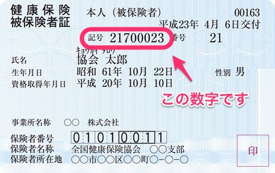

「健康保険 事業所整理記号」について説明します。

# どんなもの？

保険証などに記載されている数字です。

（例）12345678

なお、桁数は加入する健康保険によって異なります。

- 協会けんぽ: 7~8 桁
- 関東ITソフトウェア健康保険組合: 4 桁

# どこでわかるの？

健康保険証の「記号」と書かれている欄に記載されています。

**例: 協会けんぽの被保険者証**

出典：[全国健康保険協会](https://www.kyoukaikenpo.or.jp/)
