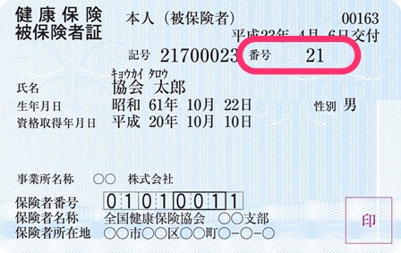

# どんなもの？

1つの事業所における従業員ごとに与えられる、健康保険証の「番号」です。

番号は、資格取得順（会社内での社会保険への加入順）に採番され、退職者による欠番があっても、同じ番号は使用できません。

事業所が合併・統合して、事業所整理記号が変更となる際には、被保険者整理番号も変更になります。

# 入社手続きではどうすればいいの？

手続き順（入社順）に数字を連番で設定してください。

初めて手続きする場合には「1」からはじめ、以降は「2」、「3」と数字を増やしていってください。

1つの事業所で退職者も含めて連番である必要があるので、新入社員を迎える場合は「直前の手続きで使用した番号」を確認し数字を設定してください。

# 今、何番まで採番しているかの確認方法は？

**最後に発行した保険証から確認できます。**

健康保険証の「番号」と書かれている欄に記載されています。

入社手続きではこの数字に「+1」した数字を設定してください。（この場合、設定するのは「22」になります）

**例: 協会けんぽの被保険者証**

出典：[全国健康保険協会](https://www.kyoukaikenpo.or.jp/g3/cat320/sb3160/sbb3160/1939-189)
