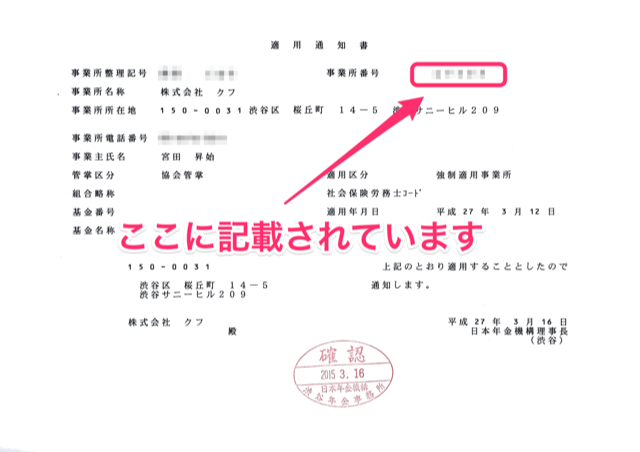

厚生年金保険の事業所番号についてご説明します。

# どんなもの？

事業所ごとに付与された5桁の数字です。

（例）01234

# どこでわかるの？

年金事務所から送付される「適用通知書」や「保険料納入告知額・領収済額通知書」などに記載されています。

**例: 適用通知書**

:::tips
※新規適用の手続き（事業所が社会保険に加入する為の手続き）を行った約1～2週間後、事業所宛に郵送されます。
※ 雇用保険にも「事業所番号（11桁）」がありますが、厚生年金保険の事業所番号とは別物ですのでご注意ください。
:::
