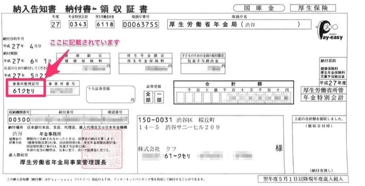

厚生年金保険 事業所整理記号について説明します。

# どんなもの？

事業所ごとに付与された「数字2桁 – カタカナまたは英数字4桁以内」の組み合わせで表される文字列です。

例：61-クセリ

## 「漢字 – ひらがな」の組み合わせで記載されている場合は？

適用通知書など、書類によっては「漢字 – ひらがな」の組み合わせで記載されている場合があります。

例：渋谷-くせり

いずれの場合でも書類の提出は可能ですが、SmartHRでは「数字 – カタカナ」の形式に変換して提出することを推奨しています。

:::tips
 **「漢字 – ひらがな」を「数字 – カタカナ」の形式に変換する方法（協会けんぽの場合）** 
支部ごとに公開されている変換表をご覧ください。
変換表は支部ごとに違うため、納入告知書や納付書、領収証書がお手元にない場合は、インターネットで下記の文言を検索してください。
> 年金機構　整理番号　変換　●●支部
- 「●●支部」の●●には東京支部、大阪支部、静岡支部など、管轄の地名を入力してください。
- それでも見つからない場合は、大変お手数ですが協会けんぽにお問い合わせください。
東京の場合は、以下のPDFをご覧ください。
[協会けんぽの被保険者証 旧記号(漢字かな）から新記号(数字）への変換方法について｜全国健康保険協会](https://www.kyoukaikenpo.or.jp/~/media/Files/tokyo/ninkei2705/kigouhenkanhouhou.pdf)
:::

# どこでわかるの？

年金事務所から送付される「納入告知書」や「健康保険・厚生年金保険被保険者標準報酬月額決定通知書」などに記載されています。

**例：納入告知書　納付書・領収証書**

