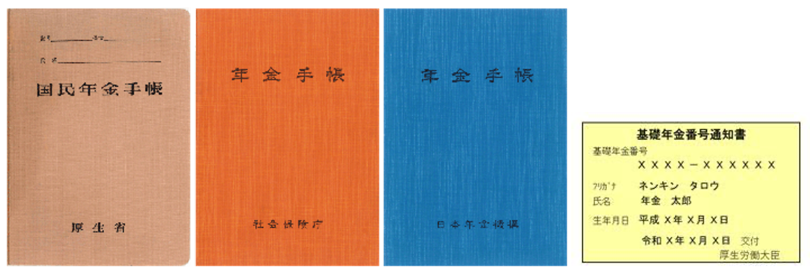
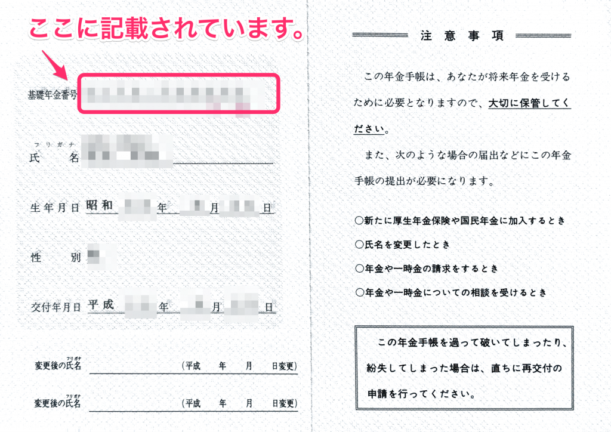

基礎年金番号についてご説明します。

# どんな番号？

10桁（4桁-6桁）の数字で、年金加入者に付与されています。退職や転職をしても変わることはありません。

（例）1234-123456

# どこに記載されている？

本人に交付されている年金手帳（青色）や、基礎年金番号通知書などに記載されています。

 **年金手帳・基礎年金番号通知書 （発行された年によって表紙が違います）** 

出典：[日本年金機構](http://www.nenkin.go.jp/service/seidozenpan/yakuwari/20131107.html)

**基礎年金番号は年金手帳（青色）の見開き1ページ目に記載されています。**

