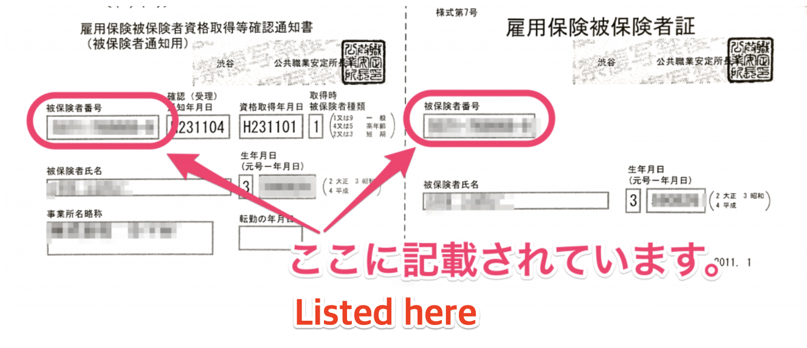

This section explains about employment insurance numbers.

# What exactly is it?

It is an 11-digit number (with a 4-6-1 configuration). This number is assigned to each person who has employment insurance. Basically, the number does not change even if the person leaves the company or changes jobs.

Example: 1234-567890-1

# Where can I find this number?

The number is listed on the employment insurance certificate or the "separation from employment" form, etc. Please note that the office number also has 11 digits and should not be confused with the employment insurance number.

**↓ Notice for confirmation of acquisition of the employment insurance qualification/Employment insurance certificate**

## (Supplemental Note) For an insurance number with 16 digits (displayed on two lines)

A 16-digit insurance number was used for people who were insured under the employment insurance system prior to July 6, 1981.

Documents sent by the Public Employment Security Office (Hello Work) after this date list the new 11-digit insurance number, so please use this number.

If you only have the 16-digit number because you did not have any employment insurance paperwork processed after this date, please use the 10-digit number from the lower line and enter it as your insurance number.

When entering this 10-digit number, add "0" to the end so that there are 11 digits in total.

Example: If the 10-digit number on the lower line is 1234512345, enter 12345123450
