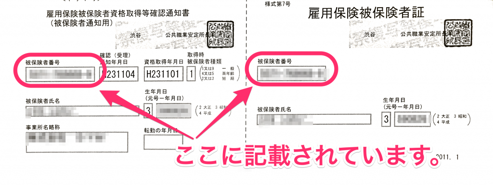

雇用保険 被保険者番号について説明します。

# どんなもの？

11 桁（4桁-6桁-1桁）の数字です。雇用保険の加入者1人1人に付与されています。退職や転職をしても基本的に変わることはありません。

例: 1234-567890-1

# どこでわかるの？

雇用保険被保険者証や離職票等に記載されています。同じ11桁の数字として「事業所番号」もありますが、「被保険者番号」とは違うものなので注意しましょう。

**↓　雇用保険被保険者資格取得等確認通知書／雇用保険被保険者証**

## （補足）被保険者番号が 16 桁（上下2段で表示）の場合

1981 年 7 月 6 日以前に雇用保険に加入した場合には 16 桁の被保険者番号が採番されています。

同日以降に公共職業安定所（ハローワーク）から発送された書類には、新たに 11 桁の被保険者番号が記されていますので、そちらをご利用ください。

なお、同日以降に雇用保険手続きが発生しておらず、16 桁の数字しかない場合には下段の 10 桁の数字を被保険者番号としてご入力ください。

10 桁の数字を入力する際は、末尾に 0 を付け、11 桁にしてください。

例：下段の 10 桁が 1234512345 の場合→12345123450
