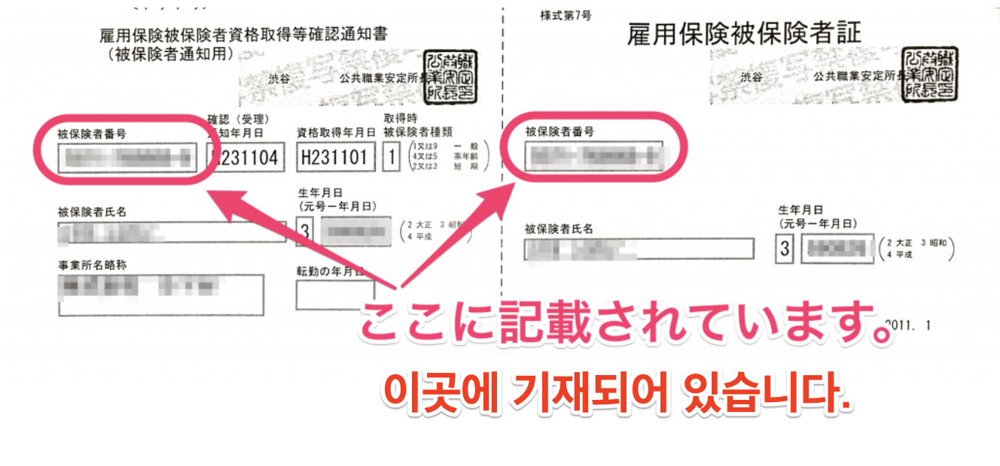

고용보험 피보험자번호（雇用保険被保険者番号）에 대하여 설명합니다.

# 무엇인가요？

11자리（4자리-6자리-1자리）의 숫자로 되어있습니다. 고용보험 가입자 1인 1인에게 부여되는 번호입니다. 퇴직 혹은 전직을 할 경우에도 기본적으로는 변하지 않습니다.

예: 1234-567890-1

# 어디에서 확인할수 있나요？

고용보험 피보험자증（雇用保険被保険者証）과 이직표 등에 기재되어있습니다. 같은 11자리의 숫자로「사업자번호」도 있습니다만, 「피보험자번호」와는 다른것이오니 주의해주세요.

**↓　고용보험 피보험자 자격획득등 확인통지서(雇用保険被保険者資格取得等確認通知書)／**

**고용보험 피보험자증(雇用保険被保険者証)**

## （보충）피보험자번호가 16자리（위아래 2단으로 표시）의 경우

1981 년 7 월 6 일 이전 고용보험에 가입하였을 경우, 16자리의 피보험자번호가 부여되어있습니다.

해당일 이후에 공공직업안정소（헬로워크）로부터 발송된 서류에는 새로운 11자리의 피보험자번호가 기재되어 있사오니, 그쪽을 이용해주세요.

또한, 해당일 이후에 고용보험수속이 발생하지 않고, 16자리의 숫자 밖에 없을경우에는 하기의 10자리 숫자를 피보험자번호로 입력해주세요.

10자리의 숫자를 입력하길때는 말미에 0을 붙여서 11자리로 기재해주세요.

예：하단의 10 자리가 1234512345의 경우 → 12345123450
