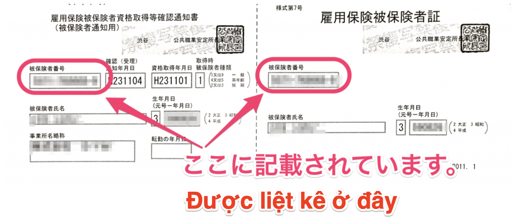

Tài liệu này hướng dẫn về Mã số người tham gia bảo hiểm trong bảo hiểm thất nghiệp.

# Mã số này là gì?

Đây là dãy số gồm 11 chữ số (4 chữ số - 6 chữ số - 1 chữ số). Mã số này được cấp cho từng cá nhân tham gia bảo hiểm thất nghiệp. Về cơ bản, mã số này sẽ không thay đổi ngay cả khi bạn nghỉ việc hay chuyển việc.

Ví dụ: 1234-567890-1

# Mã số này được hiển thị ở đâu?

Mã số này được ghi trên Giấy chứng nhận người tham gia bảo hiểm thất nghiệp và Giấy chứng nhận nghỉ việc, v.v. Xin hãy lưu ý rằng “mã số kinh doanh” của công ty cũng có 11 chữ số, nhưng mã số này khác với "mã số người tham gia bảo hiểm".

**↓** **Thông báo xác nhận tư cách người tham gia bảo hiểm thất nghiệp / Chứng nhận người tham gia bảo hiểm thất nghiệp**

## (Bổ sung) Trường hợp mã số người tham gia bảo hiểm có 16 chữ số (hiển thị thành 2 dòng)

Trường hợp người tham gia bảo hiểm thất nghiệp từ ngày 06 tháng 07 năm 1981 trở về trước được cấp mã số bảo hiểm có 16 chữ số.

Kể từ ngày nêu trên trở về sau, trên các giấy tờ do Trung tâm hỗ trợ việc làm (Hello Work) cấp sẽ ghi mã số người tham gia bảo hiểm mới có 11 chữ số, vì vậy, xin hãy sử dụng mã số này.

Ngoài ra, nếu bạn không phát sinh thủ tục xin trợ cấp thất nghiệp kể từ ngày nêu trên trở về sau và chỉ có duy nhất mã số gồm 16 chữ số, thì hãy điền 10 chữ số ở dòng dưới làm mã số người tham gia bảo hiểm.

Khi điền dãy số 10 chữ số, hãy điền thêm số 0 vào cuối cùng để đủ 11 chữ số.

Ví dụ: Trường hợp 10 chữ số ở dòng dưới là 1234512345 → mã số sẽ là 12345123450
