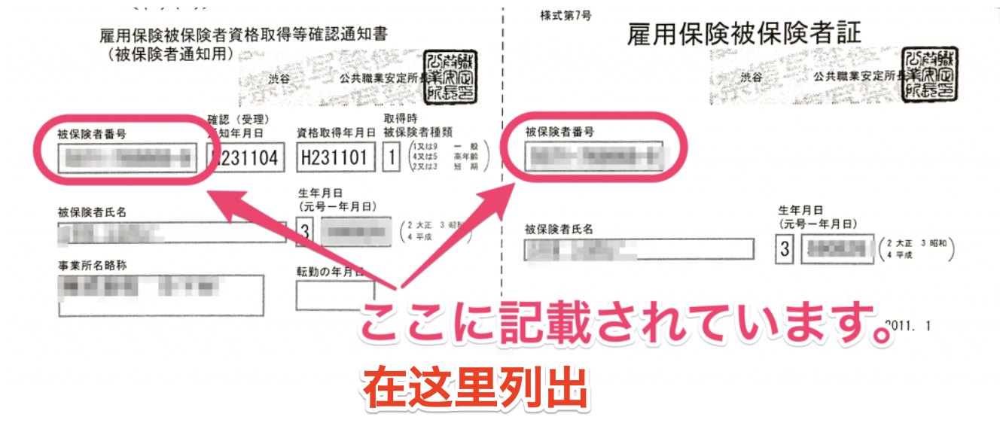

本文将说明雇佣保险 被保险人编号。

# 它是什么样的形式？

它是11位（4位-6位-1位）的数字。每位加入雇佣保险的人员都会获得。即使离职或换工作，也基本上不会改变。

例：1234-567890-1

# 从何处得知？

记载于雇佣保险被保险人证或离职票。“事业所编号”也是11位数字，请注意与“被保险人编号”区分。

**↓　雇佣保险被保险人资格取得等确认通知书****/****雇佣保险被保险人证**

## （补充）被保险人编号为16位（分上下两段显示）时

1981年7月6日及以前加入雇佣保险时，采用16位被保险人编号。

该日期之后，在公共职业安定所（HelloWork）发放的文件中采用新的11位被保险人编号，因此请使用11位被保险人编号。

此外，如果在该日期之后未办理雇佣保险手续，只有16位数字，那么请将下段的10位数字作为被保险人编号进行输入。

输入10位数字时，请在末尾加上0，凑成11位

例：下段的10位为1234512345时→12345123450
