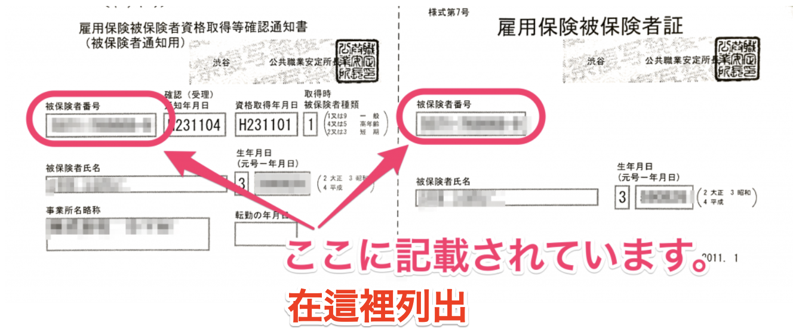

以下為僱用保險被保險人編號的相關說明。

# 這是什麼？

每位僱用保險的加入者都會獲得的一組11位（4位-6位-1位）數字編號，原則上即使離職或轉職都不會改變。

例：1234-567890-1

# 從哪裡得知編號？

在僱用保險被保險人證或離職證明等會有記載。證明上將有同樣為11位數字的「事業所編號」，這與「被保險人編號」並不相同，需特別留意。

**↓**　**僱用保險被保險人資格取得等確認通知書／僱用保險被保險人證**

## （補充）若被保險人編號是16位（分上下2行標示）

若於 1981 年 7 月 6 日以前參加僱用保險，被保險人編號會採用 16 位數字。

當日以後由公共職業安定所（HelloWork）寄出的文件，則會記載 11 位的新被保險人編號，請使用此編號。

另外，若當日以後未辦理僱用保險手續並只持有 16 位數字者，請輸入下行的 10 位數字作為被保險人編號。

輸入 10 位數字時請在最後加上 0，轉換為 11 位數字編號。

例：若下行的 10 位為 1234512345 →12345123450
