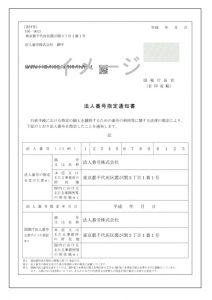

法人番号とは、検査用数字（チェックディジット（1桁）） ＋ 会社法人等番号（12桁）を合わせた数字13桁からなる番号を指します。

# 法人番号の確認方法

平成27年10月以降に国税庁から書面で通知が送られておりますので、ご確認ください。

法人番号指定通知書のイメージ

お手元に無い場合は、[国税庁法人番号公表サイト](https://www.houjin-bangou.nta.go.jp/) から検索できます。
