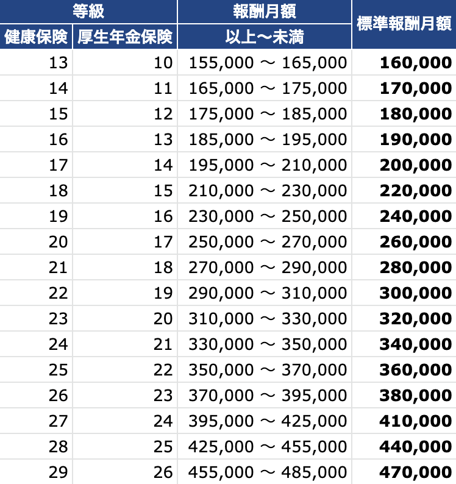

毎月の社会保険料（健康保険料・厚生年金保険料）や、保険給付（傷病手当金、出産手当金など）の額を算出する際のもととなる金額です。

健康保険では1～50等級、厚生年金保険では1～31等級の区分に分かれており、被保険者は給与額に応じてその等級の標準報酬月額を持つことになります。

報酬月額と標準報酬月額との対応例（令和2年）

たとえば、毎月の給与（通勤手当、残業手当などの各種手当も含めます）として「230,000 円以上、250,000 円未満」を受け取っている従業員の標準報酬月額は「240,000 円」です。

このように一定の範囲内の給料をひとまとめにし、保険料や保険給付額の算出に利用しようというのが標準報酬月額の基本的な考え方です。

さらに詳しい情報は、日本年金機構、全国健康保険協会、および加入されている健康保険組合のホームページを参照してください。

- [厚生年金保険料額表｜日本年金機構](https://www.nenkin.go.jp/service/kounen/hokenryo-gaku/gakuhyo/index.html)
- [都道府県毎の保険料額表｜全国健康保険協会](http://www.kyoukaikenpo.or.jp/g3/cat330/sb3150)
- [標準報酬月額について｜関東ITソフトウェア健康保険組合](https://www.its-kenpo.or.jp/hoken/jimu/hokenryou/houshuu.html)
