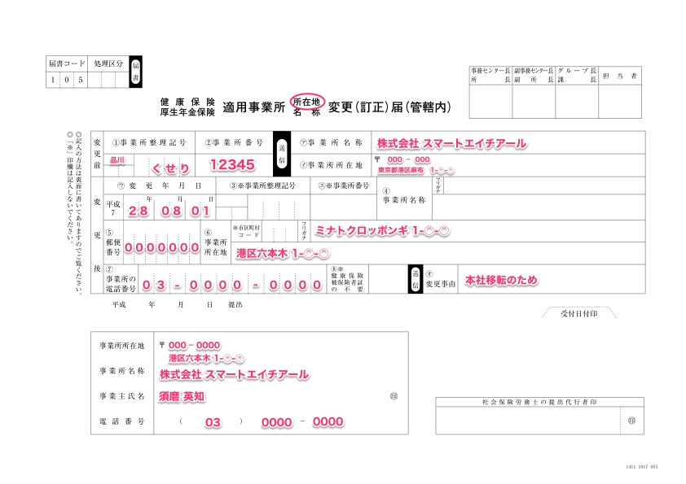
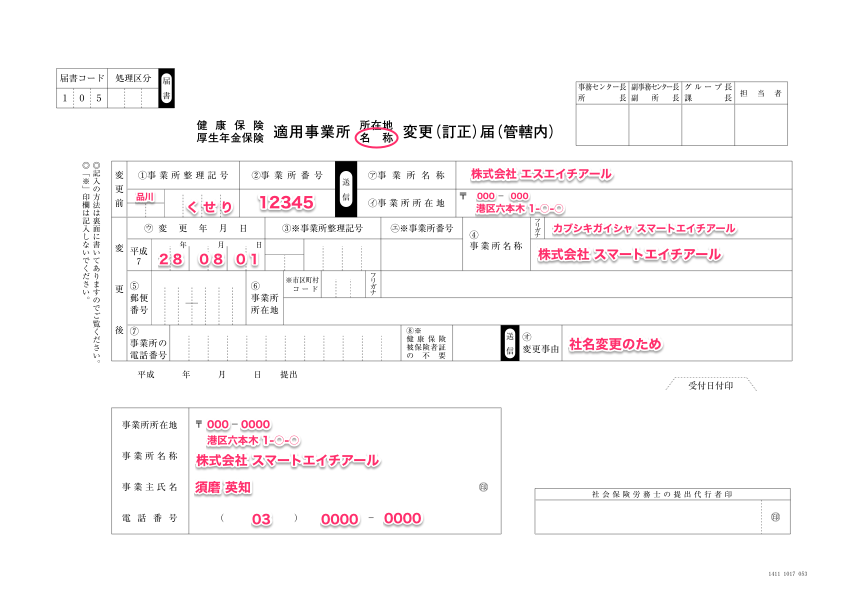
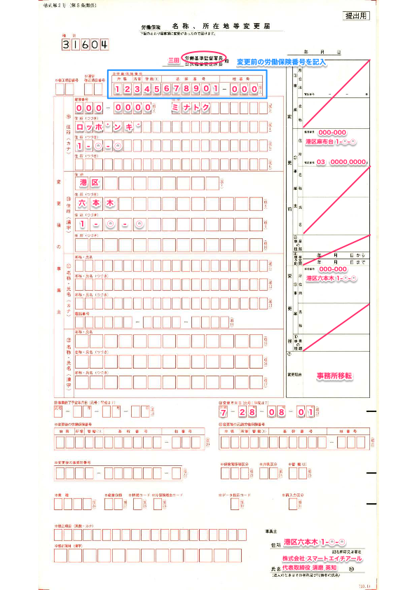
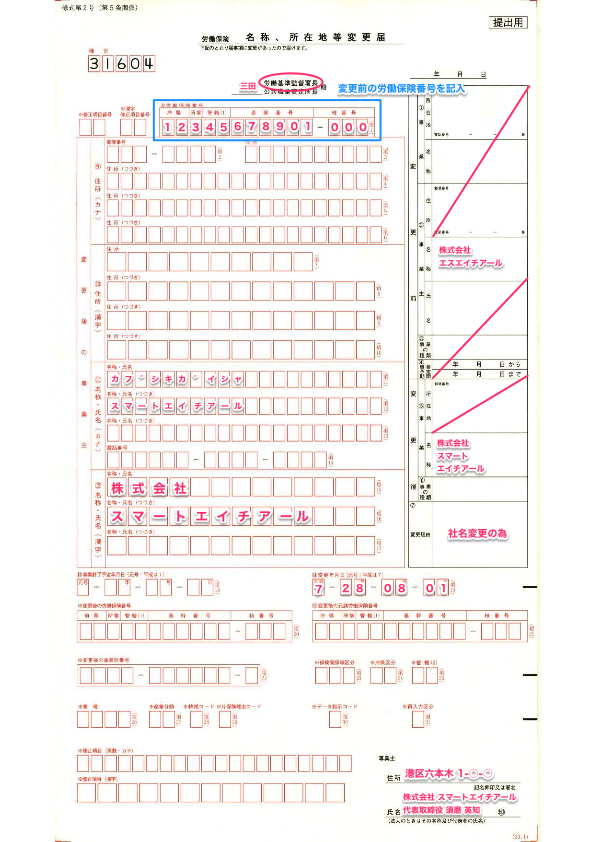
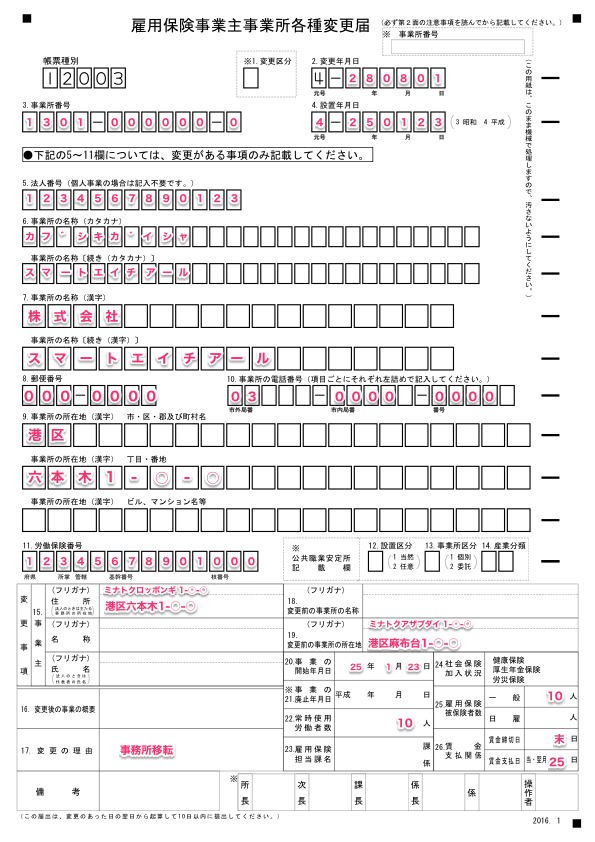
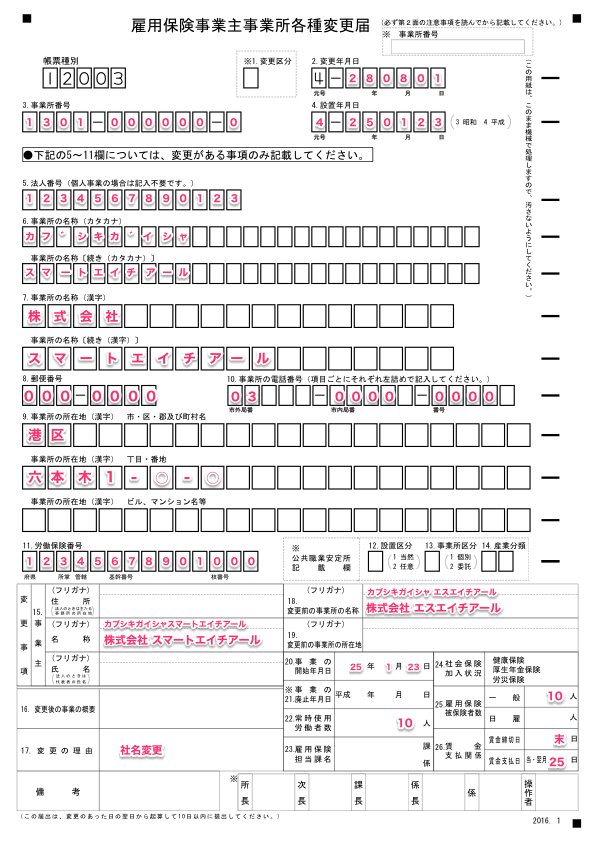

会社の移転や社名変更の他にも、会社の届け出の内容に変更がある場合、こちらの変更手続きを提出してください。

社会保険は変更日から5日以内に、労働保険は10日以内に、届け出る必要がございます。

# 社会保険

必要書類を作成し、**変更前の所在地**を管轄する年金事務所へ提出します。

管轄を調べる場合は[全国の相談・手続き窓口｜日本年金機構](http://www.nenkin.go.jp/section/soudan/)をご確認ください。

## 書類の書き方（協会けんぽの場合）

### 所在地変更の場合

### 名称変更の場合

※ 移転先の管轄が異なる場合は、[適用事業所の名称・所在地を変更するとき（管轄外）の手続き｜日本年金機構](http://www.nenkin.go.jp/service/kounen/jigyosho-hiho/jigyosho/20141205.html)にある様式をご利用ください。

# 書類の書き方（組合健保の場合）

上記書類を年金事務所に提出。健康保険分は組合健保から用紙を入手し、記入の上提出しましょう。

## その他添付書類

1.  法人事業所の場合（所在地変更・名称変更共通）は、法人（商業）登記簿謄本のコピー
2.  個人事業所の場合（所在地変更）は、事業主の住民票のコピー（個人番号の記載がないもの）
3.  個人事業所の場合（名称変更）は、公共料金の領収書のコピー等

※事業所の所在地が登記上の所在地等と異なる場合は「賃貸借契約書のコピー」など事業所所在地の確認できるものを添付してください。

### 書類フォーマット及び参考

- [適用事業所の名称・所在地を変更するとき（管轄内）の手続き｜日本年金機構](http://www.nenkin.go.jp/service/kounen/jigyosho-hiho/jigyosho/20150320.html)
- [適用事業所の名称・所在地を変更するとき（管轄外）の手続き｜日本年金機構](http://www.nenkin.go.jp/service/kounen/jigyosho-hiho/jigyosho/20141205.html)

## 労働保険

２種類の書類を作成し、労働基準監督署と、移転後の所在地を管轄するハローワークへ提出します。

「労働保険 名称、所在地等変更届」を労働基準監督署に提出した後、「雇用保険 事業主事業所各種変更届」をハローワークへ提出すると効率よく手続きができます。

※ハローワークで、「労働保険 名称、所在地等変更届の控」が必要なため

### 労働保険 名称、所在地等変更届の書き方

#### 所在地変更の場合

#### 名称変更の場合

※ 管轄の検索は[都道府県労働局(労働基準監督署、公共職業安定所)所在地一覧｜厚生労働省](http://www.mhlw.go.jp/kouseiroudoushou/shozaiannai/roudoukyoku/)を参照ください

## 書類フォーマット

移転後の所在地を管轄する管轄労働基準監督署にて入手してください。

※「労働保険 名称、所在地等変更届」は複写用紙のため、移転後の所在地を管轄する管轄労働基準監督署で直接記入することをおすすめします。

# 雇用保険 事業主事業所各種変更届の書き方

## 所在地変更の場合

## 名称変更の場合

### 書類フォーマット及び参考

[ハローワークインターネットサービス - 利用上の注意](https://hoken.hellowork.mhlw.go.jp/assist/001000.do?screenId=001000&action=koyohoJigyoChangeLink)より書類を作成できますのでご活用ください。
