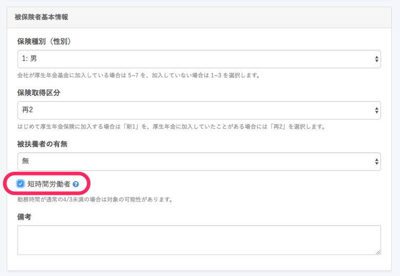

短時間労働者の対象となる条件と、資格取得届の記載方法を説明します。

# 社会保険の短時間労働者とは？

短時間労働者とは、従業員個人が短時間勤務をしているかどうかという基準だけではなく、会社が「短時間労働者」適用を受ける事業者かどうかという基準も必要です。会社が適用を受けていないのに、資格取得届で「短時間労働者」として届出を行うと、電子申請では返戻となる場合がありますのでご注意ください。

# 対象となる事業者

法人番号が同一な適用事業所の被保険者数（短時間労働者を除く、共済組合員含む）の合計が1年で6ヶ月以上、500人を超えることが見込まれる事業所が対象です。
この事業所を特定適用事業所といいます。

（該当する事業所には年金機構より、「特定適用事業所該当通知書」が届きます。）

# 対象となる短時間労働者の要件

次のすべてにあてはまる方が対象となります。

1.  勤務時間・勤務日数が常時雇用者の4分の3未満。
2.  週の所定労働時間が20時間以上
3.  雇用期間が1年以上見込まれている
4.  賃金の月額が8.8万円以上
5.  学生ではない
6.  上記の特定適用事業所に勤めている

# 平成29年4月から拡大された適用対象

上記に加え、被保険者数が常時 500 人以下の企業のうち、次の1または2に該当する事業所に勤務する短時間労働者も厚生年金保険・健康保険の適用対象となります。1に該当することによる適用は、「任意特定適用事業所 申出書」の提出が必要です。

1.  労使合意（働いている方々の２分の１以上と事業主が社会保険に加入することに
    ついて合意すること）に基づき申出をする法人・個人の事業所
2.  地方公共団体に属する事業所

# 資格取得届の記載について

入社の手続きより、資格取得届を作成後、書類をクリックいただき、**\[編集\]** をクリックしてください。

被保険者基本情報の「短時間労働者」にチェックを入れて更新してください。

資格取得届の備考欄に「短時間労働者」である旨が記載されます。

参考：[短時間労働者に対する適用拡大に関する事務手続き](https://www.nenkin.go.jp/oshirase/topics/2016/0516.files/0819.pdf)
