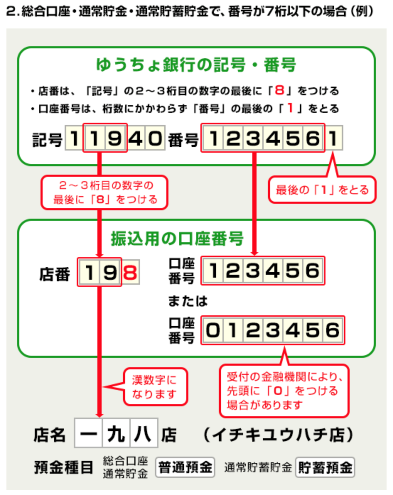

その他の銀行から、ゆうちょ銀行への振り込みへは「店番号」「口座番号」を変換して伝える必要があります。

# 支店番号

ゆうちょ銀行の支店名は記号の左から 2-3 桁目の数字に8を加えた数字を入力して下さい。

# 口座番号

ゆうちょ銀行の口座番号は、番号の左から７桁までの数字を入力して下さい。

出典：[記号･番号から振込用の店名・預金種目・口座番号への変換の公式－ゆうちょ銀行](https://www.jp-bank.japanpost.jp/kojin/sokin/koza/kj_sk_kz_furikomi_ksk.html)

# 自動変換サイト

ゆうちょ銀行のサイトで番号の自動変換が可能です。

[口座の記号・番号を入力（振込用の店名・預金種目・口座番号のご案内）－ゆうちょ銀行](https://www.jp-bank.japanpost.jp/kojin/sokin/furikomi/kouza/kj_sk_fm_kz_1.html)

その他、詳しくは[ゆうちょ銀行のサイト](https://www.jp-bank.japanpost.jp/)をご覧ください。
