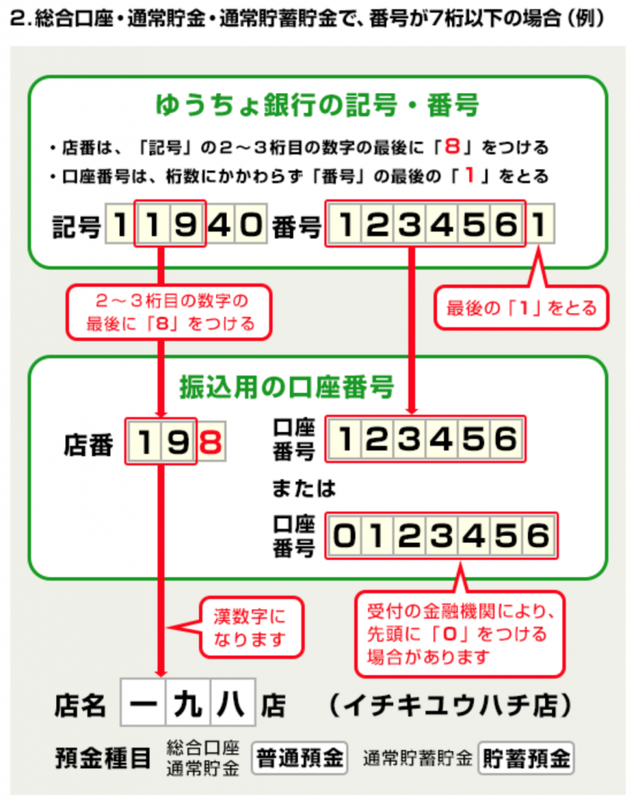

從其他銀行匯款至日本郵政銀行，需要提供轉換後的「分行代碼」與「帳號」。

# 分行代碼

日本郵政銀行的分行名稱，請輸入記號左起第 2~3 位的數字，並且在後方加上數字8。

# 帳號

日本郵政銀行的帳號，請輸入號碼左起到第7位為止的數字。

資料來源：[將記號、號碼改為匯款用分行名稱、存款種類、帳號的轉換公式－日本郵政銀行](https://www.jp-bank.japanpost.jp/kojin/sokin/koza/kj_sk_kz_furikomi_ksk.html)

# 自動轉換網站

日本郵政銀行網站提供自動轉換號碼服務。

輸入[帳戶記號、號碼（匯款用分行名稱、存款種類、帳號說明）－日本郵政銀行](https://www.jp-bank.japanpost.jp/kojin/sokin/furikomi/kouza/kj_sk_fm_kz_1.html)

其他詳細資訊請參考[日本郵政銀行網站](https://www.jp-bank.japanpost.jp/)。
